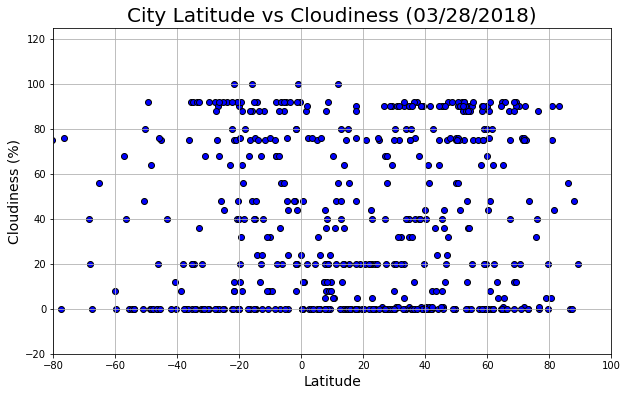

# WeatherPy

### Analysis
-  Too be completed
-  Too be completed
-  Too be completed
-  Too be completed


```python
#Install citipy library
!pip install citipy

#Dependencies
import pandas as pd
import numpy as np
import seaborn as sns
import matplotlib.pyplot as plt
import requests
from citipy import citipy
from pprint import pprint
import time

#Import API key for OpenWeatherMapy
from config import owm_key
```

    Requirement already satisfied: citipy in c:\users\austi\anaconda3\lib\site-packages
    Requirement already satisfied: kdtree>=0.12 in c:\users\austi\anaconda3\lib\site-packages (from citipy)
    

    You are using pip version 9.0.1, however version 9.0.3 is available.
    You should consider upgrading via the 'python -m pip install --upgrade pip' command.
    

### Generate Cities List


```python
#Create DataFrame
cities_df = pd.DataFrame()

#Add columns for City and Country
cities_df["City"] = ""
cities_df["Country"] = ""

#Generate 500+ random latitudes and longitudes, then add new columns and values to Dataframe
cities_df["Latitude"] = np.random.uniform(low=-90, high=90, size=1500)
cities_df["Longitude"] = np.random.uniform(low=-180, high=180, size=1500)
cities_df = round(cities_df, 2)

#Add columns to DataFrame for wanted values
cities_df["Temperature (F)"] = ""
cities_df["Humidity (%)"] = ""
cities_df["Cloudiness (%)"] = ""
cities_df["Wind Speed (mph)"] = ""

#Find and add nearest city & country based on the randomly selected lat and lng
for index, row in cities_df.iterrows():
    lat = row["Latitude"]
    lng = row["Longitude"]
    cities_df.set_value(index, "City", citipy.nearest_city(lat, lng).city_name)
    cities_df.set_value(index, "Country", citipy.nearest_city(lat, lng).country_code)

#Drop duplicate cities
cities_df.drop_duplicates(["City", "Country"], inplace=True)
cities_df.reset_index(inplace=True)

#Delete unneccesary column for aesthetics 
del cities_df["index"]

#Display updated DataFrame
cities_df.head()
```


<div>
<style>
    .dataframe thead tr:only-child th {
        text-align: right;
    }

    .dataframe thead th {
        text-align: left;
    }

    .dataframe tbody tr th {
        vertical-align: top;
    }
</style>
<table border="1" class="dataframe">
  <thead>
    <tr style="text-align: right;">
      <th></th>
      <th>City</th>
      <th>Country</th>
      <th>Latitude</th>
      <th>Longitude</th>
      <th>Temperature (F)</th>
      <th>Humidity (%)</th>
      <th>Cloudiness (%)</th>
      <th>Wind Speed (mph)</th>
    </tr>
  </thead>
  <tbody>
    <tr>
      <th>0</th>
      <td>mys shmidta</td>
      <td>ru</td>
      <td>88.43</td>
      <td>-178.96</td>
      <td></td>
      <td></td>
      <td></td>
      <td></td>
    </tr>
    <tr>
      <th>1</th>
      <td>barentsburg</td>
      <td>sj</td>
      <td>79.98</td>
      <td>-1.51</td>
      <td></td>
      <td></td>
      <td></td>
      <td></td>
    </tr>
    <tr>
      <th>2</th>
      <td>new norfolk</td>
      <td>au</td>
      <td>-62.83</td>
      <td>134.31</td>
      <td></td>
      <td></td>
      <td></td>
      <td></td>
    </tr>
    <tr>
      <th>3</th>
      <td>tiksi</td>
      <td>ru</td>
      <td>85.54</td>
      <td>122.41</td>
      <td></td>
      <td></td>
      <td></td>
      <td></td>
    </tr>
    <tr>
      <th>4</th>
      <td>saldanha</td>
      <td>za</td>
      <td>-35.96</td>
      <td>9.41</td>
      <td></td>
      <td></td>
      <td></td>
      <td></td>
    </tr>
  </tbody>
</table>
</div>


```python
#Check to be sure we have 500+ cities for dataset
len(cities_df)
```


    611


### Perform API Calls


```python
#Config info
units = "imperial"

#Access the data from openweathermapy
print("Beginning Data Retrieval")
print("---------------------------------------------------------------")

for index, row in cities_df.iterrows():
    #Target URL
    query_url = "http://api.openweathermap.org/data/2.5/weather?q=%s,%s&units=%s&appid=%s" % (row["City"], row["Country"], units, owm_key)
    
    #Print log of cities being processed
    print(f"Now retrieving City #" + str(index) + ": " + row["City"] + ", " + row["Country"])
    print(query_url)
    
    #Run requests to API
    weather_data = requests.get(query_url).json()
    
    #Use exceptional handling  to calculate and append values to DataFrame
    try:
        response = weather_data
        cities_df.set_value(index, "Temperature (F)", response["main"]["temp"])
        cities_df.set_value(index, "Humidity (%)", response["main"]["humidity"])
        cities_df.set_value(index, "Cloudiness (%)", response["clouds"]["all"])
        cities_df.set_value(index, "Wind Speed (mph)", response["wind"]["speed"])
    except:
        print("Error with city data... Skipping")
    
    
print("---------------------------------------------------------------")
print("Data Retrieval Complete")
print("---------------------------------------------------------------")  

#Covert strings to floats for DataFrame
columns = ["Latitude", "Longitude", "Temperature (F)", "Humidity (%)", "Cloudiness (%)", "Wind Speed (mph)"]
for column in columns:
    cities_df[column] = pd.to_numeric(cities_df[column], errors="coerce")
```

    Beginning Data Retrieval
    ---------------------------------------------------------------
    Now retrieving City #0: mys shmidta, ru
    http://api.openweathermap.org/data/2.5/weather?q=mys shmidta,ru&units=imperial&appid=bec2deb1e63f486b3e900db56c9f377f
    Error with city data... Skipping
    Now retrieving City #1: barentsburg, sj
    http://api.openweathermap.org/data/2.5/weather?q=barentsburg,sj&units=imperial&appid=bec2deb1e63f486b3e900db56c9f377f
    Error with city data... Skipping
    Now retrieving City #2: new norfolk, au
    http://api.openweathermap.org/data/2.5/weather?q=new norfolk,au&units=imperial&appid=bec2deb1e63f486b3e900db56c9f377f
    Now retrieving City #3: tiksi, ru
    http://api.openweathermap.org/data/2.5/weather?q=tiksi,ru&units=imperial&appid=bec2deb1e63f486b3e900db56c9f377f
    Now retrieving City #4: saldanha, za
    http://api.openweathermap.org/data/2.5/weather?q=saldanha,za&units=imperial&appid=bec2deb1e63f486b3e900db56c9f377f
    Now retrieving City #5: rikitea, pf
    http://api.openweathermap.org/data/2.5/weather?q=rikitea,pf&units=imperial&appid=bec2deb1e63f486b3e900db56c9f377f
    Now retrieving City #6: grand river south east, mu
    http://api.openweathermap.org/data/2.5/weather?q=grand river south east,mu&units=imperial&appid=bec2deb1e63f486b3e900db56c9f377f
    Error with city data... Skipping
    Now retrieving City #7: black river, jm
    http://api.openweathermap.org/data/2.5/weather?q=black river,jm&units=imperial&appid=bec2deb1e63f486b3e900db56c9f377f
    Now retrieving City #8: nemuro, jp
    http://api.openweathermap.org/data/2.5/weather?q=nemuro,jp&units=imperial&appid=bec2deb1e63f486b3e900db56c9f377f
    Now retrieving City #9: palabuhanratu, id
    http://api.openweathermap.org/data/2.5/weather?q=palabuhanratu,id&units=imperial&appid=bec2deb1e63f486b3e900db56c9f377f
    Error with city data... Skipping
    Now retrieving City #10: aquiraz, br
    http://api.openweathermap.org/data/2.5/weather?q=aquiraz,br&units=imperial&appid=bec2deb1e63f486b3e900db56c9f377f
    Now retrieving City #11: bluff, nz
    http://api.openweathermap.org/data/2.5/weather?q=bluff,nz&units=imperial&appid=bec2deb1e63f486b3e900db56c9f377f
    Now retrieving City #12: ulaangom, mn
    http://api.openweathermap.org/data/2.5/weather?q=ulaangom,mn&units=imperial&appid=bec2deb1e63f486b3e900db56c9f377f
    Now retrieving City #13: belushya guba, ru
    http://api.openweathermap.org/data/2.5/weather?q=belushya guba,ru&units=imperial&appid=bec2deb1e63f486b3e900db56c9f377f
    Error with city data... Skipping
    Now retrieving City #14: iqaluit, ca
    http://api.openweathermap.org/data/2.5/weather?q=iqaluit,ca&units=imperial&appid=bec2deb1e63f486b3e900db56c9f377f
    Now retrieving City #15: pokhara, np
    http://api.openweathermap.org/data/2.5/weather?q=pokhara,np&units=imperial&appid=bec2deb1e63f486b3e900db56c9f377f
    Now retrieving City #16: jijiga, et
    http://api.openweathermap.org/data/2.5/weather?q=jijiga,et&units=imperial&appid=bec2deb1e63f486b3e900db56c9f377f
    Now retrieving City #17: atuona, pf
    http://api.openweathermap.org/data/2.5/weather?q=atuona,pf&units=imperial&appid=bec2deb1e63f486b3e900db56c9f377f
    Now retrieving City #18: axixa do tocantins, br
    http://api.openweathermap.org/data/2.5/weather?q=axixa do tocantins,br&units=imperial&appid=bec2deb1e63f486b3e900db56c9f377f
    Error with city data... Skipping
    Now retrieving City #19: bambous virieux, mu
    http://api.openweathermap.org/data/2.5/weather?q=bambous virieux,mu&units=imperial&appid=bec2deb1e63f486b3e900db56c9f377f
    Now retrieving City #20: los llanos de aridane, es
    http://api.openweathermap.org/data/2.5/weather?q=los llanos de aridane,es&units=imperial&appid=bec2deb1e63f486b3e900db56c9f377f
    Now retrieving City #21: poros, gr
    http://api.openweathermap.org/data/2.5/weather?q=poros,gr&units=imperial&appid=bec2deb1e63f486b3e900db56c9f377f
    Now retrieving City #22: longyearbyen, sj
    http://api.openweathermap.org/data/2.5/weather?q=longyearbyen,sj&units=imperial&appid=bec2deb1e63f486b3e900db56c9f377f
    Now retrieving City #23: parras, mx
    http://api.openweathermap.org/data/2.5/weather?q=parras,mx&units=imperial&appid=bec2deb1e63f486b3e900db56c9f377f
    Error with city data... Skipping
    Now retrieving City #24: chuy, uy
    http://api.openweathermap.org/data/2.5/weather?q=chuy,uy&units=imperial&appid=bec2deb1e63f486b3e900db56c9f377f
    Now retrieving City #25: taolanaro, mg
    http://api.openweathermap.org/data/2.5/weather?q=taolanaro,mg&units=imperial&appid=bec2deb1e63f486b3e900db56c9f377f
    Error with city data... Skipping
    Now retrieving City #26: touros, br
    http://api.openweathermap.org/data/2.5/weather?q=touros,br&units=imperial&appid=bec2deb1e63f486b3e900db56c9f377f
    Now retrieving City #27: chokurdakh, ru
    http://api.openweathermap.org/data/2.5/weather?q=chokurdakh,ru&units=imperial&appid=bec2deb1e63f486b3e900db56c9f377f
    Now retrieving City #28: klaksvik, fo
    http://api.openweathermap.org/data/2.5/weather?q=klaksvik,fo&units=imperial&appid=bec2deb1e63f486b3e900db56c9f377f
    Now retrieving City #29: busselton, au
    http://api.openweathermap.org/data/2.5/weather?q=busselton,au&units=imperial&appid=bec2deb1e63f486b3e900db56c9f377f
    Now retrieving City #30: kaitangata, nz
    http://api.openweathermap.org/data/2.5/weather?q=kaitangata,nz&units=imperial&appid=bec2deb1e63f486b3e900db56c9f377f
    Now retrieving City #31: avarua, ck
    http://api.openweathermap.org/data/2.5/weather?q=avarua,ck&units=imperial&appid=bec2deb1e63f486b3e900db56c9f377f
    Now retrieving City #32: north bend, us
    http://api.openweathermap.org/data/2.5/weather?q=north bend,us&units=imperial&appid=bec2deb1e63f486b3e900db56c9f377f
    Now retrieving City #33: vila franca do campo, pt
    http://api.openweathermap.org/data/2.5/weather?q=vila franca do campo,pt&units=imperial&appid=bec2deb1e63f486b3e900db56c9f377f
    Now retrieving City #34: kota belud, my
    http://api.openweathermap.org/data/2.5/weather?q=kota belud,my&units=imperial&appid=bec2deb1e63f486b3e900db56c9f377f
    Now retrieving City #35: albany, au
    http://api.openweathermap.org/data/2.5/weather?q=albany,au&units=imperial&appid=bec2deb1e63f486b3e900db56c9f377f
    Now retrieving City #36: sioux lookout, ca
    http://api.openweathermap.org/data/2.5/weather?q=sioux lookout,ca&units=imperial&appid=bec2deb1e63f486b3e900db56c9f377f
    Now retrieving City #37: norman wells, ca
    http://api.openweathermap.org/data/2.5/weather?q=norman wells,ca&units=imperial&appid=bec2deb1e63f486b3e900db56c9f377f
    Now retrieving City #38: mataura, pf
    http://api.openweathermap.org/data/2.5/weather?q=mataura,pf&units=imperial&appid=bec2deb1e63f486b3e900db56c9f377f
    Error with city data... Skipping
    Now retrieving City #39: mahebourg, mu
    http://api.openweathermap.org/data/2.5/weather?q=mahebourg,mu&units=imperial&appid=bec2deb1e63f486b3e900db56c9f377f
    Now retrieving City #40: atar, mr
    http://api.openweathermap.org/data/2.5/weather?q=atar,mr&units=imperial&appid=bec2deb1e63f486b3e900db56c9f377f
    Now retrieving City #41: guerrero negro, mx
    http://api.openweathermap.org/data/2.5/weather?q=guerrero negro,mx&units=imperial&appid=bec2deb1e63f486b3e900db56c9f377f
    Now retrieving City #42: kosino, ru
    http://api.openweathermap.org/data/2.5/weather?q=kosino,ru&units=imperial&appid=bec2deb1e63f486b3e900db56c9f377f
    Now retrieving City #43: punta arenas, cl
    http://api.openweathermap.org/data/2.5/weather?q=punta arenas,cl&units=imperial&appid=bec2deb1e63f486b3e900db56c9f377f
    Now retrieving City #44: cape town, za
    http://api.openweathermap.org/data/2.5/weather?q=cape town,za&units=imperial&appid=bec2deb1e63f486b3e900db56c9f377f
    Now retrieving City #45: ipixuna, br
    http://api.openweathermap.org/data/2.5/weather?q=ipixuna,br&units=imperial&appid=bec2deb1e63f486b3e900db56c9f377f
    Now retrieving City #46: san policarpo, ph
    http://api.openweathermap.org/data/2.5/weather?q=san policarpo,ph&units=imperial&appid=bec2deb1e63f486b3e900db56c9f377f
    Now retrieving City #47: ilulissat, gl
    http://api.openweathermap.org/data/2.5/weather?q=ilulissat,gl&units=imperial&appid=bec2deb1e63f486b3e900db56c9f377f
    Now retrieving City #48: thomaston, us
    http://api.openweathermap.org/data/2.5/weather?q=thomaston,us&units=imperial&appid=bec2deb1e63f486b3e900db56c9f377f
    Now retrieving City #49: pucallpa, pe
    http://api.openweathermap.org/data/2.5/weather?q=pucallpa,pe&units=imperial&appid=bec2deb1e63f486b3e900db56c9f377f
    Now retrieving City #50: sentyabrskiy, ru
    http://api.openweathermap.org/data/2.5/weather?q=sentyabrskiy,ru&units=imperial&appid=bec2deb1e63f486b3e900db56c9f377f
    Error with city data... Skipping
    Now retrieving City #51: karpathos, gr
    http://api.openweathermap.org/data/2.5/weather?q=karpathos,gr&units=imperial&appid=bec2deb1e63f486b3e900db56c9f377f
    Now retrieving City #52: qaanaaq, gl
    http://api.openweathermap.org/data/2.5/weather?q=qaanaaq,gl&units=imperial&appid=bec2deb1e63f486b3e900db56c9f377f
    Now retrieving City #53: east london, za
    http://api.openweathermap.org/data/2.5/weather?q=east london,za&units=imperial&appid=bec2deb1e63f486b3e900db56c9f377f
    Now retrieving City #54: khatanga, ru
    http://api.openweathermap.org/data/2.5/weather?q=khatanga,ru&units=imperial&appid=bec2deb1e63f486b3e900db56c9f377f
    Now retrieving City #55: hithadhoo, mv
    http://api.openweathermap.org/data/2.5/weather?q=hithadhoo,mv&units=imperial&appid=bec2deb1e63f486b3e900db56c9f377f
    Now retrieving City #56: menongue, ao
    http://api.openweathermap.org/data/2.5/weather?q=menongue,ao&units=imperial&appid=bec2deb1e63f486b3e900db56c9f377f
    Now retrieving City #57: bethel, us
    http://api.openweathermap.org/data/2.5/weather?q=bethel,us&units=imperial&appid=bec2deb1e63f486b3e900db56c9f377f
    Now retrieving City #58: airai, pw
    http://api.openweathermap.org/data/2.5/weather?q=airai,pw&units=imperial&appid=bec2deb1e63f486b3e900db56c9f377f
    Error with city data... Skipping
    Now retrieving City #59: ostrovnoy, ru
    http://api.openweathermap.org/data/2.5/weather?q=ostrovnoy,ru&units=imperial&appid=bec2deb1e63f486b3e900db56c9f377f
    Now retrieving City #60: oyama, jp
    http://api.openweathermap.org/data/2.5/weather?q=oyama,jp&units=imperial&appid=bec2deb1e63f486b3e900db56c9f377f
    Now retrieving City #61: lac-megantic, ca
    http://api.openweathermap.org/data/2.5/weather?q=lac-megantic,ca&units=imperial&appid=bec2deb1e63f486b3e900db56c9f377f
    Now retrieving City #62: lebu, cl
    http://api.openweathermap.org/data/2.5/weather?q=lebu,cl&units=imperial&appid=bec2deb1e63f486b3e900db56c9f377f
    Now retrieving City #63: santa cruz, cr
    http://api.openweathermap.org/data/2.5/weather?q=santa cruz,cr&units=imperial&appid=bec2deb1e63f486b3e900db56c9f377f
    Now retrieving City #64: elat, il
    http://api.openweathermap.org/data/2.5/weather?q=elat,il&units=imperial&appid=bec2deb1e63f486b3e900db56c9f377f
    Error with city data... Skipping
    Now retrieving City #65: attawapiskat, ca
    http://api.openweathermap.org/data/2.5/weather?q=attawapiskat,ca&units=imperial&appid=bec2deb1e63f486b3e900db56c9f377f
    Error with city data... Skipping
    Now retrieving City #66: kapaa, us
    http://api.openweathermap.org/data/2.5/weather?q=kapaa,us&units=imperial&appid=bec2deb1e63f486b3e900db56c9f377f
    Now retrieving City #67: pevek, ru
    http://api.openweathermap.org/data/2.5/weather?q=pevek,ru&units=imperial&appid=bec2deb1e63f486b3e900db56c9f377f
    Now retrieving City #68: lompoc, us
    http://api.openweathermap.org/data/2.5/weather?q=lompoc,us&units=imperial&appid=bec2deb1e63f486b3e900db56c9f377f
    Now retrieving City #69: yumen, cn
    http://api.openweathermap.org/data/2.5/weather?q=yumen,cn&units=imperial&appid=bec2deb1e63f486b3e900db56c9f377f
    Now retrieving City #70: arraial do cabo, br
    http://api.openweathermap.org/data/2.5/weather?q=arraial do cabo,br&units=imperial&appid=bec2deb1e63f486b3e900db56c9f377f
    Now retrieving City #71: tura, ru
    http://api.openweathermap.org/data/2.5/weather?q=tura,ru&units=imperial&appid=bec2deb1e63f486b3e900db56c9f377f
    Now retrieving City #72: castro, cl
    http://api.openweathermap.org/data/2.5/weather?q=castro,cl&units=imperial&appid=bec2deb1e63f486b3e900db56c9f377f
    Now retrieving City #73: taiobeiras, br
    http://api.openweathermap.org/data/2.5/weather?q=taiobeiras,br&units=imperial&appid=bec2deb1e63f486b3e900db56c9f377f
    Now retrieving City #74: hobyo, so
    http://api.openweathermap.org/data/2.5/weather?q=hobyo,so&units=imperial&appid=bec2deb1e63f486b3e900db56c9f377f
    Now retrieving City #75: vaini, to
    http://api.openweathermap.org/data/2.5/weather?q=vaini,to&units=imperial&appid=bec2deb1e63f486b3e900db56c9f377f
    Now retrieving City #76: harrison, ph
    http://api.openweathermap.org/data/2.5/weather?q=harrison,ph&units=imperial&appid=bec2deb1e63f486b3e900db56c9f377f
    Now retrieving City #77: berlevag, no
    http://api.openweathermap.org/data/2.5/weather?q=berlevag,no&units=imperial&appid=bec2deb1e63f486b3e900db56c9f377f
    Now retrieving City #78: kahului, us
    http://api.openweathermap.org/data/2.5/weather?q=kahului,us&units=imperial&appid=bec2deb1e63f486b3e900db56c9f377f
    Now retrieving City #79: sirfa, jo
    http://api.openweathermap.org/data/2.5/weather?q=sirfa,jo&units=imperial&appid=bec2deb1e63f486b3e900db56c9f377f
    Error with city data... Skipping
    Now retrieving City #80: jamestown, sh
    http://api.openweathermap.org/data/2.5/weather?q=jamestown,sh&units=imperial&appid=bec2deb1e63f486b3e900db56c9f377f
    Now retrieving City #81: potosi, bo
    http://api.openweathermap.org/data/2.5/weather?q=potosi,bo&units=imperial&appid=bec2deb1e63f486b3e900db56c9f377f
    Now retrieving City #82: marcona, pe
    http://api.openweathermap.org/data/2.5/weather?q=marcona,pe&units=imperial&appid=bec2deb1e63f486b3e900db56c9f377f
    Error with city data... Skipping
    Now retrieving City #83: sarkand, kz
    http://api.openweathermap.org/data/2.5/weather?q=sarkand,kz&units=imperial&appid=bec2deb1e63f486b3e900db56c9f377f
    Now retrieving City #84: hobart, au
    http://api.openweathermap.org/data/2.5/weather?q=hobart,au&units=imperial&appid=bec2deb1e63f486b3e900db56c9f377f
    Now retrieving City #85: puerto escondido, mx
    http://api.openweathermap.org/data/2.5/weather?q=puerto escondido,mx&units=imperial&appid=bec2deb1e63f486b3e900db56c9f377f
    Now retrieving City #86: ponta do sol, pt
    http://api.openweathermap.org/data/2.5/weather?q=ponta do sol,pt&units=imperial&appid=bec2deb1e63f486b3e900db56c9f377f
    Now retrieving City #87: ushuaia, ar
    http://api.openweathermap.org/data/2.5/weather?q=ushuaia,ar&units=imperial&appid=bec2deb1e63f486b3e900db56c9f377f
    Now retrieving City #88: blagoyevo, ru
    http://api.openweathermap.org/data/2.5/weather?q=blagoyevo,ru&units=imperial&appid=bec2deb1e63f486b3e900db56c9f377f
    Now retrieving City #89: faanui, pf
    http://api.openweathermap.org/data/2.5/weather?q=faanui,pf&units=imperial&appid=bec2deb1e63f486b3e900db56c9f377f
    Now retrieving City #90: tsihombe, mg
    http://api.openweathermap.org/data/2.5/weather?q=tsihombe,mg&units=imperial&appid=bec2deb1e63f486b3e900db56c9f377f
    Error with city data... Skipping
    Now retrieving City #91: saint george, bm
    http://api.openweathermap.org/data/2.5/weather?q=saint george,bm&units=imperial&appid=bec2deb1e63f486b3e900db56c9f377f
    Now retrieving City #92: tasiilaq, gl
    http://api.openweathermap.org/data/2.5/weather?q=tasiilaq,gl&units=imperial&appid=bec2deb1e63f486b3e900db56c9f377f
    Now retrieving City #93: kunya, ru
    http://api.openweathermap.org/data/2.5/weather?q=kunya,ru&units=imperial&appid=bec2deb1e63f486b3e900db56c9f377f
    Error with city data... Skipping
    Now retrieving City #94: sitka, us
    http://api.openweathermap.org/data/2.5/weather?q=sitka,us&units=imperial&appid=bec2deb1e63f486b3e900db56c9f377f
    Now retrieving City #95: port said, eg
    http://api.openweathermap.org/data/2.5/weather?q=port said,eg&units=imperial&appid=bec2deb1e63f486b3e900db56c9f377f
    Now retrieving City #96: tabiauea, ki
    http://api.openweathermap.org/data/2.5/weather?q=tabiauea,ki&units=imperial&appid=bec2deb1e63f486b3e900db56c9f377f
    Error with city data... Skipping
    Now retrieving City #97: butaritari, ki
    http://api.openweathermap.org/data/2.5/weather?q=butaritari,ki&units=imperial&appid=bec2deb1e63f486b3e900db56c9f377f
    Now retrieving City #98: villa san giovanni, it
    http://api.openweathermap.org/data/2.5/weather?q=villa san giovanni,it&units=imperial&appid=bec2deb1e63f486b3e900db56c9f377f
    Now retrieving City #99: presidente olegario, br
    http://api.openweathermap.org/data/2.5/weather?q=presidente olegario,br&units=imperial&appid=bec2deb1e63f486b3e900db56c9f377f
    Now retrieving City #100: yellowknife, ca
    http://api.openweathermap.org/data/2.5/weather?q=yellowknife,ca&units=imperial&appid=bec2deb1e63f486b3e900db56c9f377f
    Now retrieving City #101: illoqqortoormiut, gl
    http://api.openweathermap.org/data/2.5/weather?q=illoqqortoormiut,gl&units=imperial&appid=bec2deb1e63f486b3e900db56c9f377f
    Error with city data... Skipping
    Now retrieving City #102: keti bandar, pk
    http://api.openweathermap.org/data/2.5/weather?q=keti bandar,pk&units=imperial&appid=bec2deb1e63f486b3e900db56c9f377f
    Now retrieving City #103: provideniya, ru
    http://api.openweathermap.org/data/2.5/weather?q=provideniya,ru&units=imperial&appid=bec2deb1e63f486b3e900db56c9f377f
    Now retrieving City #104: acapulco, mx
    http://api.openweathermap.org/data/2.5/weather?q=acapulco,mx&units=imperial&appid=bec2deb1e63f486b3e900db56c9f377f
    Now retrieving City #105: platanos, gr
    http://api.openweathermap.org/data/2.5/weather?q=platanos,gr&units=imperial&appid=bec2deb1e63f486b3e900db56c9f377f
    Now retrieving City #106: mangai, cd
    http://api.openweathermap.org/data/2.5/weather?q=mangai,cd&units=imperial&appid=bec2deb1e63f486b3e900db56c9f377f
    Now retrieving City #107: hamilton, bm
    http://api.openweathermap.org/data/2.5/weather?q=hamilton,bm&units=imperial&appid=bec2deb1e63f486b3e900db56c9f377f
    Now retrieving City #108: asfi, ma
    http://api.openweathermap.org/data/2.5/weather?q=asfi,ma&units=imperial&appid=bec2deb1e63f486b3e900db56c9f377f
    Error with city data... Skipping
    Now retrieving City #109: mar del plata, ar
    http://api.openweathermap.org/data/2.5/weather?q=mar del plata,ar&units=imperial&appid=bec2deb1e63f486b3e900db56c9f377f
    Now retrieving City #110: buraydah, sa
    http://api.openweathermap.org/data/2.5/weather?q=buraydah,sa&units=imperial&appid=bec2deb1e63f486b3e900db56c9f377f
    Now retrieving City #111: lermontovka, ru
    http://api.openweathermap.org/data/2.5/weather?q=lermontovka,ru&units=imperial&appid=bec2deb1e63f486b3e900db56c9f377f
    Now retrieving City #112: waipawa, nz
    http://api.openweathermap.org/data/2.5/weather?q=waipawa,nz&units=imperial&appid=bec2deb1e63f486b3e900db56c9f377f
    Now retrieving City #113: vaitupu, wf
    http://api.openweathermap.org/data/2.5/weather?q=vaitupu,wf&units=imperial&appid=bec2deb1e63f486b3e900db56c9f377f
    Error with city data... Skipping
    Now retrieving City #114: aklavik, ca
    http://api.openweathermap.org/data/2.5/weather?q=aklavik,ca&units=imperial&appid=bec2deb1e63f486b3e900db56c9f377f
    Now retrieving City #115: toul, fr
    http://api.openweathermap.org/data/2.5/weather?q=toul,fr&units=imperial&appid=bec2deb1e63f486b3e900db56c9f377f
    Now retrieving City #116: ballina, au
    http://api.openweathermap.org/data/2.5/weather?q=ballina,au&units=imperial&appid=bec2deb1e63f486b3e900db56c9f377f
    Now retrieving City #117: port elizabeth, za
    http://api.openweathermap.org/data/2.5/weather?q=port elizabeth,za&units=imperial&appid=bec2deb1e63f486b3e900db56c9f377f
    Now retrieving City #118: tumannyy, ru
    http://api.openweathermap.org/data/2.5/weather?q=tumannyy,ru&units=imperial&appid=bec2deb1e63f486b3e900db56c9f377f
    Error with city data... Skipping
    Now retrieving City #119: katsuura, jp
    http://api.openweathermap.org/data/2.5/weather?q=katsuura,jp&units=imperial&appid=bec2deb1e63f486b3e900db56c9f377f
    Now retrieving City #120: victoria, sc
    http://api.openweathermap.org/data/2.5/weather?q=victoria,sc&units=imperial&appid=bec2deb1e63f486b3e900db56c9f377f
    Now retrieving City #121: turukhansk, ru
    http://api.openweathermap.org/data/2.5/weather?q=turukhansk,ru&units=imperial&appid=bec2deb1e63f486b3e900db56c9f377f
    Now retrieving City #122: geraldton, au
    http://api.openweathermap.org/data/2.5/weather?q=geraldton,au&units=imperial&appid=bec2deb1e63f486b3e900db56c9f377f
    Now retrieving City #123: bilibino, ru
    http://api.openweathermap.org/data/2.5/weather?q=bilibino,ru&units=imperial&appid=bec2deb1e63f486b3e900db56c9f377f
    Now retrieving City #124: kartaly, ru
    http://api.openweathermap.org/data/2.5/weather?q=kartaly,ru&units=imperial&appid=bec2deb1e63f486b3e900db56c9f377f
    Now retrieving City #125: torbay, ca
    http://api.openweathermap.org/data/2.5/weather?q=torbay,ca&units=imperial&appid=bec2deb1e63f486b3e900db56c9f377f
    Now retrieving City #126: esperance, au
    http://api.openweathermap.org/data/2.5/weather?q=esperance,au&units=imperial&appid=bec2deb1e63f486b3e900db56c9f377f
    Now retrieving City #127: kupang, id
    http://api.openweathermap.org/data/2.5/weather?q=kupang,id&units=imperial&appid=bec2deb1e63f486b3e900db56c9f377f
    Now retrieving City #128: puerto ayora, ec
    http://api.openweathermap.org/data/2.5/weather?q=puerto ayora,ec&units=imperial&appid=bec2deb1e63f486b3e900db56c9f377f
    Now retrieving City #129: bredasdorp, za
    http://api.openweathermap.org/data/2.5/weather?q=bredasdorp,za&units=imperial&appid=bec2deb1e63f486b3e900db56c9f377f
    Now retrieving City #130: bien hoa, vn
    http://api.openweathermap.org/data/2.5/weather?q=bien hoa,vn&units=imperial&appid=bec2deb1e63f486b3e900db56c9f377f
    Now retrieving City #131: gazojak, tm
    http://api.openweathermap.org/data/2.5/weather?q=gazojak,tm&units=imperial&appid=bec2deb1e63f486b3e900db56c9f377f
    Now retrieving City #132: labuhan, id
    http://api.openweathermap.org/data/2.5/weather?q=labuhan,id&units=imperial&appid=bec2deb1e63f486b3e900db56c9f377f
    Now retrieving City #133: severo-kurilsk, ru
    http://api.openweathermap.org/data/2.5/weather?q=severo-kurilsk,ru&units=imperial&appid=bec2deb1e63f486b3e900db56c9f377f
    Now retrieving City #134: hami, cn
    http://api.openweathermap.org/data/2.5/weather?q=hami,cn&units=imperial&appid=bec2deb1e63f486b3e900db56c9f377f
    Now retrieving City #135: bairiki, ki
    http://api.openweathermap.org/data/2.5/weather?q=bairiki,ki&units=imperial&appid=bec2deb1e63f486b3e900db56c9f377f
    Error with city data... Skipping
    Now retrieving City #136: hermanus, za
    http://api.openweathermap.org/data/2.5/weather?q=hermanus,za&units=imperial&appid=bec2deb1e63f486b3e900db56c9f377f
    Now retrieving City #137: kodiak, us
    http://api.openweathermap.org/data/2.5/weather?q=kodiak,us&units=imperial&appid=bec2deb1e63f486b3e900db56c9f377f
    Now retrieving City #138: leningradskiy, ru
    http://api.openweathermap.org/data/2.5/weather?q=leningradskiy,ru&units=imperial&appid=bec2deb1e63f486b3e900db56c9f377f
    Now retrieving City #139: hatta, in
    http://api.openweathermap.org/data/2.5/weather?q=hatta,in&units=imperial&appid=bec2deb1e63f486b3e900db56c9f377f
    Now retrieving City #140: kamenskoye, ru
    http://api.openweathermap.org/data/2.5/weather?q=kamenskoye,ru&units=imperial&appid=bec2deb1e63f486b3e900db56c9f377f
    Error with city data... Skipping
    Now retrieving City #141: carnarvon, za
    http://api.openweathermap.org/data/2.5/weather?q=carnarvon,za&units=imperial&appid=bec2deb1e63f486b3e900db56c9f377f
    Now retrieving City #142: chabahar, ir
    http://api.openweathermap.org/data/2.5/weather?q=chabahar,ir&units=imperial&appid=bec2deb1e63f486b3e900db56c9f377f
    Now retrieving City #143: georgetown, sh
    http://api.openweathermap.org/data/2.5/weather?q=georgetown,sh&units=imperial&appid=bec2deb1e63f486b3e900db56c9f377f
    Now retrieving City #144: mount pleasant, us
    http://api.openweathermap.org/data/2.5/weather?q=mount pleasant,us&units=imperial&appid=bec2deb1e63f486b3e900db56c9f377f
    Now retrieving City #145: kochubey, ru
    http://api.openweathermap.org/data/2.5/weather?q=kochubey,ru&units=imperial&appid=bec2deb1e63f486b3e900db56c9f377f
    Now retrieving City #146: kununurra, au
    http://api.openweathermap.org/data/2.5/weather?q=kununurra,au&units=imperial&appid=bec2deb1e63f486b3e900db56c9f377f
    Now retrieving City #147: kiama, au
    http://api.openweathermap.org/data/2.5/weather?q=kiama,au&units=imperial&appid=bec2deb1e63f486b3e900db56c9f377f
    Now retrieving City #148: herrin, us
    http://api.openweathermap.org/data/2.5/weather?q=herrin,us&units=imperial&appid=bec2deb1e63f486b3e900db56c9f377f
    Now retrieving City #149: saskylakh, ru
    http://api.openweathermap.org/data/2.5/weather?q=saskylakh,ru&units=imperial&appid=bec2deb1e63f486b3e900db56c9f377f
    Now retrieving City #150: susuman, ru
    http://api.openweathermap.org/data/2.5/weather?q=susuman,ru&units=imperial&appid=bec2deb1e63f486b3e900db56c9f377f
    Now retrieving City #151: lujan, ar
    http://api.openweathermap.org/data/2.5/weather?q=lujan,ar&units=imperial&appid=bec2deb1e63f486b3e900db56c9f377f
    Now retrieving City #152: bedum, nl
    http://api.openweathermap.org/data/2.5/weather?q=bedum,nl&units=imperial&appid=bec2deb1e63f486b3e900db56c9f377f
    Now retrieving City #153: porto santo, pt
    http://api.openweathermap.org/data/2.5/weather?q=porto santo,pt&units=imperial&appid=bec2deb1e63f486b3e900db56c9f377f
    Now retrieving City #154: dedza, mw
    http://api.openweathermap.org/data/2.5/weather?q=dedza,mw&units=imperial&appid=bec2deb1e63f486b3e900db56c9f377f
    Now retrieving City #155: tunduru, tz
    http://api.openweathermap.org/data/2.5/weather?q=tunduru,tz&units=imperial&appid=bec2deb1e63f486b3e900db56c9f377f
    Error with city data... Skipping
    Now retrieving City #156: la ronge, ca
    http://api.openweathermap.org/data/2.5/weather?q=la ronge,ca&units=imperial&appid=bec2deb1e63f486b3e900db56c9f377f
    Now retrieving City #157: songjianghe, cn
    http://api.openweathermap.org/data/2.5/weather?q=songjianghe,cn&units=imperial&appid=bec2deb1e63f486b3e900db56c9f377f
    Now retrieving City #158: camacupa, ao
    http://api.openweathermap.org/data/2.5/weather?q=camacupa,ao&units=imperial&appid=bec2deb1e63f486b3e900db56c9f377f
    Now retrieving City #159: nikolskoye, ru
    http://api.openweathermap.org/data/2.5/weather?q=nikolskoye,ru&units=imperial&appid=bec2deb1e63f486b3e900db56c9f377f
    Now retrieving City #160: kruisfontein, za
    http://api.openweathermap.org/data/2.5/weather?q=kruisfontein,za&units=imperial&appid=bec2deb1e63f486b3e900db56c9f377f
    Now retrieving City #161: makat, kz
    http://api.openweathermap.org/data/2.5/weather?q=makat,kz&units=imperial&appid=bec2deb1e63f486b3e900db56c9f377f
    Now retrieving City #162: cherskiy, ru
    http://api.openweathermap.org/data/2.5/weather?q=cherskiy,ru&units=imperial&appid=bec2deb1e63f486b3e900db56c9f377f
    Now retrieving City #163: bjornevatn, no
    http://api.openweathermap.org/data/2.5/weather?q=bjornevatn,no&units=imperial&appid=bec2deb1e63f486b3e900db56c9f377f
    Now retrieving City #164: susner, in
    http://api.openweathermap.org/data/2.5/weather?q=susner,in&units=imperial&appid=bec2deb1e63f486b3e900db56c9f377f
    Now retrieving City #165: cajamarca, pe
    http://api.openweathermap.org/data/2.5/weather?q=cajamarca,pe&units=imperial&appid=bec2deb1e63f486b3e900db56c9f377f
    Now retrieving City #166: george town, ky
    http://api.openweathermap.org/data/2.5/weather?q=george town,ky&units=imperial&appid=bec2deb1e63f486b3e900db56c9f377f
    Now retrieving City #167: nanortalik, gl
    http://api.openweathermap.org/data/2.5/weather?q=nanortalik,gl&units=imperial&appid=bec2deb1e63f486b3e900db56c9f377f
    Now retrieving City #168: jaisalmer, in
    http://api.openweathermap.org/data/2.5/weather?q=jaisalmer,in&units=imperial&appid=bec2deb1e63f486b3e900db56c9f377f
    Now retrieving City #169: nara, ml
    http://api.openweathermap.org/data/2.5/weather?q=nara,ml&units=imperial&appid=bec2deb1e63f486b3e900db56c9f377f
    Now retrieving City #170: karaul, ru
    http://api.openweathermap.org/data/2.5/weather?q=karaul,ru&units=imperial&appid=bec2deb1e63f486b3e900db56c9f377f
    Error with city data... Skipping
    Now retrieving City #171: olinda, br
    http://api.openweathermap.org/data/2.5/weather?q=olinda,br&units=imperial&appid=bec2deb1e63f486b3e900db56c9f377f
    Now retrieving City #172: san cristobal, ec
    http://api.openweathermap.org/data/2.5/weather?q=san cristobal,ec&units=imperial&appid=bec2deb1e63f486b3e900db56c9f377f
    Now retrieving City #173: kenitra, ma
    http://api.openweathermap.org/data/2.5/weather?q=kenitra,ma&units=imperial&appid=bec2deb1e63f486b3e900db56c9f377f
    Now retrieving City #174: tessalit, ml
    http://api.openweathermap.org/data/2.5/weather?q=tessalit,ml&units=imperial&appid=bec2deb1e63f486b3e900db56c9f377f
    Now retrieving City #175: pangnirtung, ca
    http://api.openweathermap.org/data/2.5/weather?q=pangnirtung,ca&units=imperial&appid=bec2deb1e63f486b3e900db56c9f377f
    Now retrieving City #176: cidreira, br
    http://api.openweathermap.org/data/2.5/weather?q=cidreira,br&units=imperial&appid=bec2deb1e63f486b3e900db56c9f377f
    Now retrieving City #177: isangel, vu
    http://api.openweathermap.org/data/2.5/weather?q=isangel,vu&units=imperial&appid=bec2deb1e63f486b3e900db56c9f377f
    Now retrieving City #178: natalicio talavera, py
    http://api.openweathermap.org/data/2.5/weather?q=natalicio talavera,py&units=imperial&appid=bec2deb1e63f486b3e900db56c9f377f
    Now retrieving City #179: hambantota, lk
    http://api.openweathermap.org/data/2.5/weather?q=hambantota,lk&units=imperial&appid=bec2deb1e63f486b3e900db56c9f377f
    Now retrieving City #180: atasu, kz
    http://api.openweathermap.org/data/2.5/weather?q=atasu,kz&units=imperial&appid=bec2deb1e63f486b3e900db56c9f377f
    Now retrieving City #181: paharpur, pk
    http://api.openweathermap.org/data/2.5/weather?q=paharpur,pk&units=imperial&appid=bec2deb1e63f486b3e900db56c9f377f
    Now retrieving City #182: hopelchen, mx
    http://api.openweathermap.org/data/2.5/weather?q=hopelchen,mx&units=imperial&appid=bec2deb1e63f486b3e900db56c9f377f
    Now retrieving City #183: praxedis guerrero, mx
    http://api.openweathermap.org/data/2.5/weather?q=praxedis guerrero,mx&units=imperial&appid=bec2deb1e63f486b3e900db56c9f377f
    Now retrieving City #184: brae, gb
    http://api.openweathermap.org/data/2.5/weather?q=brae,gb&units=imperial&appid=bec2deb1e63f486b3e900db56c9f377f
    Now retrieving City #185: kerema, pg
    http://api.openweathermap.org/data/2.5/weather?q=kerema,pg&units=imperial&appid=bec2deb1e63f486b3e900db56c9f377f
    Now retrieving City #186: amderma, ru
    http://api.openweathermap.org/data/2.5/weather?q=amderma,ru&units=imperial&appid=bec2deb1e63f486b3e900db56c9f377f
    Error with city data... Skipping
    Now retrieving City #187: carnarvon, au
    http://api.openweathermap.org/data/2.5/weather?q=carnarvon,au&units=imperial&appid=bec2deb1e63f486b3e900db56c9f377f
    Now retrieving City #188: warqla, dz
    http://api.openweathermap.org/data/2.5/weather?q=warqla,dz&units=imperial&appid=bec2deb1e63f486b3e900db56c9f377f
    Error with city data... Skipping
    Now retrieving City #189: poum, nc
    http://api.openweathermap.org/data/2.5/weather?q=poum,nc&units=imperial&appid=bec2deb1e63f486b3e900db56c9f377f
    Now retrieving City #190: uglegorskiy, ru
    http://api.openweathermap.org/data/2.5/weather?q=uglegorskiy,ru&units=imperial&appid=bec2deb1e63f486b3e900db56c9f377f
    Now retrieving City #191: dunedin, nz
    http://api.openweathermap.org/data/2.5/weather?q=dunedin,nz&units=imperial&appid=bec2deb1e63f486b3e900db56c9f377f
    Now retrieving City #192: najran, sa
    http://api.openweathermap.org/data/2.5/weather?q=najran,sa&units=imperial&appid=bec2deb1e63f486b3e900db56c9f377f
    Now retrieving City #193: yarmouth, ca
    http://api.openweathermap.org/data/2.5/weather?q=yarmouth,ca&units=imperial&appid=bec2deb1e63f486b3e900db56c9f377f
    Now retrieving City #194: coquimbo, cl
    http://api.openweathermap.org/data/2.5/weather?q=coquimbo,cl&units=imperial&appid=bec2deb1e63f486b3e900db56c9f377f
    Now retrieving City #195: komsomolskiy, ru
    http://api.openweathermap.org/data/2.5/weather?q=komsomolskiy,ru&units=imperial&appid=bec2deb1e63f486b3e900db56c9f377f
    Now retrieving City #196: killam, ca
    http://api.openweathermap.org/data/2.5/weather?q=killam,ca&units=imperial&appid=bec2deb1e63f486b3e900db56c9f377f
    Now retrieving City #197: bengkulu, id
    http://api.openweathermap.org/data/2.5/weather?q=bengkulu,id&units=imperial&appid=bec2deb1e63f486b3e900db56c9f377f
    Error with city data... Skipping
    Now retrieving City #198: viedma, ar
    http://api.openweathermap.org/data/2.5/weather?q=viedma,ar&units=imperial&appid=bec2deb1e63f486b3e900db56c9f377f
    Now retrieving City #199: laguna de perlas, ni
    http://api.openweathermap.org/data/2.5/weather?q=laguna de perlas,ni&units=imperial&appid=bec2deb1e63f486b3e900db56c9f377f
    Now retrieving City #200: belle fourche, us
    http://api.openweathermap.org/data/2.5/weather?q=belle fourche,us&units=imperial&appid=bec2deb1e63f486b3e900db56c9f377f
    Now retrieving City #201: khomeyn, ir
    http://api.openweathermap.org/data/2.5/weather?q=khomeyn,ir&units=imperial&appid=bec2deb1e63f486b3e900db56c9f377f
    Now retrieving City #202: lichtenburg, za
    http://api.openweathermap.org/data/2.5/weather?q=lichtenburg,za&units=imperial&appid=bec2deb1e63f486b3e900db56c9f377f
    Now retrieving City #203: shimoda, jp
    http://api.openweathermap.org/data/2.5/weather?q=shimoda,jp&units=imperial&appid=bec2deb1e63f486b3e900db56c9f377f
    Now retrieving City #204: novikovo, ru
    http://api.openweathermap.org/data/2.5/weather?q=novikovo,ru&units=imperial&appid=bec2deb1e63f486b3e900db56c9f377f
    Now retrieving City #205: surazh, ru
    http://api.openweathermap.org/data/2.5/weather?q=surazh,ru&units=imperial&appid=bec2deb1e63f486b3e900db56c9f377f
    Now retrieving City #206: narsaq, gl
    http://api.openweathermap.org/data/2.5/weather?q=narsaq,gl&units=imperial&appid=bec2deb1e63f486b3e900db56c9f377f
    Now retrieving City #207: sagae, jp
    http://api.openweathermap.org/data/2.5/weather?q=sagae,jp&units=imperial&appid=bec2deb1e63f486b3e900db56c9f377f
    Now retrieving City #208: taltal, cl
    http://api.openweathermap.org/data/2.5/weather?q=taltal,cl&units=imperial&appid=bec2deb1e63f486b3e900db56c9f377f
    Now retrieving City #209: high rock, bs
    http://api.openweathermap.org/data/2.5/weather?q=high rock,bs&units=imperial&appid=bec2deb1e63f486b3e900db56c9f377f
    Now retrieving City #210: verkhnevilyuysk, ru
    http://api.openweathermap.org/data/2.5/weather?q=verkhnevilyuysk,ru&units=imperial&appid=bec2deb1e63f486b3e900db56c9f377f
    Now retrieving City #211: totoral, bo
    http://api.openweathermap.org/data/2.5/weather?q=totoral,bo&units=imperial&appid=bec2deb1e63f486b3e900db56c9f377f
    Now retrieving City #212: marzuq, ly
    http://api.openweathermap.org/data/2.5/weather?q=marzuq,ly&units=imperial&appid=bec2deb1e63f486b3e900db56c9f377f
    Error with city data... Skipping
    Now retrieving City #213: valkla, ee
    http://api.openweathermap.org/data/2.5/weather?q=valkla,ee&units=imperial&appid=bec2deb1e63f486b3e900db56c9f377f
    Now retrieving City #214: eureka, us
    http://api.openweathermap.org/data/2.5/weather?q=eureka,us&units=imperial&appid=bec2deb1e63f486b3e900db56c9f377f
    Now retrieving City #215: maragogi, br
    http://api.openweathermap.org/data/2.5/weather?q=maragogi,br&units=imperial&appid=bec2deb1e63f486b3e900db56c9f377f
    Now retrieving City #216: ust-nera, ru
    http://api.openweathermap.org/data/2.5/weather?q=ust-nera,ru&units=imperial&appid=bec2deb1e63f486b3e900db56c9f377f
    Now retrieving City #217: sataua, ws
    http://api.openweathermap.org/data/2.5/weather?q=sataua,ws&units=imperial&appid=bec2deb1e63f486b3e900db56c9f377f
    Error with city data... Skipping
    Now retrieving City #218: tuktoyaktuk, ca
    http://api.openweathermap.org/data/2.5/weather?q=tuktoyaktuk,ca&units=imperial&appid=bec2deb1e63f486b3e900db56c9f377f
    Now retrieving City #219: cap malheureux, mu
    http://api.openweathermap.org/data/2.5/weather?q=cap malheureux,mu&units=imperial&appid=bec2deb1e63f486b3e900db56c9f377f
    Now retrieving City #220: luderitz, na
    http://api.openweathermap.org/data/2.5/weather?q=luderitz,na&units=imperial&appid=bec2deb1e63f486b3e900db56c9f377f
    Now retrieving City #221: vardo, no
    http://api.openweathermap.org/data/2.5/weather?q=vardo,no&units=imperial&appid=bec2deb1e63f486b3e900db56c9f377f
    Now retrieving City #222: centralia, us
    http://api.openweathermap.org/data/2.5/weather?q=centralia,us&units=imperial&appid=bec2deb1e63f486b3e900db56c9f377f
    Now retrieving City #223: margate, za
    http://api.openweathermap.org/data/2.5/weather?q=margate,za&units=imperial&appid=bec2deb1e63f486b3e900db56c9f377f
    Now retrieving City #224: fortuna, us
    http://api.openweathermap.org/data/2.5/weather?q=fortuna,us&units=imperial&appid=bec2deb1e63f486b3e900db56c9f377f
    Now retrieving City #225: toliary, mg
    http://api.openweathermap.org/data/2.5/weather?q=toliary,mg&units=imperial&appid=bec2deb1e63f486b3e900db56c9f377f
    Error with city data... Skipping
    Now retrieving City #226: mogadishu, so
    http://api.openweathermap.org/data/2.5/weather?q=mogadishu,so&units=imperial&appid=bec2deb1e63f486b3e900db56c9f377f
    Now retrieving City #227: carauari, br
    http://api.openweathermap.org/data/2.5/weather?q=carauari,br&units=imperial&appid=bec2deb1e63f486b3e900db56c9f377f
    Now retrieving City #228: artyk, ru
    http://api.openweathermap.org/data/2.5/weather?q=artyk,ru&units=imperial&appid=bec2deb1e63f486b3e900db56c9f377f
    Error with city data... Skipping
    Now retrieving City #229: saint-philippe, re
    http://api.openweathermap.org/data/2.5/weather?q=saint-philippe,re&units=imperial&appid=bec2deb1e63f486b3e900db56c9f377f
    Now retrieving City #230: bahia blanca, ar
    http://api.openweathermap.org/data/2.5/weather?q=bahia blanca,ar&units=imperial&appid=bec2deb1e63f486b3e900db56c9f377f
    Now retrieving City #231: hojai, in
    http://api.openweathermap.org/data/2.5/weather?q=hojai,in&units=imperial&appid=bec2deb1e63f486b3e900db56c9f377f
    Now retrieving City #232: boa vista, br
    http://api.openweathermap.org/data/2.5/weather?q=boa vista,br&units=imperial&appid=bec2deb1e63f486b3e900db56c9f377f
    Now retrieving City #233: reconquista, ar
    http://api.openweathermap.org/data/2.5/weather?q=reconquista,ar&units=imperial&appid=bec2deb1e63f486b3e900db56c9f377f
    Now retrieving City #234: ribeira grande, pt
    http://api.openweathermap.org/data/2.5/weather?q=ribeira grande,pt&units=imperial&appid=bec2deb1e63f486b3e900db56c9f377f
    Now retrieving City #235: pisco, pe
    http://api.openweathermap.org/data/2.5/weather?q=pisco,pe&units=imperial&appid=bec2deb1e63f486b3e900db56c9f377f
    Now retrieving City #236: lakes entrance, au
    http://api.openweathermap.org/data/2.5/weather?q=lakes entrance,au&units=imperial&appid=bec2deb1e63f486b3e900db56c9f377f
    Now retrieving City #237: ketchikan, us
    http://api.openweathermap.org/data/2.5/weather?q=ketchikan,us&units=imperial&appid=bec2deb1e63f486b3e900db56c9f377f
    Now retrieving City #238: college, us
    http://api.openweathermap.org/data/2.5/weather?q=college,us&units=imperial&appid=bec2deb1e63f486b3e900db56c9f377f
    Now retrieving City #239: corumba, br
    http://api.openweathermap.org/data/2.5/weather?q=corumba,br&units=imperial&appid=bec2deb1e63f486b3e900db56c9f377f
    Now retrieving City #240: konstantinovo, ru
    http://api.openweathermap.org/data/2.5/weather?q=konstantinovo,ru&units=imperial&appid=bec2deb1e63f486b3e900db56c9f377f
    Now retrieving City #241: cathedral city, us
    http://api.openweathermap.org/data/2.5/weather?q=cathedral city,us&units=imperial&appid=bec2deb1e63f486b3e900db56c9f377f
    Now retrieving City #242: oksfjord, no
    http://api.openweathermap.org/data/2.5/weather?q=oksfjord,no&units=imperial&appid=bec2deb1e63f486b3e900db56c9f377f
    Now retrieving City #243: khandyga, ru
    http://api.openweathermap.org/data/2.5/weather?q=khandyga,ru&units=imperial&appid=bec2deb1e63f486b3e900db56c9f377f
    Now retrieving City #244: king city, us
    http://api.openweathermap.org/data/2.5/weather?q=king city,us&units=imperial&appid=bec2deb1e63f486b3e900db56c9f377f
    Now retrieving City #245: cervo, es
    http://api.openweathermap.org/data/2.5/weather?q=cervo,es&units=imperial&appid=bec2deb1e63f486b3e900db56c9f377f
    Now retrieving City #246: takoradi, gh
    http://api.openweathermap.org/data/2.5/weather?q=takoradi,gh&units=imperial&appid=bec2deb1e63f486b3e900db56c9f377f
    Now retrieving City #247: zhigansk, ru
    http://api.openweathermap.org/data/2.5/weather?q=zhigansk,ru&units=imperial&appid=bec2deb1e63f486b3e900db56c9f377f
    Now retrieving City #248: shetpe, kz
    http://api.openweathermap.org/data/2.5/weather?q=shetpe,kz&units=imperial&appid=bec2deb1e63f486b3e900db56c9f377f
    Now retrieving City #249: el triunfo, ec
    http://api.openweathermap.org/data/2.5/weather?q=el triunfo,ec&units=imperial&appid=bec2deb1e63f486b3e900db56c9f377f
    Now retrieving City #250: kamenka, ru
    http://api.openweathermap.org/data/2.5/weather?q=kamenka,ru&units=imperial&appid=bec2deb1e63f486b3e900db56c9f377f
    Now retrieving City #251: ghatanji, in
    http://api.openweathermap.org/data/2.5/weather?q=ghatanji,in&units=imperial&appid=bec2deb1e63f486b3e900db56c9f377f
    Now retrieving City #252: aflu, dz
    http://api.openweathermap.org/data/2.5/weather?q=aflu,dz&units=imperial&appid=bec2deb1e63f486b3e900db56c9f377f
    Error with city data... Skipping
    Now retrieving City #253: grand gaube, mu
    http://api.openweathermap.org/data/2.5/weather?q=grand gaube,mu&units=imperial&appid=bec2deb1e63f486b3e900db56c9f377f
    Now retrieving City #254: kangaatsiaq, gl
    http://api.openweathermap.org/data/2.5/weather?q=kangaatsiaq,gl&units=imperial&appid=bec2deb1e63f486b3e900db56c9f377f
    Now retrieving City #255: sorvag, fo
    http://api.openweathermap.org/data/2.5/weather?q=sorvag,fo&units=imperial&appid=bec2deb1e63f486b3e900db56c9f377f
    Error with city data... Skipping
    Now retrieving City #256: portland, au
    http://api.openweathermap.org/data/2.5/weather?q=portland,au&units=imperial&appid=bec2deb1e63f486b3e900db56c9f377f
    Now retrieving City #257: manjo, cm
    http://api.openweathermap.org/data/2.5/weather?q=manjo,cm&units=imperial&appid=bec2deb1e63f486b3e900db56c9f377f
    Now retrieving City #258: tromso, no
    http://api.openweathermap.org/data/2.5/weather?q=tromso,no&units=imperial&appid=bec2deb1e63f486b3e900db56c9f377f
    Now retrieving City #259: dikson, ru
    http://api.openweathermap.org/data/2.5/weather?q=dikson,ru&units=imperial&appid=bec2deb1e63f486b3e900db56c9f377f
    Now retrieving City #260: osoyoos, ca
    http://api.openweathermap.org/data/2.5/weather?q=osoyoos,ca&units=imperial&appid=bec2deb1e63f486b3e900db56c9f377f
    Now retrieving City #261: cockburn town, tc
    http://api.openweathermap.org/data/2.5/weather?q=cockburn town,tc&units=imperial&appid=bec2deb1e63f486b3e900db56c9f377f
    Now retrieving City #262: mount isa, au
    http://api.openweathermap.org/data/2.5/weather?q=mount isa,au&units=imperial&appid=bec2deb1e63f486b3e900db56c9f377f
    Now retrieving City #263: jilove u prahy, cz
    http://api.openweathermap.org/data/2.5/weather?q=jilove u prahy,cz&units=imperial&appid=bec2deb1e63f486b3e900db56c9f377f
    Now retrieving City #264: bargal, so
    http://api.openweathermap.org/data/2.5/weather?q=bargal,so&units=imperial&appid=bec2deb1e63f486b3e900db56c9f377f
    Error with city data... Skipping
    Now retrieving City #265: port alfred, za
    http://api.openweathermap.org/data/2.5/weather?q=port alfred,za&units=imperial&appid=bec2deb1e63f486b3e900db56c9f377f
    Now retrieving City #266: port shepstone, za
    http://api.openweathermap.org/data/2.5/weather?q=port shepstone,za&units=imperial&appid=bec2deb1e63f486b3e900db56c9f377f
    Now retrieving City #267: mount gambier, au
    http://api.openweathermap.org/data/2.5/weather?q=mount gambier,au&units=imperial&appid=bec2deb1e63f486b3e900db56c9f377f
    Now retrieving City #268: shambu, et
    http://api.openweathermap.org/data/2.5/weather?q=shambu,et&units=imperial&appid=bec2deb1e63f486b3e900db56c9f377f
    Now retrieving City #269: barrow, us
    http://api.openweathermap.org/data/2.5/weather?q=barrow,us&units=imperial&appid=bec2deb1e63f486b3e900db56c9f377f
    Now retrieving City #270: dingle, ie
    http://api.openweathermap.org/data/2.5/weather?q=dingle,ie&units=imperial&appid=bec2deb1e63f486b3e900db56c9f377f
    Now retrieving City #271: camacha, pt
    http://api.openweathermap.org/data/2.5/weather?q=camacha,pt&units=imperial&appid=bec2deb1e63f486b3e900db56c9f377f
    Now retrieving City #272: axim, gh
    http://api.openweathermap.org/data/2.5/weather?q=axim,gh&units=imperial&appid=bec2deb1e63f486b3e900db56c9f377f
    Now retrieving City #273: urucurituba, br
    http://api.openweathermap.org/data/2.5/weather?q=urucurituba,br&units=imperial&appid=bec2deb1e63f486b3e900db56c9f377f
    Error with city data... Skipping
    Now retrieving City #274: saleaula, ws
    http://api.openweathermap.org/data/2.5/weather?q=saleaula,ws&units=imperial&appid=bec2deb1e63f486b3e900db56c9f377f
    Error with city data... Skipping
    Now retrieving City #275: sao jose da coroa grande, br
    http://api.openweathermap.org/data/2.5/weather?q=sao jose da coroa grande,br&units=imperial&appid=bec2deb1e63f486b3e900db56c9f377f
    Now retrieving City #276: adrar, dz
    http://api.openweathermap.org/data/2.5/weather?q=adrar,dz&units=imperial&appid=bec2deb1e63f486b3e900db56c9f377f
    Now retrieving City #277: kendari, id
    http://api.openweathermap.org/data/2.5/weather?q=kendari,id&units=imperial&appid=bec2deb1e63f486b3e900db56c9f377f
    Now retrieving City #278: miri, my
    http://api.openweathermap.org/data/2.5/weather?q=miri,my&units=imperial&appid=bec2deb1e63f486b3e900db56c9f377f
    Now retrieving City #279: kitui, ke
    http://api.openweathermap.org/data/2.5/weather?q=kitui,ke&units=imperial&appid=bec2deb1e63f486b3e900db56c9f377f
    Now retrieving City #280: mayo, ca
    http://api.openweathermap.org/data/2.5/weather?q=mayo,ca&units=imperial&appid=bec2deb1e63f486b3e900db56c9f377f
    Now retrieving City #281: walvis bay, na
    http://api.openweathermap.org/data/2.5/weather?q=walvis bay,na&units=imperial&appid=bec2deb1e63f486b3e900db56c9f377f
    Now retrieving City #282: yulara, au
    http://api.openweathermap.org/data/2.5/weather?q=yulara,au&units=imperial&appid=bec2deb1e63f486b3e900db56c9f377f
    Now retrieving City #283: lata, sb
    http://api.openweathermap.org/data/2.5/weather?q=lata,sb&units=imperial&appid=bec2deb1e63f486b3e900db56c9f377f
    Error with city data... Skipping
    Now retrieving City #284: ierissos, gr
    http://api.openweathermap.org/data/2.5/weather?q=ierissos,gr&units=imperial&appid=bec2deb1e63f486b3e900db56c9f377f
    Now retrieving City #285: abiy adi, et
    http://api.openweathermap.org/data/2.5/weather?q=abiy adi,et&units=imperial&appid=bec2deb1e63f486b3e900db56c9f377f
    Error with city data... Skipping
    Now retrieving City #286: acari, pe
    http://api.openweathermap.org/data/2.5/weather?q=acari,pe&units=imperial&appid=bec2deb1e63f486b3e900db56c9f377f
    Now retrieving City #287: jieshi, cn
    http://api.openweathermap.org/data/2.5/weather?q=jieshi,cn&units=imperial&appid=bec2deb1e63f486b3e900db56c9f377f
    Now retrieving City #288: porto nacional, br
    http://api.openweathermap.org/data/2.5/weather?q=porto nacional,br&units=imperial&appid=bec2deb1e63f486b3e900db56c9f377f
    Now retrieving City #289: lagoa, pt
    http://api.openweathermap.org/data/2.5/weather?q=lagoa,pt&units=imperial&appid=bec2deb1e63f486b3e900db56c9f377f
    Now retrieving City #290: kiruna, se
    http://api.openweathermap.org/data/2.5/weather?q=kiruna,se&units=imperial&appid=bec2deb1e63f486b3e900db56c9f377f
    Now retrieving City #291: sibu, my
    http://api.openweathermap.org/data/2.5/weather?q=sibu,my&units=imperial&appid=bec2deb1e63f486b3e900db56c9f377f
    Now retrieving City #292: burkhala, ru
    http://api.openweathermap.org/data/2.5/weather?q=burkhala,ru&units=imperial&appid=bec2deb1e63f486b3e900db56c9f377f
    Error with city data... Skipping
    Now retrieving City #293: lumphat, kh
    http://api.openweathermap.org/data/2.5/weather?q=lumphat,kh&units=imperial&appid=bec2deb1e63f486b3e900db56c9f377f
    Now retrieving City #294: dudinka, ru
    http://api.openweathermap.org/data/2.5/weather?q=dudinka,ru&units=imperial&appid=bec2deb1e63f486b3e900db56c9f377f
    Now retrieving City #295: buritizeiro, br
    http://api.openweathermap.org/data/2.5/weather?q=buritizeiro,br&units=imperial&appid=bec2deb1e63f486b3e900db56c9f377f
    Now retrieving City #296: port hedland, au
    http://api.openweathermap.org/data/2.5/weather?q=port hedland,au&units=imperial&appid=bec2deb1e63f486b3e900db56c9f377f
    Now retrieving City #297: ende, id
    http://api.openweathermap.org/data/2.5/weather?q=ende,id&units=imperial&appid=bec2deb1e63f486b3e900db56c9f377f
    Now retrieving City #298: talnakh, ru
    http://api.openweathermap.org/data/2.5/weather?q=talnakh,ru&units=imperial&appid=bec2deb1e63f486b3e900db56c9f377f
    Now retrieving City #299: ylojarvi, fi
    http://api.openweathermap.org/data/2.5/weather?q=ylojarvi,fi&units=imperial&appid=bec2deb1e63f486b3e900db56c9f377f
    Now retrieving City #300: matagami, ca
    http://api.openweathermap.org/data/2.5/weather?q=matagami,ca&units=imperial&appid=bec2deb1e63f486b3e900db56c9f377f
    Now retrieving City #301: oranjemund, na
    http://api.openweathermap.org/data/2.5/weather?q=oranjemund,na&units=imperial&appid=bec2deb1e63f486b3e900db56c9f377f
    Now retrieving City #302: hajnowka, pl
    http://api.openweathermap.org/data/2.5/weather?q=hajnowka,pl&units=imperial&appid=bec2deb1e63f486b3e900db56c9f377f
    Now retrieving City #303: kushmurun, kz
    http://api.openweathermap.org/data/2.5/weather?q=kushmurun,kz&units=imperial&appid=bec2deb1e63f486b3e900db56c9f377f
    Error with city data... Skipping
    Now retrieving City #304: bua yai, th
    http://api.openweathermap.org/data/2.5/weather?q=bua yai,th&units=imperial&appid=bec2deb1e63f486b3e900db56c9f377f
    Now retrieving City #305: meyungs, pw
    http://api.openweathermap.org/data/2.5/weather?q=meyungs,pw&units=imperial&appid=bec2deb1e63f486b3e900db56c9f377f
    Error with city data... Skipping
    Now retrieving City #306: matara, lk
    http://api.openweathermap.org/data/2.5/weather?q=matara,lk&units=imperial&appid=bec2deb1e63f486b3e900db56c9f377f
    Now retrieving City #307: teya, ru
    http://api.openweathermap.org/data/2.5/weather?q=teya,ru&units=imperial&appid=bec2deb1e63f486b3e900db56c9f377f
    Now retrieving City #308: bolungarvik, is
    http://api.openweathermap.org/data/2.5/weather?q=bolungarvik,is&units=imperial&appid=bec2deb1e63f486b3e900db56c9f377f
    Error with city data... Skipping
    Now retrieving City #309: constitucion, mx
    http://api.openweathermap.org/data/2.5/weather?q=constitucion,mx&units=imperial&appid=bec2deb1e63f486b3e900db56c9f377f
    Now retrieving City #310: galle, lk
    http://api.openweathermap.org/data/2.5/weather?q=galle,lk&units=imperial&appid=bec2deb1e63f486b3e900db56c9f377f
    Now retrieving City #311: hasaki, jp
    http://api.openweathermap.org/data/2.5/weather?q=hasaki,jp&units=imperial&appid=bec2deb1e63f486b3e900db56c9f377f
    Now retrieving City #312: pandan, ph
    http://api.openweathermap.org/data/2.5/weather?q=pandan,ph&units=imperial&appid=bec2deb1e63f486b3e900db56c9f377f
    Now retrieving City #313: saint-augustin, ca
    http://api.openweathermap.org/data/2.5/weather?q=saint-augustin,ca&units=imperial&appid=bec2deb1e63f486b3e900db56c9f377f
    Now retrieving City #314: hihifo, to
    http://api.openweathermap.org/data/2.5/weather?q=hihifo,to&units=imperial&appid=bec2deb1e63f486b3e900db56c9f377f
    Error with city data... Skipping
    Now retrieving City #315: ponta do sol, cv
    http://api.openweathermap.org/data/2.5/weather?q=ponta do sol,cv&units=imperial&appid=bec2deb1e63f486b3e900db56c9f377f
    Now retrieving City #316: tarko-sale, ru
    http://api.openweathermap.org/data/2.5/weather?q=tarko-sale,ru&units=imperial&appid=bec2deb1e63f486b3e900db56c9f377f
    Now retrieving City #317: hofn, is
    http://api.openweathermap.org/data/2.5/weather?q=hofn,is&units=imperial&appid=bec2deb1e63f486b3e900db56c9f377f
    Now retrieving City #318: palmer, us
    http://api.openweathermap.org/data/2.5/weather?q=palmer,us&units=imperial&appid=bec2deb1e63f486b3e900db56c9f377f
    Now retrieving City #319: shingu, jp
    http://api.openweathermap.org/data/2.5/weather?q=shingu,jp&units=imperial&appid=bec2deb1e63f486b3e900db56c9f377f
    Now retrieving City #320: kothi, in
    http://api.openweathermap.org/data/2.5/weather?q=kothi,in&units=imperial&appid=bec2deb1e63f486b3e900db56c9f377f
    Now retrieving City #321: beloha, mg
    http://api.openweathermap.org/data/2.5/weather?q=beloha,mg&units=imperial&appid=bec2deb1e63f486b3e900db56c9f377f
    Now retrieving City #322: derzhavinsk, kz
    http://api.openweathermap.org/data/2.5/weather?q=derzhavinsk,kz&units=imperial&appid=bec2deb1e63f486b3e900db56c9f377f
    Now retrieving City #323: baoying, cn
    http://api.openweathermap.org/data/2.5/weather?q=baoying,cn&units=imperial&appid=bec2deb1e63f486b3e900db56c9f377f
    Now retrieving City #324: mahalapye, bw
    http://api.openweathermap.org/data/2.5/weather?q=mahalapye,bw&units=imperial&appid=bec2deb1e63f486b3e900db56c9f377f
    Now retrieving City #325: abashiri, jp
    http://api.openweathermap.org/data/2.5/weather?q=abashiri,jp&units=imperial&appid=bec2deb1e63f486b3e900db56c9f377f
    Now retrieving City #326: siverek, tr
    http://api.openweathermap.org/data/2.5/weather?q=siverek,tr&units=imperial&appid=bec2deb1e63f486b3e900db56c9f377f
    Now retrieving City #327: villa carlos paz, ar
    http://api.openweathermap.org/data/2.5/weather?q=villa carlos paz,ar&units=imperial&appid=bec2deb1e63f486b3e900db56c9f377f
    Now retrieving City #328: codrington, ag
    http://api.openweathermap.org/data/2.5/weather?q=codrington,ag&units=imperial&appid=bec2deb1e63f486b3e900db56c9f377f
    Error with city data... Skipping
    Now retrieving City #329: hilo, us
    http://api.openweathermap.org/data/2.5/weather?q=hilo,us&units=imperial&appid=bec2deb1e63f486b3e900db56c9f377f
    Now retrieving City #330: te anau, nz
    http://api.openweathermap.org/data/2.5/weather?q=te anau,nz&units=imperial&appid=bec2deb1e63f486b3e900db56c9f377f
    Now retrieving City #331: kirakira, sb
    http://api.openweathermap.org/data/2.5/weather?q=kirakira,sb&units=imperial&appid=bec2deb1e63f486b3e900db56c9f377f
    Now retrieving City #332: verkhnyaya inta, ru
    http://api.openweathermap.org/data/2.5/weather?q=verkhnyaya inta,ru&units=imperial&appid=bec2deb1e63f486b3e900db56c9f377f
    Now retrieving City #333: nova olimpia, br
    http://api.openweathermap.org/data/2.5/weather?q=nova olimpia,br&units=imperial&appid=bec2deb1e63f486b3e900db56c9f377f
    Now retrieving City #334: salalah, om
    http://api.openweathermap.org/data/2.5/weather?q=salalah,om&units=imperial&appid=bec2deb1e63f486b3e900db56c9f377f
    Now retrieving City #335: rognan, no
    http://api.openweathermap.org/data/2.5/weather?q=rognan,no&units=imperial&appid=bec2deb1e63f486b3e900db56c9f377f
    Now retrieving City #336: kotelnich, ru
    http://api.openweathermap.org/data/2.5/weather?q=kotelnich,ru&units=imperial&appid=bec2deb1e63f486b3e900db56c9f377f
    Now retrieving City #337: alofi, nu
    http://api.openweathermap.org/data/2.5/weather?q=alofi,nu&units=imperial&appid=bec2deb1e63f486b3e900db56c9f377f
    Now retrieving City #338: pafos, cy
    http://api.openweathermap.org/data/2.5/weather?q=pafos,cy&units=imperial&appid=bec2deb1e63f486b3e900db56c9f377f
    Error with city data... Skipping
    Now retrieving City #339: tairua, nz
    http://api.openweathermap.org/data/2.5/weather?q=tairua,nz&units=imperial&appid=bec2deb1e63f486b3e900db56c9f377f
    Now retrieving City #340: alta floresta, br
    http://api.openweathermap.org/data/2.5/weather?q=alta floresta,br&units=imperial&appid=bec2deb1e63f486b3e900db56c9f377f
    Now retrieving City #341: clyde river, ca
    http://api.openweathermap.org/data/2.5/weather?q=clyde river,ca&units=imperial&appid=bec2deb1e63f486b3e900db56c9f377f
    Now retrieving City #342: nambucca heads, au
    http://api.openweathermap.org/data/2.5/weather?q=nambucca heads,au&units=imperial&appid=bec2deb1e63f486b3e900db56c9f377f
    Now retrieving City #343: mitsamiouli, km
    http://api.openweathermap.org/data/2.5/weather?q=mitsamiouli,km&units=imperial&appid=bec2deb1e63f486b3e900db56c9f377f
    Now retrieving City #344: rocky mountain house, ca
    http://api.openweathermap.org/data/2.5/weather?q=rocky mountain house,ca&units=imperial&appid=bec2deb1e63f486b3e900db56c9f377f
    Now retrieving City #345: coihaique, cl
    http://api.openweathermap.org/data/2.5/weather?q=coihaique,cl&units=imperial&appid=bec2deb1e63f486b3e900db56c9f377f
    Now retrieving City #346: sukhobezvodnoye, ru
    http://api.openweathermap.org/data/2.5/weather?q=sukhobezvodnoye,ru&units=imperial&appid=bec2deb1e63f486b3e900db56c9f377f
    Now retrieving City #347: rawlins, us
    http://api.openweathermap.org/data/2.5/weather?q=rawlins,us&units=imperial&appid=bec2deb1e63f486b3e900db56c9f377f
    Now retrieving City #348: grand-lahou, ci
    http://api.openweathermap.org/data/2.5/weather?q=grand-lahou,ci&units=imperial&appid=bec2deb1e63f486b3e900db56c9f377f
    Now retrieving City #349: novoselitskoye, ru
    http://api.openweathermap.org/data/2.5/weather?q=novoselitskoye,ru&units=imperial&appid=bec2deb1e63f486b3e900db56c9f377f
    Now retrieving City #350: xai-xai, mz
    http://api.openweathermap.org/data/2.5/weather?q=xai-xai,mz&units=imperial&appid=bec2deb1e63f486b3e900db56c9f377f
    Now retrieving City #351: ouargaye, bf
    http://api.openweathermap.org/data/2.5/weather?q=ouargaye,bf&units=imperial&appid=bec2deb1e63f486b3e900db56c9f377f
    Now retrieving City #352: bathsheba, bb
    http://api.openweathermap.org/data/2.5/weather?q=bathsheba,bb&units=imperial&appid=bec2deb1e63f486b3e900db56c9f377f
    Now retrieving City #353: kobojango, bw
    http://api.openweathermap.org/data/2.5/weather?q=kobojango,bw&units=imperial&appid=bec2deb1e63f486b3e900db56c9f377f
    Error with city data... Skipping
    Now retrieving City #354: rizhao, cn
    http://api.openweathermap.org/data/2.5/weather?q=rizhao,cn&units=imperial&appid=bec2deb1e63f486b3e900db56c9f377f
    Now retrieving City #355: nago, jp
    http://api.openweathermap.org/data/2.5/weather?q=nago,jp&units=imperial&appid=bec2deb1e63f486b3e900db56c9f377f
    Now retrieving City #356: kathu, th
    http://api.openweathermap.org/data/2.5/weather?q=kathu,th&units=imperial&appid=bec2deb1e63f486b3e900db56c9f377f
    Now retrieving City #357: rio grande, br
    http://api.openweathermap.org/data/2.5/weather?q=rio grande,br&units=imperial&appid=bec2deb1e63f486b3e900db56c9f377f
    Now retrieving City #358: hualmay, pe
    http://api.openweathermap.org/data/2.5/weather?q=hualmay,pe&units=imperial&appid=bec2deb1e63f486b3e900db56c9f377f
    Now retrieving City #359: soe, id
    http://api.openweathermap.org/data/2.5/weather?q=soe,id&units=imperial&appid=bec2deb1e63f486b3e900db56c9f377f
    Now retrieving City #360: evensk, ru
    http://api.openweathermap.org/data/2.5/weather?q=evensk,ru&units=imperial&appid=bec2deb1e63f486b3e900db56c9f377f
    Now retrieving City #361: rio branco, br
    http://api.openweathermap.org/data/2.5/weather?q=rio branco,br&units=imperial&appid=bec2deb1e63f486b3e900db56c9f377f
    Now retrieving City #362: plainview, us
    http://api.openweathermap.org/data/2.5/weather?q=plainview,us&units=imperial&appid=bec2deb1e63f486b3e900db56c9f377f
    Now retrieving City #363: naugarzan, tj
    http://api.openweathermap.org/data/2.5/weather?q=naugarzan,tj&units=imperial&appid=bec2deb1e63f486b3e900db56c9f377f
    Error with city data... Skipping
    Now retrieving City #364: laguna, br
    http://api.openweathermap.org/data/2.5/weather?q=laguna,br&units=imperial&appid=bec2deb1e63f486b3e900db56c9f377f
    Error with city data... Skipping
    Now retrieving City #365: upernavik, gl
    http://api.openweathermap.org/data/2.5/weather?q=upernavik,gl&units=imperial&appid=bec2deb1e63f486b3e900db56c9f377f
    Now retrieving City #366: dzerzhinskoye, ru
    http://api.openweathermap.org/data/2.5/weather?q=dzerzhinskoye,ru&units=imperial&appid=bec2deb1e63f486b3e900db56c9f377f
    Now retrieving City #367: san luis, ar
    http://api.openweathermap.org/data/2.5/weather?q=san luis,ar&units=imperial&appid=bec2deb1e63f486b3e900db56c9f377f
    Now retrieving City #368: sao filipe, cv
    http://api.openweathermap.org/data/2.5/weather?q=sao filipe,cv&units=imperial&appid=bec2deb1e63f486b3e900db56c9f377f
    Now retrieving City #369: nuuk, gl
    http://api.openweathermap.org/data/2.5/weather?q=nuuk,gl&units=imperial&appid=bec2deb1e63f486b3e900db56c9f377f
    Now retrieving City #370: zatoka, ua
    http://api.openweathermap.org/data/2.5/weather?q=zatoka,ua&units=imperial&appid=bec2deb1e63f486b3e900db56c9f377f
    Now retrieving City #371: ishigaki, jp
    http://api.openweathermap.org/data/2.5/weather?q=ishigaki,jp&units=imperial&appid=bec2deb1e63f486b3e900db56c9f377f
    Now retrieving City #372: sampit, id
    http://api.openweathermap.org/data/2.5/weather?q=sampit,id&units=imperial&appid=bec2deb1e63f486b3e900db56c9f377f
    Now retrieving City #373: bolshaya chernigovka, ru
    http://api.openweathermap.org/data/2.5/weather?q=bolshaya chernigovka,ru&units=imperial&appid=bec2deb1e63f486b3e900db56c9f377f
    Error with city data... Skipping
    Now retrieving City #374: ashqelon, il
    http://api.openweathermap.org/data/2.5/weather?q=ashqelon,il&units=imperial&appid=bec2deb1e63f486b3e900db56c9f377f
    Now retrieving City #375: oranjestad, an
    http://api.openweathermap.org/data/2.5/weather?q=oranjestad,an&units=imperial&appid=bec2deb1e63f486b3e900db56c9f377f
    Error with city data... Skipping
    Now retrieving City #376: balarampur, in
    http://api.openweathermap.org/data/2.5/weather?q=balarampur,in&units=imperial&appid=bec2deb1e63f486b3e900db56c9f377f
    Now retrieving City #377: okhotsk, ru
    http://api.openweathermap.org/data/2.5/weather?q=okhotsk,ru&units=imperial&appid=bec2deb1e63f486b3e900db56c9f377f
    Now retrieving City #378: mildura, au
    http://api.openweathermap.org/data/2.5/weather?q=mildura,au&units=imperial&appid=bec2deb1e63f486b3e900db56c9f377f
    Now retrieving City #379: san patricio, mx
    http://api.openweathermap.org/data/2.5/weather?q=san patricio,mx&units=imperial&appid=bec2deb1e63f486b3e900db56c9f377f
    Now retrieving City #380: cabo san lucas, mx
    http://api.openweathermap.org/data/2.5/weather?q=cabo san lucas,mx&units=imperial&appid=bec2deb1e63f486b3e900db56c9f377f
    Now retrieving City #381: tuatapere, nz
    http://api.openweathermap.org/data/2.5/weather?q=tuatapere,nz&units=imperial&appid=bec2deb1e63f486b3e900db56c9f377f
    Now retrieving City #382: lima, pe
    http://api.openweathermap.org/data/2.5/weather?q=lima,pe&units=imperial&appid=bec2deb1e63f486b3e900db56c9f377f
    Now retrieving City #383: kantabanji, in
    http://api.openweathermap.org/data/2.5/weather?q=kantabanji,in&units=imperial&appid=bec2deb1e63f486b3e900db56c9f377f
    Now retrieving City #384: pilar, ph
    http://api.openweathermap.org/data/2.5/weather?q=pilar,ph&units=imperial&appid=bec2deb1e63f486b3e900db56c9f377f
    Now retrieving City #385: thompson, ca
    http://api.openweathermap.org/data/2.5/weather?q=thompson,ca&units=imperial&appid=bec2deb1e63f486b3e900db56c9f377f
    Now retrieving City #386: matveyevka, ru
    http://api.openweathermap.org/data/2.5/weather?q=matveyevka,ru&units=imperial&appid=bec2deb1e63f486b3e900db56c9f377f
    Now retrieving City #387: vestmannaeyjar, is
    http://api.openweathermap.org/data/2.5/weather?q=vestmannaeyjar,is&units=imperial&appid=bec2deb1e63f486b3e900db56c9f377f
    Now retrieving City #388: montalto uffugo, it
    http://api.openweathermap.org/data/2.5/weather?q=montalto uffugo,it&units=imperial&appid=bec2deb1e63f486b3e900db56c9f377f
    Now retrieving City #389: xining, cn
    http://api.openweathermap.org/data/2.5/weather?q=xining,cn&units=imperial&appid=bec2deb1e63f486b3e900db56c9f377f
    Now retrieving City #390: koslan, ru
    http://api.openweathermap.org/data/2.5/weather?q=koslan,ru&units=imperial&appid=bec2deb1e63f486b3e900db56c9f377f
    Now retrieving City #391: filingue, ne
    http://api.openweathermap.org/data/2.5/weather?q=filingue,ne&units=imperial&appid=bec2deb1e63f486b3e900db56c9f377f
    Now retrieving City #392: ancud, cl
    http://api.openweathermap.org/data/2.5/weather?q=ancud,cl&units=imperial&appid=bec2deb1e63f486b3e900db56c9f377f
    Now retrieving City #393: tiznit, ma
    http://api.openweathermap.org/data/2.5/weather?q=tiznit,ma&units=imperial&appid=bec2deb1e63f486b3e900db56c9f377f
    Now retrieving City #394: kosh-agach, ru
    http://api.openweathermap.org/data/2.5/weather?q=kosh-agach,ru&units=imperial&appid=bec2deb1e63f486b3e900db56c9f377f
    Now retrieving City #395: nouadhibou, mr
    http://api.openweathermap.org/data/2.5/weather?q=nouadhibou,mr&units=imperial&appid=bec2deb1e63f486b3e900db56c9f377f
    Now retrieving City #396: sur, om
    http://api.openweathermap.org/data/2.5/weather?q=sur,om&units=imperial&appid=bec2deb1e63f486b3e900db56c9f377f
    Now retrieving City #397: cuiluan, cn
    http://api.openweathermap.org/data/2.5/weather?q=cuiluan,cn&units=imperial&appid=bec2deb1e63f486b3e900db56c9f377f
    Now retrieving City #398: praia, cv
    http://api.openweathermap.org/data/2.5/weather?q=praia,cv&units=imperial&appid=bec2deb1e63f486b3e900db56c9f377f
    Now retrieving City #399: lakatoro, vu
    http://api.openweathermap.org/data/2.5/weather?q=lakatoro,vu&units=imperial&appid=bec2deb1e63f486b3e900db56c9f377f
    Now retrieving City #400: shelburne, ca
    http://api.openweathermap.org/data/2.5/weather?q=shelburne,ca&units=imperial&appid=bec2deb1e63f486b3e900db56c9f377f
    Now retrieving City #401: la gaulette, mu
    http://api.openweathermap.org/data/2.5/weather?q=la gaulette,mu&units=imperial&appid=bec2deb1e63f486b3e900db56c9f377f
    Error with city data... Skipping
    Now retrieving City #402: srednekolymsk, ru
    http://api.openweathermap.org/data/2.5/weather?q=srednekolymsk,ru&units=imperial&appid=bec2deb1e63f486b3e900db56c9f377f
    Now retrieving City #403: chissamba, ao
    http://api.openweathermap.org/data/2.5/weather?q=chissamba,ao&units=imperial&appid=bec2deb1e63f486b3e900db56c9f377f
    Error with city data... Skipping
    Now retrieving City #404: cururupu, br
    http://api.openweathermap.org/data/2.5/weather?q=cururupu,br&units=imperial&appid=bec2deb1e63f486b3e900db56c9f377f
    Now retrieving City #405: schwabach, de
    http://api.openweathermap.org/data/2.5/weather?q=schwabach,de&units=imperial&appid=bec2deb1e63f486b3e900db56c9f377f
    Now retrieving City #406: dhanera, in
    http://api.openweathermap.org/data/2.5/weather?q=dhanera,in&units=imperial&appid=bec2deb1e63f486b3e900db56c9f377f
    Now retrieving City #407: ambodifototra, mg
    http://api.openweathermap.org/data/2.5/weather?q=ambodifototra,mg&units=imperial&appid=bec2deb1e63f486b3e900db56c9f377f
    Error with city data... Skipping
    Now retrieving City #408: pacific grove, us
    http://api.openweathermap.org/data/2.5/weather?q=pacific grove,us&units=imperial&appid=bec2deb1e63f486b3e900db56c9f377f
    Now retrieving City #409: campbell river, ca
    http://api.openweathermap.org/data/2.5/weather?q=campbell river,ca&units=imperial&appid=bec2deb1e63f486b3e900db56c9f377f
    Now retrieving City #410: naze, jp
    http://api.openweathermap.org/data/2.5/weather?q=naze,jp&units=imperial&appid=bec2deb1e63f486b3e900db56c9f377f
    Now retrieving City #411: magelang, id
    http://api.openweathermap.org/data/2.5/weather?q=magelang,id&units=imperial&appid=bec2deb1e63f486b3e900db56c9f377f
    Now retrieving City #412: casas grandes, mx
    http://api.openweathermap.org/data/2.5/weather?q=casas grandes,mx&units=imperial&appid=bec2deb1e63f486b3e900db56c9f377f
    Now retrieving City #413: constitucion, cl
    http://api.openweathermap.org/data/2.5/weather?q=constitucion,cl&units=imperial&appid=bec2deb1e63f486b3e900db56c9f377f
    Now retrieving City #414: pahrump, us
    http://api.openweathermap.org/data/2.5/weather?q=pahrump,us&units=imperial&appid=bec2deb1e63f486b3e900db56c9f377f
    Now retrieving City #415: neuquen, ar
    http://api.openweathermap.org/data/2.5/weather?q=neuquen,ar&units=imperial&appid=bec2deb1e63f486b3e900db56c9f377f
    Now retrieving City #416: kanniyakumari, in
    http://api.openweathermap.org/data/2.5/weather?q=kanniyakumari,in&units=imperial&appid=bec2deb1e63f486b3e900db56c9f377f
    Now retrieving City #417: changping, cn
    http://api.openweathermap.org/data/2.5/weather?q=changping,cn&units=imperial&appid=bec2deb1e63f486b3e900db56c9f377f
    Now retrieving City #418: cham, de
    http://api.openweathermap.org/data/2.5/weather?q=cham,de&units=imperial&appid=bec2deb1e63f486b3e900db56c9f377f
    Now retrieving City #419: shihezi, cn
    http://api.openweathermap.org/data/2.5/weather?q=shihezi,cn&units=imperial&appid=bec2deb1e63f486b3e900db56c9f377f
    Now retrieving City #420: changji, cn
    http://api.openweathermap.org/data/2.5/weather?q=changji,cn&units=imperial&appid=bec2deb1e63f486b3e900db56c9f377f
    Now retrieving City #421: meulaboh, id
    http://api.openweathermap.org/data/2.5/weather?q=meulaboh,id&units=imperial&appid=bec2deb1e63f486b3e900db56c9f377f
    Now retrieving City #422: biala podlaska, pl
    http://api.openweathermap.org/data/2.5/weather?q=biala podlaska,pl&units=imperial&appid=bec2deb1e63f486b3e900db56c9f377f
    Now retrieving City #423: vredendal, za
    http://api.openweathermap.org/data/2.5/weather?q=vredendal,za&units=imperial&appid=bec2deb1e63f486b3e900db56c9f377f
    Now retrieving City #424: richards bay, za
    http://api.openweathermap.org/data/2.5/weather?q=richards bay,za&units=imperial&appid=bec2deb1e63f486b3e900db56c9f377f
    Now retrieving City #425: ajdabiya, ly
    http://api.openweathermap.org/data/2.5/weather?q=ajdabiya,ly&units=imperial&appid=bec2deb1e63f486b3e900db56c9f377f
    Now retrieving City #426: chake chake, tz
    http://api.openweathermap.org/data/2.5/weather?q=chake chake,tz&units=imperial&appid=bec2deb1e63f486b3e900db56c9f377f
    Now retrieving City #427: chengzihe, cn
    http://api.openweathermap.org/data/2.5/weather?q=chengzihe,cn&units=imperial&appid=bec2deb1e63f486b3e900db56c9f377f
    Now retrieving City #428: makakilo city, us
    http://api.openweathermap.org/data/2.5/weather?q=makakilo city,us&units=imperial&appid=bec2deb1e63f486b3e900db56c9f377f
    Now retrieving City #429: asau, tv
    http://api.openweathermap.org/data/2.5/weather?q=asau,tv&units=imperial&appid=bec2deb1e63f486b3e900db56c9f377f
    Error with city data... Skipping
    Now retrieving City #430: the valley, ai
    http://api.openweathermap.org/data/2.5/weather?q=the valley,ai&units=imperial&appid=bec2deb1e63f486b3e900db56c9f377f
    Now retrieving City #431: khuzdar, pk
    http://api.openweathermap.org/data/2.5/weather?q=khuzdar,pk&units=imperial&appid=bec2deb1e63f486b3e900db56c9f377f
    Now retrieving City #432: urumqi, cn
    http://api.openweathermap.org/data/2.5/weather?q=urumqi,cn&units=imperial&appid=bec2deb1e63f486b3e900db56c9f377f
    Error with city data... Skipping
    Now retrieving City #433: namibe, ao
    http://api.openweathermap.org/data/2.5/weather?q=namibe,ao&units=imperial&appid=bec2deb1e63f486b3e900db56c9f377f
    Now retrieving City #434: bulawayo, zw
    http://api.openweathermap.org/data/2.5/weather?q=bulawayo,zw&units=imperial&appid=bec2deb1e63f486b3e900db56c9f377f
    Now retrieving City #435: buala, sb
    http://api.openweathermap.org/data/2.5/weather?q=buala,sb&units=imperial&appid=bec2deb1e63f486b3e900db56c9f377f
    Now retrieving City #436: lavrentiya, ru
    http://api.openweathermap.org/data/2.5/weather?q=lavrentiya,ru&units=imperial&appid=bec2deb1e63f486b3e900db56c9f377f
    Now retrieving City #437: kloulklubed, pw
    http://api.openweathermap.org/data/2.5/weather?q=kloulklubed,pw&units=imperial&appid=bec2deb1e63f486b3e900db56c9f377f
    Now retrieving City #438: armidale, au
    http://api.openweathermap.org/data/2.5/weather?q=armidale,au&units=imperial&appid=bec2deb1e63f486b3e900db56c9f377f
    Now retrieving City #439: datong, cn
    http://api.openweathermap.org/data/2.5/weather?q=datong,cn&units=imperial&appid=bec2deb1e63f486b3e900db56c9f377f
    Now retrieving City #440: oderzo, it
    http://api.openweathermap.org/data/2.5/weather?q=oderzo,it&units=imperial&appid=bec2deb1e63f486b3e900db56c9f377f
    Now retrieving City #441: stromness, gb
    http://api.openweathermap.org/data/2.5/weather?q=stromness,gb&units=imperial&appid=bec2deb1e63f486b3e900db56c9f377f
    Now retrieving City #442: ayorou, ne
    http://api.openweathermap.org/data/2.5/weather?q=ayorou,ne&units=imperial&appid=bec2deb1e63f486b3e900db56c9f377f
    Now retrieving City #443: khudumelapye, bw
    http://api.openweathermap.org/data/2.5/weather?q=khudumelapye,bw&units=imperial&appid=bec2deb1e63f486b3e900db56c9f377f
    Now retrieving City #444: launceston, au
    http://api.openweathermap.org/data/2.5/weather?q=launceston,au&units=imperial&appid=bec2deb1e63f486b3e900db56c9f377f
    Now retrieving City #445: booue, ga
    http://api.openweathermap.org/data/2.5/weather?q=booue,ga&units=imperial&appid=bec2deb1e63f486b3e900db56c9f377f
    Now retrieving City #446: tres arroyos, ar
    http://api.openweathermap.org/data/2.5/weather?q=tres arroyos,ar&units=imperial&appid=bec2deb1e63f486b3e900db56c9f377f
    Now retrieving City #447: male, mv
    http://api.openweathermap.org/data/2.5/weather?q=male,mv&units=imperial&appid=bec2deb1e63f486b3e900db56c9f377f
    Now retrieving City #448: belyy yar, ru
    http://api.openweathermap.org/data/2.5/weather?q=belyy yar,ru&units=imperial&appid=bec2deb1e63f486b3e900db56c9f377f
    Now retrieving City #449: staroderevyankovskaya, ru
    http://api.openweathermap.org/data/2.5/weather?q=staroderevyankovskaya,ru&units=imperial&appid=bec2deb1e63f486b3e900db56c9f377f
    Now retrieving City #450: sao felix do xingu, br
    http://api.openweathermap.org/data/2.5/weather?q=sao felix do xingu,br&units=imperial&appid=bec2deb1e63f486b3e900db56c9f377f
    Now retrieving City #451: paray-le-monial, fr
    http://api.openweathermap.org/data/2.5/weather?q=paray-le-monial,fr&units=imperial&appid=bec2deb1e63f486b3e900db56c9f377f
    Now retrieving City #452: pedernales, do
    http://api.openweathermap.org/data/2.5/weather?q=pedernales,do&units=imperial&appid=bec2deb1e63f486b3e900db56c9f377f
    Now retrieving City #453: sayyan, ye
    http://api.openweathermap.org/data/2.5/weather?q=sayyan,ye&units=imperial&appid=bec2deb1e63f486b3e900db56c9f377f
    Now retrieving City #454: udachnyy, ru
    http://api.openweathermap.org/data/2.5/weather?q=udachnyy,ru&units=imperial&appid=bec2deb1e63f486b3e900db56c9f377f
    Now retrieving City #455: sarkad, hu
    http://api.openweathermap.org/data/2.5/weather?q=sarkad,hu&units=imperial&appid=bec2deb1e63f486b3e900db56c9f377f
    Now retrieving City #456: quatre cocos, mu
    http://api.openweathermap.org/data/2.5/weather?q=quatre cocos,mu&units=imperial&appid=bec2deb1e63f486b3e900db56c9f377f
    Now retrieving City #457: biltine, td
    http://api.openweathermap.org/data/2.5/weather?q=biltine,td&units=imperial&appid=bec2deb1e63f486b3e900db56c9f377f
    Now retrieving City #458: tieling, cn
    http://api.openweathermap.org/data/2.5/weather?q=tieling,cn&units=imperial&appid=bec2deb1e63f486b3e900db56c9f377f
    Now retrieving City #459: port hardy, ca
    http://api.openweathermap.org/data/2.5/weather?q=port hardy,ca&units=imperial&appid=bec2deb1e63f486b3e900db56c9f377f
    Now retrieving City #460: peniche, pt
    http://api.openweathermap.org/data/2.5/weather?q=peniche,pt&units=imperial&appid=bec2deb1e63f486b3e900db56c9f377f
    Now retrieving City #461: yelizovo, ru
    http://api.openweathermap.org/data/2.5/weather?q=yelizovo,ru&units=imperial&appid=bec2deb1e63f486b3e900db56c9f377f
    Now retrieving City #462: yeppoon, au
    http://api.openweathermap.org/data/2.5/weather?q=yeppoon,au&units=imperial&appid=bec2deb1e63f486b3e900db56c9f377f
    Now retrieving City #463: ponta delgada, pt
    http://api.openweathermap.org/data/2.5/weather?q=ponta delgada,pt&units=imperial&appid=bec2deb1e63f486b3e900db56c9f377f
    Now retrieving City #464: amapa, br
    http://api.openweathermap.org/data/2.5/weather?q=amapa,br&units=imperial&appid=bec2deb1e63f486b3e900db56c9f377f
    Now retrieving City #465: paamiut, gl
    http://api.openweathermap.org/data/2.5/weather?q=paamiut,gl&units=imperial&appid=bec2deb1e63f486b3e900db56c9f377f
    Now retrieving City #466: harper, lr
    http://api.openweathermap.org/data/2.5/weather?q=harper,lr&units=imperial&appid=bec2deb1e63f486b3e900db56c9f377f
    Now retrieving City #467: sakassou, ci
    http://api.openweathermap.org/data/2.5/weather?q=sakassou,ci&units=imperial&appid=bec2deb1e63f486b3e900db56c9f377f
    Now retrieving City #468: ixtapa, mx
    http://api.openweathermap.org/data/2.5/weather?q=ixtapa,mx&units=imperial&appid=bec2deb1e63f486b3e900db56c9f377f
    Now retrieving City #469: alcudia, es
    http://api.openweathermap.org/data/2.5/weather?q=alcudia,es&units=imperial&appid=bec2deb1e63f486b3e900db56c9f377f
    Now retrieving City #470: koumac, nc
    http://api.openweathermap.org/data/2.5/weather?q=koumac,nc&units=imperial&appid=bec2deb1e63f486b3e900db56c9f377f
    Now retrieving City #471: aswan, eg
    http://api.openweathermap.org/data/2.5/weather?q=aswan,eg&units=imperial&appid=bec2deb1e63f486b3e900db56c9f377f
    Now retrieving City #472: sendenhorst, de
    http://api.openweathermap.org/data/2.5/weather?q=sendenhorst,de&units=imperial&appid=bec2deb1e63f486b3e900db56c9f377f
    Now retrieving City #473: albion, mu
    http://api.openweathermap.org/data/2.5/weather?q=albion,mu&units=imperial&appid=bec2deb1e63f486b3e900db56c9f377f
    Now retrieving City #474: alakurtti, ru
    http://api.openweathermap.org/data/2.5/weather?q=alakurtti,ru&units=imperial&appid=bec2deb1e63f486b3e900db56c9f377f
    Now retrieving City #475: haines junction, ca
    http://api.openweathermap.org/data/2.5/weather?q=haines junction,ca&units=imperial&appid=bec2deb1e63f486b3e900db56c9f377f
    Now retrieving City #476: kavaratti, in
    http://api.openweathermap.org/data/2.5/weather?q=kavaratti,in&units=imperial&appid=bec2deb1e63f486b3e900db56c9f377f
    Now retrieving City #477: yerbogachen, ru
    http://api.openweathermap.org/data/2.5/weather?q=yerbogachen,ru&units=imperial&appid=bec2deb1e63f486b3e900db56c9f377f
    Now retrieving City #478: gat, ly
    http://api.openweathermap.org/data/2.5/weather?q=gat,ly&units=imperial&appid=bec2deb1e63f486b3e900db56c9f377f
    Error with city data... Skipping
    Now retrieving City #479: zhuanghe, cn
    http://api.openweathermap.org/data/2.5/weather?q=zhuanghe,cn&units=imperial&appid=bec2deb1e63f486b3e900db56c9f377f
    Now retrieving City #480: itoman, jp
    http://api.openweathermap.org/data/2.5/weather?q=itoman,jp&units=imperial&appid=bec2deb1e63f486b3e900db56c9f377f
    Now retrieving City #481: ailigandi, pa
    http://api.openweathermap.org/data/2.5/weather?q=ailigandi,pa&units=imperial&appid=bec2deb1e63f486b3e900db56c9f377f
    Now retrieving City #482: broome, au
    http://api.openweathermap.org/data/2.5/weather?q=broome,au&units=imperial&appid=bec2deb1e63f486b3e900db56c9f377f
    Now retrieving City #483: prado, br
    http://api.openweathermap.org/data/2.5/weather?q=prado,br&units=imperial&appid=bec2deb1e63f486b3e900db56c9f377f
    Now retrieving City #484: rehoboth, na
    http://api.openweathermap.org/data/2.5/weather?q=rehoboth,na&units=imperial&appid=bec2deb1e63f486b3e900db56c9f377f
    Now retrieving City #485: leshukonskoye, ru
    http://api.openweathermap.org/data/2.5/weather?q=leshukonskoye,ru&units=imperial&appid=bec2deb1e63f486b3e900db56c9f377f
    Now retrieving City #486: yemtsa, ru
    http://api.openweathermap.org/data/2.5/weather?q=yemtsa,ru&units=imperial&appid=bec2deb1e63f486b3e900db56c9f377f
    Now retrieving City #487: linxia, cn
    http://api.openweathermap.org/data/2.5/weather?q=linxia,cn&units=imperial&appid=bec2deb1e63f486b3e900db56c9f377f
    Now retrieving City #488: otjiwarongo, na
    http://api.openweathermap.org/data/2.5/weather?q=otjiwarongo,na&units=imperial&appid=bec2deb1e63f486b3e900db56c9f377f
    Now retrieving City #489: nizhneyansk, ru
    http://api.openweathermap.org/data/2.5/weather?q=nizhneyansk,ru&units=imperial&appid=bec2deb1e63f486b3e900db56c9f377f
    Error with city data... Skipping
    Now retrieving City #490: rovaniemi, fi
    http://api.openweathermap.org/data/2.5/weather?q=rovaniemi,fi&units=imperial&appid=bec2deb1e63f486b3e900db56c9f377f
    Now retrieving City #491: zheleznodorozhnyy, ru
    http://api.openweathermap.org/data/2.5/weather?q=zheleznodorozhnyy,ru&units=imperial&appid=bec2deb1e63f486b3e900db56c9f377f
    Now retrieving City #492: latehar, in
    http://api.openweathermap.org/data/2.5/weather?q=latehar,in&units=imperial&appid=bec2deb1e63f486b3e900db56c9f377f
    Now retrieving City #493: port blair, in
    http://api.openweathermap.org/data/2.5/weather?q=port blair,in&units=imperial&appid=bec2deb1e63f486b3e900db56c9f377f
    Now retrieving City #494: cuamba, mz
    http://api.openweathermap.org/data/2.5/weather?q=cuamba,mz&units=imperial&appid=bec2deb1e63f486b3e900db56c9f377f
    Now retrieving City #495: westport, nz
    http://api.openweathermap.org/data/2.5/weather?q=westport,nz&units=imperial&appid=bec2deb1e63f486b3e900db56c9f377f
    Now retrieving City #496: ban nahin, la
    http://api.openweathermap.org/data/2.5/weather?q=ban nahin,la&units=imperial&appid=bec2deb1e63f486b3e900db56c9f377f
    Now retrieving City #497: canala, nc
    http://api.openweathermap.org/data/2.5/weather?q=canala,nc&units=imperial&appid=bec2deb1e63f486b3e900db56c9f377f
    Now retrieving City #498: ewa beach, us
    http://api.openweathermap.org/data/2.5/weather?q=ewa beach,us&units=imperial&appid=bec2deb1e63f486b3e900db56c9f377f
    Now retrieving City #499: mawlaik, mm
    http://api.openweathermap.org/data/2.5/weather?q=mawlaik,mm&units=imperial&appid=bec2deb1e63f486b3e900db56c9f377f
    Now retrieving City #500: chapais, ca
    http://api.openweathermap.org/data/2.5/weather?q=chapais,ca&units=imperial&appid=bec2deb1e63f486b3e900db56c9f377f
    Now retrieving City #501: taseyevo, ru
    http://api.openweathermap.org/data/2.5/weather?q=taseyevo,ru&units=imperial&appid=bec2deb1e63f486b3e900db56c9f377f
    Now retrieving City #502: vila velha, br
    http://api.openweathermap.org/data/2.5/weather?q=vila velha,br&units=imperial&appid=bec2deb1e63f486b3e900db56c9f377f
    Now retrieving City #503: noumea, nc
    http://api.openweathermap.org/data/2.5/weather?q=noumea,nc&units=imperial&appid=bec2deb1e63f486b3e900db56c9f377f
    Now retrieving City #504: puerto leguizamo, co
    http://api.openweathermap.org/data/2.5/weather?q=puerto leguizamo,co&units=imperial&appid=bec2deb1e63f486b3e900db56c9f377f
    Now retrieving City #505: auki, sb
    http://api.openweathermap.org/data/2.5/weather?q=auki,sb&units=imperial&appid=bec2deb1e63f486b3e900db56c9f377f
    Now retrieving City #506: epe, ng
    http://api.openweathermap.org/data/2.5/weather?q=epe,ng&units=imperial&appid=bec2deb1e63f486b3e900db56c9f377f
    Now retrieving City #507: sao desiderio, br
    http://api.openweathermap.org/data/2.5/weather?q=sao desiderio,br&units=imperial&appid=bec2deb1e63f486b3e900db56c9f377f
    Now retrieving City #508: alice springs, au
    http://api.openweathermap.org/data/2.5/weather?q=alice springs,au&units=imperial&appid=bec2deb1e63f486b3e900db56c9f377f
    Now retrieving City #509: husavik, is
    http://api.openweathermap.org/data/2.5/weather?q=husavik,is&units=imperial&appid=bec2deb1e63f486b3e900db56c9f377f
    Now retrieving City #510: liverpool, ca
    http://api.openweathermap.org/data/2.5/weather?q=liverpool,ca&units=imperial&appid=bec2deb1e63f486b3e900db56c9f377f
    Now retrieving City #511: sinnamary, gf
    http://api.openweathermap.org/data/2.5/weather?q=sinnamary,gf&units=imperial&appid=bec2deb1e63f486b3e900db56c9f377f
    Now retrieving City #512: abilene, us
    http://api.openweathermap.org/data/2.5/weather?q=abilene,us&units=imperial&appid=bec2deb1e63f486b3e900db56c9f377f
    Now retrieving City #513: gondanglegi, id
    http://api.openweathermap.org/data/2.5/weather?q=gondanglegi,id&units=imperial&appid=bec2deb1e63f486b3e900db56c9f377f
    Now retrieving City #514: itarema, br
    http://api.openweathermap.org/data/2.5/weather?q=itarema,br&units=imperial&appid=bec2deb1e63f486b3e900db56c9f377f
    Now retrieving City #515: tabukiniberu, ki
    http://api.openweathermap.org/data/2.5/weather?q=tabukiniberu,ki&units=imperial&appid=bec2deb1e63f486b3e900db56c9f377f
    Error with city data... Skipping
    Now retrieving City #516: turayf, sa
    http://api.openweathermap.org/data/2.5/weather?q=turayf,sa&units=imperial&appid=bec2deb1e63f486b3e900db56c9f377f
    Now retrieving City #517: antalaha, mg
    http://api.openweathermap.org/data/2.5/weather?q=antalaha,mg&units=imperial&appid=bec2deb1e63f486b3e900db56c9f377f
    Now retrieving City #518: vaitape, pf
    http://api.openweathermap.org/data/2.5/weather?q=vaitape,pf&units=imperial&appid=bec2deb1e63f486b3e900db56c9f377f
    Now retrieving City #519: khilok, ru
    http://api.openweathermap.org/data/2.5/weather?q=khilok,ru&units=imperial&appid=bec2deb1e63f486b3e900db56c9f377f
    Now retrieving City #520: eyl, so
    http://api.openweathermap.org/data/2.5/weather?q=eyl,so&units=imperial&appid=bec2deb1e63f486b3e900db56c9f377f
    Now retrieving City #521: anadyr, ru
    http://api.openweathermap.org/data/2.5/weather?q=anadyr,ru&units=imperial&appid=bec2deb1e63f486b3e900db56c9f377f
    Now retrieving City #522: boddam, gb
    http://api.openweathermap.org/data/2.5/weather?q=boddam,gb&units=imperial&appid=bec2deb1e63f486b3e900db56c9f377f
    Now retrieving City #523: cenotillo, mx
    http://api.openweathermap.org/data/2.5/weather?q=cenotillo,mx&units=imperial&appid=bec2deb1e63f486b3e900db56c9f377f
    Now retrieving City #524: uttaradit, th
    http://api.openweathermap.org/data/2.5/weather?q=uttaradit,th&units=imperial&appid=bec2deb1e63f486b3e900db56c9f377f
    Now retrieving City #525: karakendzha, tj
    http://api.openweathermap.org/data/2.5/weather?q=karakendzha,tj&units=imperial&appid=bec2deb1e63f486b3e900db56c9f377f
    Error with city data... Skipping
    Now retrieving City #526: fuzhou, cn
    http://api.openweathermap.org/data/2.5/weather?q=fuzhou,cn&units=imperial&appid=bec2deb1e63f486b3e900db56c9f377f
    Now retrieving City #527: yelabuga, ru
    http://api.openweathermap.org/data/2.5/weather?q=yelabuga,ru&units=imperial&appid=bec2deb1e63f486b3e900db56c9f377f
    Now retrieving City #528: souillac, mu
    http://api.openweathermap.org/data/2.5/weather?q=souillac,mu&units=imperial&appid=bec2deb1e63f486b3e900db56c9f377f
    Now retrieving City #529: hirara, jp
    http://api.openweathermap.org/data/2.5/weather?q=hirara,jp&units=imperial&appid=bec2deb1e63f486b3e900db56c9f377f
    Now retrieving City #530: bonanza, ni
    http://api.openweathermap.org/data/2.5/weather?q=bonanza,ni&units=imperial&appid=bec2deb1e63f486b3e900db56c9f377f
    Now retrieving City #531: zapolyarnyy, ru
    http://api.openweathermap.org/data/2.5/weather?q=zapolyarnyy,ru&units=imperial&appid=bec2deb1e63f486b3e900db56c9f377f
    Now retrieving City #532: keffi, ng
    http://api.openweathermap.org/data/2.5/weather?q=keffi,ng&units=imperial&appid=bec2deb1e63f486b3e900db56c9f377f
    Now retrieving City #533: usogorsk, ru
    http://api.openweathermap.org/data/2.5/weather?q=usogorsk,ru&units=imperial&appid=bec2deb1e63f486b3e900db56c9f377f
    Now retrieving City #534: lovozero, ru
    http://api.openweathermap.org/data/2.5/weather?q=lovozero,ru&units=imperial&appid=bec2deb1e63f486b3e900db56c9f377f
    Now retrieving City #535: sile, tr
    http://api.openweathermap.org/data/2.5/weather?q=sile,tr&units=imperial&appid=bec2deb1e63f486b3e900db56c9f377f
    Now retrieving City #536: almeirim, br
    http://api.openweathermap.org/data/2.5/weather?q=almeirim,br&units=imperial&appid=bec2deb1e63f486b3e900db56c9f377f
    Now retrieving City #537: arantangi, in
    http://api.openweathermap.org/data/2.5/weather?q=arantangi,in&units=imperial&appid=bec2deb1e63f486b3e900db56c9f377f
    Now retrieving City #538: isla mujeres, mx
    http://api.openweathermap.org/data/2.5/weather?q=isla mujeres,mx&units=imperial&appid=bec2deb1e63f486b3e900db56c9f377f
    Now retrieving City #539: payakumbuh, id
    http://api.openweathermap.org/data/2.5/weather?q=payakumbuh,id&units=imperial&appid=bec2deb1e63f486b3e900db56c9f377f
    Now retrieving City #540: korla, cn
    http://api.openweathermap.org/data/2.5/weather?q=korla,cn&units=imperial&appid=bec2deb1e63f486b3e900db56c9f377f
    Now retrieving City #541: wajid, so
    http://api.openweathermap.org/data/2.5/weather?q=wajid,so&units=imperial&appid=bec2deb1e63f486b3e900db56c9f377f
    Now retrieving City #542: kokopo, pg
    http://api.openweathermap.org/data/2.5/weather?q=kokopo,pg&units=imperial&appid=bec2deb1e63f486b3e900db56c9f377f
    Now retrieving City #543: hovd, mn
    http://api.openweathermap.org/data/2.5/weather?q=hovd,mn&units=imperial&appid=bec2deb1e63f486b3e900db56c9f377f
    Now retrieving City #544: carutapera, br
    http://api.openweathermap.org/data/2.5/weather?q=carutapera,br&units=imperial&appid=bec2deb1e63f486b3e900db56c9f377f
    Now retrieving City #545: talmenka, ru
    http://api.openweathermap.org/data/2.5/weather?q=talmenka,ru&units=imperial&appid=bec2deb1e63f486b3e900db56c9f377f
    Now retrieving City #546: copparo, it
    http://api.openweathermap.org/data/2.5/weather?q=copparo,it&units=imperial&appid=bec2deb1e63f486b3e900db56c9f377f
    Now retrieving City #547: saint-pierre, pm
    http://api.openweathermap.org/data/2.5/weather?q=saint-pierre,pm&units=imperial&appid=bec2deb1e63f486b3e900db56c9f377f
    Now retrieving City #548: kasongo-lunda, cd
    http://api.openweathermap.org/data/2.5/weather?q=kasongo-lunda,cd&units=imperial&appid=bec2deb1e63f486b3e900db56c9f377f
    Now retrieving City #549: ambilobe, mg
    http://api.openweathermap.org/data/2.5/weather?q=ambilobe,mg&units=imperial&appid=bec2deb1e63f486b3e900db56c9f377f
    Now retrieving City #550: kasama, zm
    http://api.openweathermap.org/data/2.5/weather?q=kasama,zm&units=imperial&appid=bec2deb1e63f486b3e900db56c9f377f
    Now retrieving City #551: nigde, tr
    http://api.openweathermap.org/data/2.5/weather?q=nigde,tr&units=imperial&appid=bec2deb1e63f486b3e900db56c9f377f
    Now retrieving City #552: pemba, mz
    http://api.openweathermap.org/data/2.5/weather?q=pemba,mz&units=imperial&appid=bec2deb1e63f486b3e900db56c9f377f
    Now retrieving City #553: batagay, ru
    http://api.openweathermap.org/data/2.5/weather?q=batagay,ru&units=imperial&appid=bec2deb1e63f486b3e900db56c9f377f
    Now retrieving City #554: tabuk, sa
    http://api.openweathermap.org/data/2.5/weather?q=tabuk,sa&units=imperial&appid=bec2deb1e63f486b3e900db56c9f377f
    Now retrieving City #555: gornopravdinsk, ru
    http://api.openweathermap.org/data/2.5/weather?q=gornopravdinsk,ru&units=imperial&appid=bec2deb1e63f486b3e900db56c9f377f
    Now retrieving City #556: tilichiki, ru
    http://api.openweathermap.org/data/2.5/weather?q=tilichiki,ru&units=imperial&appid=bec2deb1e63f486b3e900db56c9f377f
    Now retrieving City #557: mehamn, no
    http://api.openweathermap.org/data/2.5/weather?q=mehamn,no&units=imperial&appid=bec2deb1e63f486b3e900db56c9f377f
    Now retrieving City #558: aniva, ru
    http://api.openweathermap.org/data/2.5/weather?q=aniva,ru&units=imperial&appid=bec2deb1e63f486b3e900db56c9f377f
    Now retrieving City #559: rawson, ar
    http://api.openweathermap.org/data/2.5/weather?q=rawson,ar&units=imperial&appid=bec2deb1e63f486b3e900db56c9f377f
    Now retrieving City #560: bumba, cd
    http://api.openweathermap.org/data/2.5/weather?q=bumba,cd&units=imperial&appid=bec2deb1e63f486b3e900db56c9f377f
    Now retrieving City #561: katobu, id
    http://api.openweathermap.org/data/2.5/weather?q=katobu,id&units=imperial&appid=bec2deb1e63f486b3e900db56c9f377f
    Now retrieving City #562: samusu, ws
    http://api.openweathermap.org/data/2.5/weather?q=samusu,ws&units=imperial&appid=bec2deb1e63f486b3e900db56c9f377f
    Error with city data... Skipping
    Now retrieving City #563: vicuna, cl
    http://api.openweathermap.org/data/2.5/weather?q=vicuna,cl&units=imperial&appid=bec2deb1e63f486b3e900db56c9f377f
    Now retrieving City #564: fowa, eg
    http://api.openweathermap.org/data/2.5/weather?q=fowa,eg&units=imperial&appid=bec2deb1e63f486b3e900db56c9f377f
    Error with city data... Skipping
    Now retrieving City #565: rawatbhata, in
    http://api.openweathermap.org/data/2.5/weather?q=rawatbhata,in&units=imperial&appid=bec2deb1e63f486b3e900db56c9f377f
    Now retrieving City #566: terrace, ca
    http://api.openweathermap.org/data/2.5/weather?q=terrace,ca&units=imperial&appid=bec2deb1e63f486b3e900db56c9f377f
    Now retrieving City #567: tautira, pf
    http://api.openweathermap.org/data/2.5/weather?q=tautira,pf&units=imperial&appid=bec2deb1e63f486b3e900db56c9f377f
    Now retrieving City #568: jandaia do sul, br
    http://api.openweathermap.org/data/2.5/weather?q=jandaia do sul,br&units=imperial&appid=bec2deb1e63f486b3e900db56c9f377f
    Now retrieving City #569: mahajanga, mg
    http://api.openweathermap.org/data/2.5/weather?q=mahajanga,mg&units=imperial&appid=bec2deb1e63f486b3e900db56c9f377f
    Now retrieving City #570: ust-koksa, ru
    http://api.openweathermap.org/data/2.5/weather?q=ust-koksa,ru&units=imperial&appid=bec2deb1e63f486b3e900db56c9f377f
    Now retrieving City #571: evanston, us
    http://api.openweathermap.org/data/2.5/weather?q=evanston,us&units=imperial&appid=bec2deb1e63f486b3e900db56c9f377f
    Now retrieving City #572: tartagal, ar
    http://api.openweathermap.org/data/2.5/weather?q=tartagal,ar&units=imperial&appid=bec2deb1e63f486b3e900db56c9f377f
    Now retrieving City #573: santa marta, co
    http://api.openweathermap.org/data/2.5/weather?q=santa marta,co&units=imperial&appid=bec2deb1e63f486b3e900db56c9f377f
    Now retrieving City #574: ijaki, ki
    http://api.openweathermap.org/data/2.5/weather?q=ijaki,ki&units=imperial&appid=bec2deb1e63f486b3e900db56c9f377f
    Error with city data... Skipping
    Now retrieving City #575: warrnambool, au
    http://api.openweathermap.org/data/2.5/weather?q=warrnambool,au&units=imperial&appid=bec2deb1e63f486b3e900db56c9f377f
    Now retrieving City #576: nortelandia, br
    http://api.openweathermap.org/data/2.5/weather?q=nortelandia,br&units=imperial&appid=bec2deb1e63f486b3e900db56c9f377f
    Now retrieving City #577: le marin, mq
    http://api.openweathermap.org/data/2.5/weather?q=le marin,mq&units=imperial&appid=bec2deb1e63f486b3e900db56c9f377f
    Now retrieving City #578: muros, es
    http://api.openweathermap.org/data/2.5/weather?q=muros,es&units=imperial&appid=bec2deb1e63f486b3e900db56c9f377f
    Now retrieving City #579: simi, gr
    http://api.openweathermap.org/data/2.5/weather?q=simi,gr&units=imperial&appid=bec2deb1e63f486b3e900db56c9f377f
    Error with city data... Skipping
    Now retrieving City #580: aykhal, ru
    http://api.openweathermap.org/data/2.5/weather?q=aykhal,ru&units=imperial&appid=bec2deb1e63f486b3e900db56c9f377f
    Now retrieving City #581: soure, br
    http://api.openweathermap.org/data/2.5/weather?q=soure,br&units=imperial&appid=bec2deb1e63f486b3e900db56c9f377f
    Now retrieving City #582: beysehir, tr
    http://api.openweathermap.org/data/2.5/weather?q=beysehir,tr&units=imperial&appid=bec2deb1e63f486b3e900db56c9f377f
    Now retrieving City #583: sao joao da barra, br
    http://api.openweathermap.org/data/2.5/weather?q=sao joao da barra,br&units=imperial&appid=bec2deb1e63f486b3e900db56c9f377f
    Now retrieving City #584: rome, us
    http://api.openweathermap.org/data/2.5/weather?q=rome,us&units=imperial&appid=bec2deb1e63f486b3e900db56c9f377f
    Now retrieving City #585: bacuit, ph
    http://api.openweathermap.org/data/2.5/weather?q=bacuit,ph&units=imperial&appid=bec2deb1e63f486b3e900db56c9f377f
    Error with city data... Skipping
    Now retrieving City #586: salekhard, ru
    http://api.openweathermap.org/data/2.5/weather?q=salekhard,ru&units=imperial&appid=bec2deb1e63f486b3e900db56c9f377f
    Now retrieving City #587: utena, lt
    http://api.openweathermap.org/data/2.5/weather?q=utena,lt&units=imperial&appid=bec2deb1e63f486b3e900db56c9f377f
    Now retrieving City #588: ahipara, nz
    http://api.openweathermap.org/data/2.5/weather?q=ahipara,nz&units=imperial&appid=bec2deb1e63f486b3e900db56c9f377f
    Now retrieving City #589: methven, nz
    http://api.openweathermap.org/data/2.5/weather?q=methven,nz&units=imperial&appid=bec2deb1e63f486b3e900db56c9f377f
    Now retrieving City #590: carbonia, it
    http://api.openweathermap.org/data/2.5/weather?q=carbonia,it&units=imperial&appid=bec2deb1e63f486b3e900db56c9f377f
    Now retrieving City #591: genhe, cn
    http://api.openweathermap.org/data/2.5/weather?q=genhe,cn&units=imperial&appid=bec2deb1e63f486b3e900db56c9f377f
    Now retrieving City #592: porvoo, fi
    http://api.openweathermap.org/data/2.5/weather?q=porvoo,fi&units=imperial&appid=bec2deb1e63f486b3e900db56c9f377f
    Now retrieving City #593: cheremukhovo, ru
    http://api.openweathermap.org/data/2.5/weather?q=cheremukhovo,ru&units=imperial&appid=bec2deb1e63f486b3e900db56c9f377f
    Now retrieving City #594: marsa matruh, eg
    http://api.openweathermap.org/data/2.5/weather?q=marsa matruh,eg&units=imperial&appid=bec2deb1e63f486b3e900db56c9f377f
    Now retrieving City #595: weinan, cn
    http://api.openweathermap.org/data/2.5/weather?q=weinan,cn&units=imperial&appid=bec2deb1e63f486b3e900db56c9f377f
    Now retrieving City #596: port hawkesbury, ca
    http://api.openweathermap.org/data/2.5/weather?q=port hawkesbury,ca&units=imperial&appid=bec2deb1e63f486b3e900db56c9f377f
    Now retrieving City #597: paredon, mx
    http://api.openweathermap.org/data/2.5/weather?q=paredon,mx&units=imperial&appid=bec2deb1e63f486b3e900db56c9f377f
    Error with city data... Skipping
    Now retrieving City #598: ngunguru, nz
    http://api.openweathermap.org/data/2.5/weather?q=ngunguru,nz&units=imperial&appid=bec2deb1e63f486b3e900db56c9f377f
    Now retrieving City #599: pontes e lacerda, br
    http://api.openweathermap.org/data/2.5/weather?q=pontes e lacerda,br&units=imperial&appid=bec2deb1e63f486b3e900db56c9f377f
    Now retrieving City #600: mareeba, au
    http://api.openweathermap.org/data/2.5/weather?q=mareeba,au&units=imperial&appid=bec2deb1e63f486b3e900db56c9f377f
    Now retrieving City #601: kampot, kh
    http://api.openweathermap.org/data/2.5/weather?q=kampot,kh&units=imperial&appid=bec2deb1e63f486b3e900db56c9f377f
    Now retrieving City #602: kralendijk, an
    http://api.openweathermap.org/data/2.5/weather?q=kralendijk,an&units=imperial&appid=bec2deb1e63f486b3e900db56c9f377f
    Error with city data... Skipping
    Now retrieving City #603: puerto madryn, ar
    http://api.openweathermap.org/data/2.5/weather?q=puerto madryn,ar&units=imperial&appid=bec2deb1e63f486b3e900db56c9f377f
    Now retrieving City #604: tambura, sd
    http://api.openweathermap.org/data/2.5/weather?q=tambura,sd&units=imperial&appid=bec2deb1e63f486b3e900db56c9f377f
    Error with city data... Skipping
    Now retrieving City #605: tucurui, br
    http://api.openweathermap.org/data/2.5/weather?q=tucurui,br&units=imperial&appid=bec2deb1e63f486b3e900db56c9f377f
    Now retrieving City #606: horqueta, py
    http://api.openweathermap.org/data/2.5/weather?q=horqueta,py&units=imperial&appid=bec2deb1e63f486b3e900db56c9f377f
    Now retrieving City #607: comodoro rivadavia, ar
    http://api.openweathermap.org/data/2.5/weather?q=comodoro rivadavia,ar&units=imperial&appid=bec2deb1e63f486b3e900db56c9f377f
    Now retrieving City #608: cabedelo, br
    http://api.openweathermap.org/data/2.5/weather?q=cabedelo,br&units=imperial&appid=bec2deb1e63f486b3e900db56c9f377f
    Now retrieving City #609: esna, eg
    http://api.openweathermap.org/data/2.5/weather?q=esna,eg&units=imperial&appid=bec2deb1e63f486b3e900db56c9f377f
    Error with city data... Skipping
    Now retrieving City #610: galdar, es
    http://api.openweathermap.org/data/2.5/weather?q=galdar,es&units=imperial&appid=bec2deb1e63f486b3e900db56c9f377f
    ---------------------------------------------------------------
    Data Retrieval Complete
    ---------------------------------------------------------------
    


```python
#Drop NaN values from DataFrame
cities_df.dropna(inplace=True)

#Display final DataFrame
cities_df.head()
```


<div>
<style>
    .dataframe thead tr:only-child th {
        text-align: right;
    }

    .dataframe thead th {
        text-align: left;
    }

    .dataframe tbody tr th {
        vertical-align: top;
    }
</style>
<table border="1" class="dataframe">
  <thead>
    <tr style="text-align: right;">
      <th></th>
      <th>City</th>
      <th>Country</th>
      <th>Latitude</th>
      <th>Longitude</th>
      <th>Temperature (F)</th>
      <th>Humidity (%)</th>
      <th>Cloudiness (%)</th>
      <th>Wind Speed (mph)</th>
    </tr>
  </thead>
  <tbody>
    <tr>
      <th>2</th>
      <td>new norfolk</td>
      <td>au</td>
      <td>-62.83</td>
      <td>134.31</td>
      <td>59.00</td>
      <td>58.0</td>
      <td>75.0</td>
      <td>13.87</td>
    </tr>
    <tr>
      <th>3</th>
      <td>tiksi</td>
      <td>ru</td>
      <td>85.54</td>
      <td>122.41</td>
      <td>2.49</td>
      <td>84.0</td>
      <td>48.0</td>
      <td>6.31</td>
    </tr>
    <tr>
      <th>4</th>
      <td>saldanha</td>
      <td>za</td>
      <td>-35.96</td>
      <td>9.41</td>
      <td>50.00</td>
      <td>81.0</td>
      <td>8.0</td>
      <td>1.12</td>
    </tr>
    <tr>
      <th>5</th>
      <td>rikitea</td>
      <td>pf</td>
      <td>-25.19</td>
      <td>-113.02</td>
      <td>80.79</td>
      <td>100.0</td>
      <td>88.0</td>
      <td>16.93</td>
    </tr>
    <tr>
      <th>7</th>
      <td>black river</td>
      <td>jm</td>
      <td>16.48</td>
      <td>-78.65</td>
      <td>77.00</td>
      <td>78.0</td>
      <td>20.0</td>
      <td>4.70</td>
    </tr>
  </tbody>
</table>
</div>


```python
#Check for missing values in DataFrame
cities_df.count()
```


    City                541
    Country             541
    Latitude            541
    Longitude           541
    Temperature (F)     541
    Humidity (%)        541
    Cloudiness (%)      541
    Wind Speed (mph)    541
    dtype: int64


```python
#Export DataFrame as CSV
cities_df.to_csv("Output/city_weather_info.csv")
```

### Latitude vs Temperature Plot


```python
#Define axis values
x_axis = cities_df["Latitude"]
y_axis = cities_df["Temperature (F)"]

#Set size of scatter plots
plt.figure(figsize=(10,6))

#Create scatter plot
plt.scatter(x_axis, y_axis, color="navy", edgecolors="black")

#Aesthetics
plt.title("City Latitude vs Temperature " + "(" + time.strftime("%m/%d/%Y") + ")", fontsize=20)
plt.xlabel("Latitude", fontsize=14)
plt.xlim(-80,100)
plt.ylabel("Temperature (F)", fontsize=14)
plt.ylim(-100,150)

#Save plot as PNG image
plt.savefig("Images/Latitude_vs_Temperature.png")

plt.grid()
plt.show()
```


### Latitude vs Humidity Plot


```python
#Define axis values
x_axis = cities_df["Latitude"]
y_axis = cities_df["Humidity (%)"]

#Set size of scatter plots
plt.figure(figsize=(10,6))

#Create scatter plot
plt.scatter(x_axis, y_axis, color="green", edgecolors="black")

#Aesthetics
plt.title("City Latitude vs Humidity " + "(" + time.strftime("%m/%d/%Y") + ")", fontsize=20)
plt.xlabel("Latitude", fontsize=14)
plt.xlim(-80,100)
plt.ylabel("Humidity (%)", fontsize=14)
plt.ylim(-100,120)

#Save plot as PNG image
plt.savefig("Images/Latitude_vs_Humidity.png")

plt.grid()
plt.show()
```


### Latitude vs Cloudiness Plot


```python
#Define axis values
x_axis = cities_df["Latitude"]
y_axis = cities_df["Cloudiness (%)"]

#Set size of scatter plots
plt.figure(figsize=(10,6))

#Create scatter plot
plt.scatter(x_axis, y_axis, color="blue", edgecolors="black")

#Aesthetics
plt.title("City Latitude vs Cloudiness " + "(" + time.strftime("%m/%d/%Y") + ")", fontsize=20)
plt.xlabel("Latitude", fontsize=14)
plt.xlim(-80,100)
plt.ylabel("Cloudiness (%)", fontsize=14)
plt.ylim(-100,120)

#Save plot as PNG image
plt.savefig("Images/Latitude_vs_Cloudiness.png")

plt.grid()
plt.show()
```





### Latitude vs Wind Speed Plot


```python
#Define axis values
x_axis = cities_df["Latitude"]
y_axis = cities_df["Wind Speed (mph)"]

#Set size of scatter plots
plt.figure(figsize=(10,6))

#Create scatter plot
plt.scatter(x_axis, y_axis, color="orange", edgecolors="black")

#Aesthetics
plt.title("City Latitude vs Wind Speed " + "(" + time.strftime("%m/%d/%Y") + ")", fontsize=20)
plt.xlabel("Latitude", fontsize=14)
plt.xlim(-80,100)
plt.ylabel("Wind Speed (mph)", fontsize=14)
plt.ylim(-5,40)

#Save plot as PNG image
plt.savefig("Images/Latitude_vs_WindSpeed.png")

plt.grid()
plt.show()
```


