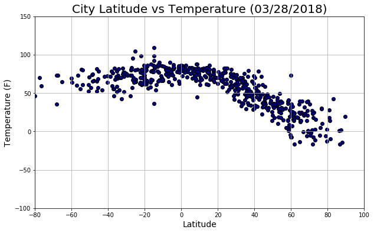
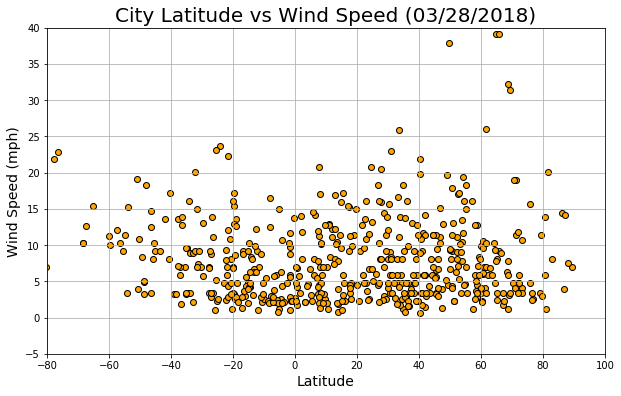

# WeatherPy

### Analysis
-  Looking at the City Latitude vs Temperature scatterplot, it is made evident that the closer a city is to the equator (x-value = 0), the higher the temperature of the city is.
-  In City Latitude vs Humidity scatterplot, we see that there is no true correlation between a city's humidity and its latitude. Visualization shows that there are cities ranging from latitude -50 to latitude 70 that all have 100% humidity. 
-  Cloudiness % also does not appear to have a correlation to a city's latitude. However, a large population of the data had 0% cloudiness. Those cities may tend to be higher in temperature since there is no cloud coverage. Just a theory however.... would need further analysis to be determined. 
-  The majority of the randomly selected cities had a wind speed in the range of 0-10 mph. However, cities equal distance from the equator (latitudes -20 to -40; latitudes 20 to 40), on average, had a higher wind speed, reaching top speeds of over 35 mph.


```python
#Install citipy library
!pip install citipy

#Dependencies
import pandas as pd
import numpy as np
import seaborn as sns
import matplotlib.pyplot as plt
import requests
import time

from citipy import citipy
from pprint import pprint

#Import API key for OpenWeatherMapy
from config import owm_key
```

    Requirement already satisfied: citipy in c:\users\austi\anaconda3\envs\pythondata\lib\site-packages
    Requirement already satisfied: kdtree>=0.12 in c:\users\austi\anaconda3\envs\pythondata\lib\site-packages (from citipy)
    

    You are using pip version 9.0.1, however version 9.0.3 is available.
    You should consider upgrading via the 'python -m pip install --upgrade pip' command.
    

### Generate Cities List


```python
#Create DataFrame
cities_df = pd.DataFrame()

#Add columns for City and Country
cities_df["City"] = ""
cities_df["Country"] = ""

#Generate 500+ random latitudes and longitudes, then add new columns and values to Dataframe
cities_df["Latitude"] = np.random.uniform(low=-90, high=90, size=1500)
cities_df["Longitude"] = np.random.uniform(low=-180, high=180, size=1500)
cities_df = round(cities_df, 2)

#Add columns to DataFrame for wanted values
cities_df["Temperature (F)"] = ""
cities_df["Humidity (%)"] = ""
cities_df["Cloudiness (%)"] = ""
cities_df["Wind Speed (mph)"] = ""

#Find and add nearest city & country based on the randomly selected lat and lng
for index, row in cities_df.iterrows():
    lat = row["Latitude"]
    lng = row["Longitude"]
    cities_df.set_value(index, "City", citipy.nearest_city(lat, lng).city_name)
    cities_df.set_value(index, "Country", citipy.nearest_city(lat, lng).country_code)

#Drop duplicate cities
cities_df.drop_duplicates(["City", "Country"], inplace=True)
cities_df.reset_index(inplace=True)

#Delete unneccesary column for aesthetics 
del cities_df["index"]

#Display updated DataFrame
cities_df.head()
```

    C:\Users\austi\Anaconda3\envs\PythonData\lib\site-packages\ipykernel_launcher.py:23: FutureWarning: set_value is deprecated and will be removed in a future release. Please use .at[] or .iat[] accessors instead
    C:\Users\austi\Anaconda3\envs\PythonData\lib\site-packages\ipykernel_launcher.py:24: FutureWarning: set_value is deprecated and will be removed in a future release. Please use .at[] or .iat[] accessors instead
    


<div>
<style scoped>
    .dataframe tbody tr th:only-of-type {
        vertical-align: middle;
    }

    .dataframe tbody tr th {
        vertical-align: top;
    }

    .dataframe thead th {
        text-align: right;
    }
</style>
<table border="1" class="dataframe">
  <thead>
    <tr style="text-align: right;">
      <th></th>
      <th>City</th>
      <th>Country</th>
      <th>Latitude</th>
      <th>Longitude</th>
      <th>Temperature (F)</th>
      <th>Humidity (%)</th>
      <th>Cloudiness (%)</th>
      <th>Wind Speed (mph)</th>
    </tr>
  </thead>
  <tbody>
    <tr>
      <th>0</th>
      <td>severo-kurilsk</td>
      <td>ru</td>
      <td>37.91</td>
      <td>164.52</td>
      <td></td>
      <td></td>
      <td></td>
      <td></td>
    </tr>
    <tr>
      <th>1</th>
      <td>sakakah</td>
      <td>sa</td>
      <td>29.25</td>
      <td>40.84</td>
      <td></td>
      <td></td>
      <td></td>
      <td></td>
    </tr>
    <tr>
      <th>2</th>
      <td>bluff</td>
      <td>nz</td>
      <td>-76.56</td>
      <td>152.80</td>
      <td></td>
      <td></td>
      <td></td>
      <td></td>
    </tr>
    <tr>
      <th>3</th>
      <td>codrington</td>
      <td>ag</td>
      <td>24.48</td>
      <td>-52.29</td>
      <td></td>
      <td></td>
      <td></td>
      <td></td>
    </tr>
    <tr>
      <th>4</th>
      <td>rikitea</td>
      <td>pf</td>
      <td>-19.14</td>
      <td>-111.31</td>
      <td></td>
      <td></td>
      <td></td>
      <td></td>
    </tr>
  </tbody>
</table>
</div>


```python
#Check to be sure we have 500+ cities for dataset
len(cities_df)
```


    616


### Perform API Calls


```python
#Config info
units = "imperial"

#Access the data from openweathermapy
print("Beginning Data Retrieval")
print("---------------------------------------------------------------")

for index, row in cities_df.iterrows():
    #Target URL
    query_url = "http://api.openweathermap.org/data/2.5/weather?q=%s,%s&units=%s&appid=%s" % (row["City"], row["Country"], units, owm_key)
    
    #Print log of cities being processed
    print(f"Now retrieving City #" + str(index) + ": " + row["City"] + ", " + row["Country"])
    print(query_url)
    
    #Run requests to API
    weather_data = requests.get(query_url).json()
    
    #Use exceptional handling  to calculate and append values to DataFrame
    try:
        response = weather_data
        cities_df.set_value(index, "Temperature (F)", response["main"]["temp"])
        cities_df.set_value(index, "Humidity (%)", response["main"]["humidity"])
        cities_df.set_value(index, "Cloudiness (%)", response["clouds"]["all"])
        cities_df.set_value(index, "Wind Speed (mph)", response["wind"]["speed"])
    except:
        print("Error with city data... Skipping")
    
    
print("---------------------------------------------------------------")
print("Data Retrieval Complete")
print("---------------------------------------------------------------")  

#Covert strings to floats for DataFrame
columns = ["Latitude", "Longitude", "Temperature (F)", "Humidity (%)", "Cloudiness (%)", "Wind Speed (mph)"]
for column in columns:
    cities_df[column] = pd.to_numeric(cities_df[column], errors="coerce")
```

    Beginning Data Retrieval
    ---------------------------------------------------------------
    Now retrieving City #0: severo-kurilsk, ru
    http://api.openweathermap.org/data/2.5/weather?q=severo-kurilsk,ru&units=imperial&appid=bec2deb1e63f486b3e900db56c9f377f
    Now retrieving City #1: sakakah, sa
    http://api.openweathermap.org/data/2.5/weather?q=sakakah,sa&units=imperial&appid=bec2deb1e63f486b3e900db56c9f377f
    Error with city data... Skipping
    Now retrieving City #2: bluff, nz
    http://api.openweathermap.org/data/2.5/weather?q=bluff,nz&units=imperial&appid=bec2deb1e63f486b3e900db56c9f377f
    Now retrieving City #3: codrington, ag
    http://api.openweathermap.org/data/2.5/weather?q=codrington,ag&units=imperial&appid=bec2deb1e63f486b3e900db56c9f377f
    

    C:\Users\austi\Anaconda3\envs\PythonData\lib\site-packages\ipykernel_launcher.py:22: FutureWarning: set_value is deprecated and will be removed in a future release. Please use .at[] or .iat[] accessors instead
    C:\Users\austi\Anaconda3\envs\PythonData\lib\site-packages\ipykernel_launcher.py:23: FutureWarning: set_value is deprecated and will be removed in a future release. Please use .at[] or .iat[] accessors instead
    C:\Users\austi\Anaconda3\envs\PythonData\lib\site-packages\ipykernel_launcher.py:24: FutureWarning: set_value is deprecated and will be removed in a future release. Please use .at[] or .iat[] accessors instead
    C:\Users\austi\Anaconda3\envs\PythonData\lib\site-packages\ipykernel_launcher.py:25: FutureWarning: set_value is deprecated and will be removed in a future release. Please use .at[] or .iat[] accessors instead
    

    Error with city data... Skipping
    Now retrieving City #4: rikitea, pf
    http://api.openweathermap.org/data/2.5/weather?q=rikitea,pf&units=imperial&appid=bec2deb1e63f486b3e900db56c9f377f
    Now retrieving City #5: yingcheng, cn
    http://api.openweathermap.org/data/2.5/weather?q=yingcheng,cn&units=imperial&appid=bec2deb1e63f486b3e900db56c9f377f
    Now retrieving City #6: matagami, ca
    http://api.openweathermap.org/data/2.5/weather?q=matagami,ca&units=imperial&appid=bec2deb1e63f486b3e900db56c9f377f
    Now retrieving City #7: arraial do cabo, br
    http://api.openweathermap.org/data/2.5/weather?q=arraial do cabo,br&units=imperial&appid=bec2deb1e63f486b3e900db56c9f377f
    Now retrieving City #8: kapaa, us
    http://api.openweathermap.org/data/2.5/weather?q=kapaa,us&units=imperial&appid=bec2deb1e63f486b3e900db56c9f377f
    Now retrieving City #9: cape town, za
    http://api.openweathermap.org/data/2.5/weather?q=cape town,za&units=imperial&appid=bec2deb1e63f486b3e900db56c9f377f
    Now retrieving City #10: dingle, ie
    http://api.openweathermap.org/data/2.5/weather?q=dingle,ie&units=imperial&appid=bec2deb1e63f486b3e900db56c9f377f
    Now retrieving City #11: illoqqortoormiut, gl
    http://api.openweathermap.org/data/2.5/weather?q=illoqqortoormiut,gl&units=imperial&appid=bec2deb1e63f486b3e900db56c9f377f
    Error with city data... Skipping
    Now retrieving City #12: vaini, to
    http://api.openweathermap.org/data/2.5/weather?q=vaini,to&units=imperial&appid=bec2deb1e63f486b3e900db56c9f377f
    Now retrieving City #13: salalah, om
    http://api.openweathermap.org/data/2.5/weather?q=salalah,om&units=imperial&appid=bec2deb1e63f486b3e900db56c9f377f
    Now retrieving City #14: bud, no
    http://api.openweathermap.org/data/2.5/weather?q=bud,no&units=imperial&appid=bec2deb1e63f486b3e900db56c9f377f
    Now retrieving City #15: hilo, us
    http://api.openweathermap.org/data/2.5/weather?q=hilo,us&units=imperial&appid=bec2deb1e63f486b3e900db56c9f377f
    Now retrieving City #16: saint-joseph, re
    http://api.openweathermap.org/data/2.5/weather?q=saint-joseph,re&units=imperial&appid=bec2deb1e63f486b3e900db56c9f377f
    Now retrieving City #17: carnarvon, au
    http://api.openweathermap.org/data/2.5/weather?q=carnarvon,au&units=imperial&appid=bec2deb1e63f486b3e900db56c9f377f
    Now retrieving City #18: mecca, sa
    http://api.openweathermap.org/data/2.5/weather?q=mecca,sa&units=imperial&appid=bec2deb1e63f486b3e900db56c9f377f
    Now retrieving City #19: souillac, mu
    http://api.openweathermap.org/data/2.5/weather?q=souillac,mu&units=imperial&appid=bec2deb1e63f486b3e900db56c9f377f
    Now retrieving City #20: komsomolskiy, ru
    http://api.openweathermap.org/data/2.5/weather?q=komsomolskiy,ru&units=imperial&appid=bec2deb1e63f486b3e900db56c9f377f
    Now retrieving City #21: airai, pw
    http://api.openweathermap.org/data/2.5/weather?q=airai,pw&units=imperial&appid=bec2deb1e63f486b3e900db56c9f377f
    Error with city data... Skipping
    Now retrieving City #22: boshan, cn
    http://api.openweathermap.org/data/2.5/weather?q=boshan,cn&units=imperial&appid=bec2deb1e63f486b3e900db56c9f377f
    Now retrieving City #23: dikson, ru
    http://api.openweathermap.org/data/2.5/weather?q=dikson,ru&units=imperial&appid=bec2deb1e63f486b3e900db56c9f377f
    Now retrieving City #24: punta arenas, cl
    http://api.openweathermap.org/data/2.5/weather?q=punta arenas,cl&units=imperial&appid=bec2deb1e63f486b3e900db56c9f377f
    Now retrieving City #25: nalut, ly
    http://api.openweathermap.org/data/2.5/weather?q=nalut,ly&units=imperial&appid=bec2deb1e63f486b3e900db56c9f377f
    Now retrieving City #26: kirakira, sb
    http://api.openweathermap.org/data/2.5/weather?q=kirakira,sb&units=imperial&appid=bec2deb1e63f486b3e900db56c9f377f
    Now retrieving City #27: tuktoyaktuk, ca
    http://api.openweathermap.org/data/2.5/weather?q=tuktoyaktuk,ca&units=imperial&appid=bec2deb1e63f486b3e900db56c9f377f
    Now retrieving City #28: grand river south east, mu
    http://api.openweathermap.org/data/2.5/weather?q=grand river south east,mu&units=imperial&appid=bec2deb1e63f486b3e900db56c9f377f
    Error with city data... Skipping
    Now retrieving City #29: nizhneyansk, ru
    http://api.openweathermap.org/data/2.5/weather?q=nizhneyansk,ru&units=imperial&appid=bec2deb1e63f486b3e900db56c9f377f
    Error with city data... Skipping
    Now retrieving City #30: wilmington, us
    http://api.openweathermap.org/data/2.5/weather?q=wilmington,us&units=imperial&appid=bec2deb1e63f486b3e900db56c9f377f
    Now retrieving City #31: longjiang, cn
    http://api.openweathermap.org/data/2.5/weather?q=longjiang,cn&units=imperial&appid=bec2deb1e63f486b3e900db56c9f377f
    Now retrieving City #32: cabo san lucas, mx
    http://api.openweathermap.org/data/2.5/weather?q=cabo san lucas,mx&units=imperial&appid=bec2deb1e63f486b3e900db56c9f377f
    Now retrieving City #33: east london, za
    http://api.openweathermap.org/data/2.5/weather?q=east london,za&units=imperial&appid=bec2deb1e63f486b3e900db56c9f377f
    Now retrieving City #34: tuggurt, dz
    http://api.openweathermap.org/data/2.5/weather?q=tuggurt,dz&units=imperial&appid=bec2deb1e63f486b3e900db56c9f377f
    Error with city data... Skipping
    Now retrieving City #35: chokurdakh, ru
    http://api.openweathermap.org/data/2.5/weather?q=chokurdakh,ru&units=imperial&appid=bec2deb1e63f486b3e900db56c9f377f
    Now retrieving City #36: castro, cl
    http://api.openweathermap.org/data/2.5/weather?q=castro,cl&units=imperial&appid=bec2deb1e63f486b3e900db56c9f377f
    Now retrieving City #37: matara, lk
    http://api.openweathermap.org/data/2.5/weather?q=matara,lk&units=imperial&appid=bec2deb1e63f486b3e900db56c9f377f
    Now retrieving City #38: tallahassee, us
    http://api.openweathermap.org/data/2.5/weather?q=tallahassee,us&units=imperial&appid=bec2deb1e63f486b3e900db56c9f377f
    Now retrieving City #39: hirado, jp
    http://api.openweathermap.org/data/2.5/weather?q=hirado,jp&units=imperial&appid=bec2deb1e63f486b3e900db56c9f377f
    Now retrieving City #40: tasiilaq, gl
    http://api.openweathermap.org/data/2.5/weather?q=tasiilaq,gl&units=imperial&appid=bec2deb1e63f486b3e900db56c9f377f
    Now retrieving City #41: kosgi, in
    http://api.openweathermap.org/data/2.5/weather?q=kosgi,in&units=imperial&appid=bec2deb1e63f486b3e900db56c9f377f
    Error with city data... Skipping
    Now retrieving City #42: raduzhnyy, ru
    http://api.openweathermap.org/data/2.5/weather?q=raduzhnyy,ru&units=imperial&appid=bec2deb1e63f486b3e900db56c9f377f
    Now retrieving City #43: orgun, af
    http://api.openweathermap.org/data/2.5/weather?q=orgun,af&units=imperial&appid=bec2deb1e63f486b3e900db56c9f377f
    Error with city data... Skipping
    Now retrieving City #44: porto novo, cv
    http://api.openweathermap.org/data/2.5/weather?q=porto novo,cv&units=imperial&appid=bec2deb1e63f486b3e900db56c9f377f
    Now retrieving City #45: saint-philippe, re
    http://api.openweathermap.org/data/2.5/weather?q=saint-philippe,re&units=imperial&appid=bec2deb1e63f486b3e900db56c9f377f
    Now retrieving City #46: chuguyevka, ru
    http://api.openweathermap.org/data/2.5/weather?q=chuguyevka,ru&units=imperial&appid=bec2deb1e63f486b3e900db56c9f377f
    Now retrieving City #47: new norfolk, au
    http://api.openweathermap.org/data/2.5/weather?q=new norfolk,au&units=imperial&appid=bec2deb1e63f486b3e900db56c9f377f
    Now retrieving City #48: bethel, us
    http://api.openweathermap.org/data/2.5/weather?q=bethel,us&units=imperial&appid=bec2deb1e63f486b3e900db56c9f377f
    Now retrieving City #49: jamestown, sh
    http://api.openweathermap.org/data/2.5/weather?q=jamestown,sh&units=imperial&appid=bec2deb1e63f486b3e900db56c9f377f
    Now retrieving City #50: belmonte, br
    http://api.openweathermap.org/data/2.5/weather?q=belmonte,br&units=imperial&appid=bec2deb1e63f486b3e900db56c9f377f
    Now retrieving City #51: prince george, ca
    http://api.openweathermap.org/data/2.5/weather?q=prince george,ca&units=imperial&appid=bec2deb1e63f486b3e900db56c9f377f
    Now retrieving City #52: moskovskiy, tj
    http://api.openweathermap.org/data/2.5/weather?q=moskovskiy,tj&units=imperial&appid=bec2deb1e63f486b3e900db56c9f377f
    Error with city data... Skipping
    Now retrieving City #53: mataura, pf
    http://api.openweathermap.org/data/2.5/weather?q=mataura,pf&units=imperial&appid=bec2deb1e63f486b3e900db56c9f377f
    Error with city data... Skipping
    Now retrieving City #54: marawi, sd
    http://api.openweathermap.org/data/2.5/weather?q=marawi,sd&units=imperial&appid=bec2deb1e63f486b3e900db56c9f377f
    Now retrieving City #55: albany, au
    http://api.openweathermap.org/data/2.5/weather?q=albany,au&units=imperial&appid=bec2deb1e63f486b3e900db56c9f377f
    Now retrieving City #56: karwar, in
    http://api.openweathermap.org/data/2.5/weather?q=karwar,in&units=imperial&appid=bec2deb1e63f486b3e900db56c9f377f
    Now retrieving City #57: ushuaia, ar
    http://api.openweathermap.org/data/2.5/weather?q=ushuaia,ar&units=imperial&appid=bec2deb1e63f486b3e900db56c9f377f
    Now retrieving City #58: torbay, ca
    http://api.openweathermap.org/data/2.5/weather?q=torbay,ca&units=imperial&appid=bec2deb1e63f486b3e900db56c9f377f
    Now retrieving City #59: coquimbo, cl
    http://api.openweathermap.org/data/2.5/weather?q=coquimbo,cl&units=imperial&appid=bec2deb1e63f486b3e900db56c9f377f
    Now retrieving City #60: karkaralinsk, kz
    http://api.openweathermap.org/data/2.5/weather?q=karkaralinsk,kz&units=imperial&appid=bec2deb1e63f486b3e900db56c9f377f
    Error with city data... Skipping
    Now retrieving City #61: port blair, in
    http://api.openweathermap.org/data/2.5/weather?q=port blair,in&units=imperial&appid=bec2deb1e63f486b3e900db56c9f377f
    Now retrieving City #62: kruisfontein, za
    http://api.openweathermap.org/data/2.5/weather?q=kruisfontein,za&units=imperial&appid=bec2deb1e63f486b3e900db56c9f377f
    Now retrieving City #63: hofn, is
    http://api.openweathermap.org/data/2.5/weather?q=hofn,is&units=imperial&appid=bec2deb1e63f486b3e900db56c9f377f
    Now retrieving City #64: khani, ru
    http://api.openweathermap.org/data/2.5/weather?q=khani,ru&units=imperial&appid=bec2deb1e63f486b3e900db56c9f377f
    Error with city data... Skipping
    Now retrieving City #65: bredasdorp, za
    http://api.openweathermap.org/data/2.5/weather?q=bredasdorp,za&units=imperial&appid=bec2deb1e63f486b3e900db56c9f377f
    Now retrieving City #66: vao, nc
    http://api.openweathermap.org/data/2.5/weather?q=vao,nc&units=imperial&appid=bec2deb1e63f486b3e900db56c9f377f
    Now retrieving City #67: portland, au
    http://api.openweathermap.org/data/2.5/weather?q=portland,au&units=imperial&appid=bec2deb1e63f486b3e900db56c9f377f
    Now retrieving City #68: busselton, au
    http://api.openweathermap.org/data/2.5/weather?q=busselton,au&units=imperial&appid=bec2deb1e63f486b3e900db56c9f377f
    Now retrieving City #69: qaanaaq, gl
    http://api.openweathermap.org/data/2.5/weather?q=qaanaaq,gl&units=imperial&appid=bec2deb1e63f486b3e900db56c9f377f
    Now retrieving City #70: coahuayana, mx
    http://api.openweathermap.org/data/2.5/weather?q=coahuayana,mx&units=imperial&appid=bec2deb1e63f486b3e900db56c9f377f
    Now retrieving City #71: vila velha, br
    http://api.openweathermap.org/data/2.5/weather?q=vila velha,br&units=imperial&appid=bec2deb1e63f486b3e900db56c9f377f
    Now retrieving City #72: taolanaro, mg
    http://api.openweathermap.org/data/2.5/weather?q=taolanaro,mg&units=imperial&appid=bec2deb1e63f486b3e900db56c9f377f
    Error with city data... Skipping
    Now retrieving City #73: ponta do sol, cv
    http://api.openweathermap.org/data/2.5/weather?q=ponta do sol,cv&units=imperial&appid=bec2deb1e63f486b3e900db56c9f377f
    Now retrieving City #74: conceicao das alagoas, br
    http://api.openweathermap.org/data/2.5/weather?q=conceicao das alagoas,br&units=imperial&appid=bec2deb1e63f486b3e900db56c9f377f
    Now retrieving City #75: hereford, us
    http://api.openweathermap.org/data/2.5/weather?q=hereford,us&units=imperial&appid=bec2deb1e63f486b3e900db56c9f377f
    Now retrieving City #76: saskylakh, ru
    http://api.openweathermap.org/data/2.5/weather?q=saskylakh,ru&units=imperial&appid=bec2deb1e63f486b3e900db56c9f377f
    Now retrieving City #77: korla, cn
    http://api.openweathermap.org/data/2.5/weather?q=korla,cn&units=imperial&appid=bec2deb1e63f486b3e900db56c9f377f
    Now retrieving City #78: honiara, sb
    http://api.openweathermap.org/data/2.5/weather?q=honiara,sb&units=imperial&appid=bec2deb1e63f486b3e900db56c9f377f
    Now retrieving City #79: chuy, uy
    http://api.openweathermap.org/data/2.5/weather?q=chuy,uy&units=imperial&appid=bec2deb1e63f486b3e900db56c9f377f
    Now retrieving City #80: alekseyevsk, ru
    http://api.openweathermap.org/data/2.5/weather?q=alekseyevsk,ru&units=imperial&appid=bec2deb1e63f486b3e900db56c9f377f
    Now retrieving City #81: hobart, au
    http://api.openweathermap.org/data/2.5/weather?q=hobart,au&units=imperial&appid=bec2deb1e63f486b3e900db56c9f377f
    Now retrieving City #82: port alfred, za
    http://api.openweathermap.org/data/2.5/weather?q=port alfred,za&units=imperial&appid=bec2deb1e63f486b3e900db56c9f377f
    Now retrieving City #83: barrow, us
    http://api.openweathermap.org/data/2.5/weather?q=barrow,us&units=imperial&appid=bec2deb1e63f486b3e900db56c9f377f
    Now retrieving City #84: hami, cn
    http://api.openweathermap.org/data/2.5/weather?q=hami,cn&units=imperial&appid=bec2deb1e63f486b3e900db56c9f377f
    Now retrieving City #85: mys shmidta, ru
    http://api.openweathermap.org/data/2.5/weather?q=mys shmidta,ru&units=imperial&appid=bec2deb1e63f486b3e900db56c9f377f
    Error with city data... Skipping
    Now retrieving City #86: otjimbingwe, na
    http://api.openweathermap.org/data/2.5/weather?q=otjimbingwe,na&units=imperial&appid=bec2deb1e63f486b3e900db56c9f377f
    Now retrieving City #87: kununurra, au
    http://api.openweathermap.org/data/2.5/weather?q=kununurra,au&units=imperial&appid=bec2deb1e63f486b3e900db56c9f377f
    Now retrieving City #88: tabiauea, ki
    http://api.openweathermap.org/data/2.5/weather?q=tabiauea,ki&units=imperial&appid=bec2deb1e63f486b3e900db56c9f377f
    Error with city data... Skipping
    Now retrieving City #89: ferkessedougou, ci
    http://api.openweathermap.org/data/2.5/weather?q=ferkessedougou,ci&units=imperial&appid=bec2deb1e63f486b3e900db56c9f377f
    Now retrieving City #90: barentsburg, sj
    http://api.openweathermap.org/data/2.5/weather?q=barentsburg,sj&units=imperial&appid=bec2deb1e63f486b3e900db56c9f377f
    Error with city data... Skipping
    Now retrieving City #91: fundacion, co
    http://api.openweathermap.org/data/2.5/weather?q=fundacion,co&units=imperial&appid=bec2deb1e63f486b3e900db56c9f377f
    Now retrieving City #92: mar del plata, ar
    http://api.openweathermap.org/data/2.5/weather?q=mar del plata,ar&units=imperial&appid=bec2deb1e63f486b3e900db56c9f377f
    Now retrieving City #93: cairns, au
    http://api.openweathermap.org/data/2.5/weather?q=cairns,au&units=imperial&appid=bec2deb1e63f486b3e900db56c9f377f
    Now retrieving City #94: padang, id
    http://api.openweathermap.org/data/2.5/weather?q=padang,id&units=imperial&appid=bec2deb1e63f486b3e900db56c9f377f
    Now retrieving City #95: tomatlan, mx
    http://api.openweathermap.org/data/2.5/weather?q=tomatlan,mx&units=imperial&appid=bec2deb1e63f486b3e900db56c9f377f
    Now retrieving City #96: riyadh, sa
    http://api.openweathermap.org/data/2.5/weather?q=riyadh,sa&units=imperial&appid=bec2deb1e63f486b3e900db56c9f377f
    Now retrieving City #97: kumluca, tr
    http://api.openweathermap.org/data/2.5/weather?q=kumluca,tr&units=imperial&appid=bec2deb1e63f486b3e900db56c9f377f
    Now retrieving City #98: lunca ilvei, ro
    http://api.openweathermap.org/data/2.5/weather?q=lunca ilvei,ro&units=imperial&appid=bec2deb1e63f486b3e900db56c9f377f
    Now retrieving City #99: ayaviri, pe
    http://api.openweathermap.org/data/2.5/weather?q=ayaviri,pe&units=imperial&appid=bec2deb1e63f486b3e900db56c9f377f
    Now retrieving City #100: pimenta bueno, br
    http://api.openweathermap.org/data/2.5/weather?q=pimenta bueno,br&units=imperial&appid=bec2deb1e63f486b3e900db56c9f377f
    Now retrieving City #101: ahipara, nz
    http://api.openweathermap.org/data/2.5/weather?q=ahipara,nz&units=imperial&appid=bec2deb1e63f486b3e900db56c9f377f
    Now retrieving City #102: udachnyy, ru
    http://api.openweathermap.org/data/2.5/weather?q=udachnyy,ru&units=imperial&appid=bec2deb1e63f486b3e900db56c9f377f
    Now retrieving City #103: sentyabrskiy, ru
    http://api.openweathermap.org/data/2.5/weather?q=sentyabrskiy,ru&units=imperial&appid=bec2deb1e63f486b3e900db56c9f377f
    Error with city data... Skipping
    Now retrieving City #104: zhanaozen, kz
    http://api.openweathermap.org/data/2.5/weather?q=zhanaozen,kz&units=imperial&appid=bec2deb1e63f486b3e900db56c9f377f
    Now retrieving City #105: buchanan, lr
    http://api.openweathermap.org/data/2.5/weather?q=buchanan,lr&units=imperial&appid=bec2deb1e63f486b3e900db56c9f377f
    Now retrieving City #106: atuona, pf
    http://api.openweathermap.org/data/2.5/weather?q=atuona,pf&units=imperial&appid=bec2deb1e63f486b3e900db56c9f377f
    Now retrieving City #107: harper, lr
    http://api.openweathermap.org/data/2.5/weather?q=harper,lr&units=imperial&appid=bec2deb1e63f486b3e900db56c9f377f
    Now retrieving City #108: warqla, dz
    http://api.openweathermap.org/data/2.5/weather?q=warqla,dz&units=imperial&appid=bec2deb1e63f486b3e900db56c9f377f
    Error with city data... Skipping
    Now retrieving City #109: north myrtle beach, us
    http://api.openweathermap.org/data/2.5/weather?q=north myrtle beach,us&units=imperial&appid=bec2deb1e63f486b3e900db56c9f377f
    Now retrieving City #110: beypur, in
    http://api.openweathermap.org/data/2.5/weather?q=beypur,in&units=imperial&appid=bec2deb1e63f486b3e900db56c9f377f
    Error with city data... Skipping
    Now retrieving City #111: puerto ayora, ec
    http://api.openweathermap.org/data/2.5/weather?q=puerto ayora,ec&units=imperial&appid=bec2deb1e63f486b3e900db56c9f377f
    Now retrieving City #112: grandview, us
    http://api.openweathermap.org/data/2.5/weather?q=grandview,us&units=imperial&appid=bec2deb1e63f486b3e900db56c9f377f
    Now retrieving City #113: lavrentiya, ru
    http://api.openweathermap.org/data/2.5/weather?q=lavrentiya,ru&units=imperial&appid=bec2deb1e63f486b3e900db56c9f377f
    Now retrieving City #114: constitucion, mx
    http://api.openweathermap.org/data/2.5/weather?q=constitucion,mx&units=imperial&appid=bec2deb1e63f486b3e900db56c9f377f
    Now retrieving City #115: vardo, no
    http://api.openweathermap.org/data/2.5/weather?q=vardo,no&units=imperial&appid=bec2deb1e63f486b3e900db56c9f377f
    Now retrieving City #116: isangel, vu
    http://api.openweathermap.org/data/2.5/weather?q=isangel,vu&units=imperial&appid=bec2deb1e63f486b3e900db56c9f377f
    Now retrieving City #117: mogadishu, so
    http://api.openweathermap.org/data/2.5/weather?q=mogadishu,so&units=imperial&appid=bec2deb1e63f486b3e900db56c9f377f
    Now retrieving City #118: kot samaba, pk
    http://api.openweathermap.org/data/2.5/weather?q=kot samaba,pk&units=imperial&appid=bec2deb1e63f486b3e900db56c9f377f
    Now retrieving City #119: namatanai, pg
    http://api.openweathermap.org/data/2.5/weather?q=namatanai,pg&units=imperial&appid=bec2deb1e63f486b3e900db56c9f377f
    Now retrieving City #120: yellowknife, ca
    http://api.openweathermap.org/data/2.5/weather?q=yellowknife,ca&units=imperial&appid=bec2deb1e63f486b3e900db56c9f377f
    Now retrieving City #121: victoria, sc
    http://api.openweathermap.org/data/2.5/weather?q=victoria,sc&units=imperial&appid=bec2deb1e63f486b3e900db56c9f377f
    Now retrieving City #122: gizo, sb
    http://api.openweathermap.org/data/2.5/weather?q=gizo,sb&units=imperial&appid=bec2deb1e63f486b3e900db56c9f377f
    Now retrieving City #123: aklavik, ca
    http://api.openweathermap.org/data/2.5/weather?q=aklavik,ca&units=imperial&appid=bec2deb1e63f486b3e900db56c9f377f
    Now retrieving City #124: mount gambier, au
    http://api.openweathermap.org/data/2.5/weather?q=mount gambier,au&units=imperial&appid=bec2deb1e63f486b3e900db56c9f377f
    Now retrieving City #125: ixtapa, mx
    http://api.openweathermap.org/data/2.5/weather?q=ixtapa,mx&units=imperial&appid=bec2deb1e63f486b3e900db56c9f377f
    Now retrieving City #126: pyapon, mm
    http://api.openweathermap.org/data/2.5/weather?q=pyapon,mm&units=imperial&appid=bec2deb1e63f486b3e900db56c9f377f
    Now retrieving City #127: los llanos de aridane, es
    http://api.openweathermap.org/data/2.5/weather?q=los llanos de aridane,es&units=imperial&appid=bec2deb1e63f486b3e900db56c9f377f
    Now retrieving City #128: macenta, gn
    http://api.openweathermap.org/data/2.5/weather?q=macenta,gn&units=imperial&appid=bec2deb1e63f486b3e900db56c9f377f
    Now retrieving City #129: kangaatsiaq, gl
    http://api.openweathermap.org/data/2.5/weather?q=kangaatsiaq,gl&units=imperial&appid=bec2deb1e63f486b3e900db56c9f377f
    Now retrieving City #130: bur gabo, so
    http://api.openweathermap.org/data/2.5/weather?q=bur gabo,so&units=imperial&appid=bec2deb1e63f486b3e900db56c9f377f
    Error with city data... Skipping
    Now retrieving City #131: longyearbyen, sj
    http://api.openweathermap.org/data/2.5/weather?q=longyearbyen,sj&units=imperial&appid=bec2deb1e63f486b3e900db56c9f377f
    Now retrieving City #132: gisborne, nz
    http://api.openweathermap.org/data/2.5/weather?q=gisborne,nz&units=imperial&appid=bec2deb1e63f486b3e900db56c9f377f
    Now retrieving City #133: maniitsoq, gl
    http://api.openweathermap.org/data/2.5/weather?q=maniitsoq,gl&units=imperial&appid=bec2deb1e63f486b3e900db56c9f377f
    Now retrieving City #134: faanui, pf
    http://api.openweathermap.org/data/2.5/weather?q=faanui,pf&units=imperial&appid=bec2deb1e63f486b3e900db56c9f377f
    Now retrieving City #135: quang ngai, vn
    http://api.openweathermap.org/data/2.5/weather?q=quang ngai,vn&units=imperial&appid=bec2deb1e63f486b3e900db56c9f377f
    Now retrieving City #136: belushya guba, ru
    http://api.openweathermap.org/data/2.5/weather?q=belushya guba,ru&units=imperial&appid=bec2deb1e63f486b3e900db56c9f377f
    Error with city data... Skipping
    Now retrieving City #137: neyshabur, ir
    http://api.openweathermap.org/data/2.5/weather?q=neyshabur,ir&units=imperial&appid=bec2deb1e63f486b3e900db56c9f377f
    Now retrieving City #138: soderhamn, se
    http://api.openweathermap.org/data/2.5/weather?q=soderhamn,se&units=imperial&appid=bec2deb1e63f486b3e900db56c9f377f
    Now retrieving City #139: hermanus, za
    http://api.openweathermap.org/data/2.5/weather?q=hermanus,za&units=imperial&appid=bec2deb1e63f486b3e900db56c9f377f
    Now retrieving City #140: luderitz, na
    http://api.openweathermap.org/data/2.5/weather?q=luderitz,na&units=imperial&appid=bec2deb1e63f486b3e900db56c9f377f
    Now retrieving City #141: lorengau, pg
    http://api.openweathermap.org/data/2.5/weather?q=lorengau,pg&units=imperial&appid=bec2deb1e63f486b3e900db56c9f377f
    Now retrieving City #142: nanortalik, gl
    http://api.openweathermap.org/data/2.5/weather?q=nanortalik,gl&units=imperial&appid=bec2deb1e63f486b3e900db56c9f377f
    Now retrieving City #143: avarua, ck
    http://api.openweathermap.org/data/2.5/weather?q=avarua,ck&units=imperial&appid=bec2deb1e63f486b3e900db56c9f377f
    Now retrieving City #144: ngunguru, nz
    http://api.openweathermap.org/data/2.5/weather?q=ngunguru,nz&units=imperial&appid=bec2deb1e63f486b3e900db56c9f377f
    Now retrieving City #145: fairbanks, us
    http://api.openweathermap.org/data/2.5/weather?q=fairbanks,us&units=imperial&appid=bec2deb1e63f486b3e900db56c9f377f
    Now retrieving City #146: takoradi, gh
    http://api.openweathermap.org/data/2.5/weather?q=takoradi,gh&units=imperial&appid=bec2deb1e63f486b3e900db56c9f377f
    Now retrieving City #147: uusikaupunki, fi
    http://api.openweathermap.org/data/2.5/weather?q=uusikaupunki,fi&units=imperial&appid=bec2deb1e63f486b3e900db56c9f377f
    Now retrieving City #148: gorontalo, id
    http://api.openweathermap.org/data/2.5/weather?q=gorontalo,id&units=imperial&appid=bec2deb1e63f486b3e900db56c9f377f
    Now retrieving City #149: sinnamary, gf
    http://api.openweathermap.org/data/2.5/weather?q=sinnamary,gf&units=imperial&appid=bec2deb1e63f486b3e900db56c9f377f
    Now retrieving City #150: fort nelson, ca
    http://api.openweathermap.org/data/2.5/weather?q=fort nelson,ca&units=imperial&appid=bec2deb1e63f486b3e900db56c9f377f
    Now retrieving City #151: salinopolis, br
    http://api.openweathermap.org/data/2.5/weather?q=salinopolis,br&units=imperial&appid=bec2deb1e63f486b3e900db56c9f377f
    Now retrieving City #152: te anau, nz
    http://api.openweathermap.org/data/2.5/weather?q=te anau,nz&units=imperial&appid=bec2deb1e63f486b3e900db56c9f377f
    Now retrieving City #153: lagoa, pt
    http://api.openweathermap.org/data/2.5/weather?q=lagoa,pt&units=imperial&appid=bec2deb1e63f486b3e900db56c9f377f
    Now retrieving City #154: bambous virieux, mu
    http://api.openweathermap.org/data/2.5/weather?q=bambous virieux,mu&units=imperial&appid=bec2deb1e63f486b3e900db56c9f377f
    Now retrieving City #155: clyde river, ca
    http://api.openweathermap.org/data/2.5/weather?q=clyde river,ca&units=imperial&appid=bec2deb1e63f486b3e900db56c9f377f
    Now retrieving City #156: tumannyy, ru
    http://api.openweathermap.org/data/2.5/weather?q=tumannyy,ru&units=imperial&appid=bec2deb1e63f486b3e900db56c9f377f
    Error with city data... Skipping
    Now retrieving City #157: lebu, cl
    http://api.openweathermap.org/data/2.5/weather?q=lebu,cl&units=imperial&appid=bec2deb1e63f486b3e900db56c9f377f
    Now retrieving City #158: ossora, ru
    http://api.openweathermap.org/data/2.5/weather?q=ossora,ru&units=imperial&appid=bec2deb1e63f486b3e900db56c9f377f
    Now retrieving City #159: pangoa, pe
    http://api.openweathermap.org/data/2.5/weather?q=pangoa,pe&units=imperial&appid=bec2deb1e63f486b3e900db56c9f377f
    Now retrieving City #160: naliya, in
    http://api.openweathermap.org/data/2.5/weather?q=naliya,in&units=imperial&appid=bec2deb1e63f486b3e900db56c9f377f
    Now retrieving City #161: itarema, br
    http://api.openweathermap.org/data/2.5/weather?q=itarema,br&units=imperial&appid=bec2deb1e63f486b3e900db56c9f377f
    Now retrieving City #162: upernavik, gl
    http://api.openweathermap.org/data/2.5/weather?q=upernavik,gl&units=imperial&appid=bec2deb1e63f486b3e900db56c9f377f
    Now retrieving City #163: honningsvag, no
    http://api.openweathermap.org/data/2.5/weather?q=honningsvag,no&units=imperial&appid=bec2deb1e63f486b3e900db56c9f377f
    Now retrieving City #164: ternate, id
    http://api.openweathermap.org/data/2.5/weather?q=ternate,id&units=imperial&appid=bec2deb1e63f486b3e900db56c9f377f
    Now retrieving City #165: volkhovskiy, ru
    http://api.openweathermap.org/data/2.5/weather?q=volkhovskiy,ru&units=imperial&appid=bec2deb1e63f486b3e900db56c9f377f
    Now retrieving City #166: tukrah, ly
    http://api.openweathermap.org/data/2.5/weather?q=tukrah,ly&units=imperial&appid=bec2deb1e63f486b3e900db56c9f377f
    Error with city data... Skipping
    Now retrieving City #167: vila franca do campo, pt
    http://api.openweathermap.org/data/2.5/weather?q=vila franca do campo,pt&units=imperial&appid=bec2deb1e63f486b3e900db56c9f377f
    Now retrieving City #168: klaksvik, fo
    http://api.openweathermap.org/data/2.5/weather?q=klaksvik,fo&units=imperial&appid=bec2deb1e63f486b3e900db56c9f377f
    Now retrieving City #169: janakpur road, in
    http://api.openweathermap.org/data/2.5/weather?q=janakpur road,in&units=imperial&appid=bec2deb1e63f486b3e900db56c9f377f
    Error with city data... Skipping
    Now retrieving City #170: hithadhoo, mv
    http://api.openweathermap.org/data/2.5/weather?q=hithadhoo,mv&units=imperial&appid=bec2deb1e63f486b3e900db56c9f377f
    Now retrieving City #171: lincoln, nz
    http://api.openweathermap.org/data/2.5/weather?q=lincoln,nz&units=imperial&appid=bec2deb1e63f486b3e900db56c9f377f
    Now retrieving City #172: dovers, vc
    http://api.openweathermap.org/data/2.5/weather?q=dovers,vc&units=imperial&appid=bec2deb1e63f486b3e900db56c9f377f
    Now retrieving City #173: tuatapere, nz
    http://api.openweathermap.org/data/2.5/weather?q=tuatapere,nz&units=imperial&appid=bec2deb1e63f486b3e900db56c9f377f
    Now retrieving City #174: quatre cocos, mu
    http://api.openweathermap.org/data/2.5/weather?q=quatre cocos,mu&units=imperial&appid=bec2deb1e63f486b3e900db56c9f377f
    Now retrieving City #175: sitka, us
    http://api.openweathermap.org/data/2.5/weather?q=sitka,us&units=imperial&appid=bec2deb1e63f486b3e900db56c9f377f
    Now retrieving City #176: nouadhibou, mr
    http://api.openweathermap.org/data/2.5/weather?q=nouadhibou,mr&units=imperial&appid=bec2deb1e63f486b3e900db56c9f377f
    Now retrieving City #177: butaritari, ki
    http://api.openweathermap.org/data/2.5/weather?q=butaritari,ki&units=imperial&appid=bec2deb1e63f486b3e900db56c9f377f
    Now retrieving City #178: misratah, ly
    http://api.openweathermap.org/data/2.5/weather?q=misratah,ly&units=imperial&appid=bec2deb1e63f486b3e900db56c9f377f
    Now retrieving City #179: santo antonio do sudoeste, br
    http://api.openweathermap.org/data/2.5/weather?q=santo antonio do sudoeste,br&units=imperial&appid=bec2deb1e63f486b3e900db56c9f377f
    Now retrieving City #180: srivardhan, in
    http://api.openweathermap.org/data/2.5/weather?q=srivardhan,in&units=imperial&appid=bec2deb1e63f486b3e900db56c9f377f
    Now retrieving City #181: lazaro cardenas, mx
    http://api.openweathermap.org/data/2.5/weather?q=lazaro cardenas,mx&units=imperial&appid=bec2deb1e63f486b3e900db56c9f377f
    Now retrieving City #182: nikolskoye, ru
    http://api.openweathermap.org/data/2.5/weather?q=nikolskoye,ru&units=imperial&appid=bec2deb1e63f486b3e900db56c9f377f
    Now retrieving City #183: georgetown, sh
    http://api.openweathermap.org/data/2.5/weather?q=georgetown,sh&units=imperial&appid=bec2deb1e63f486b3e900db56c9f377f
    Now retrieving City #184: katangli, ru
    http://api.openweathermap.org/data/2.5/weather?q=katangli,ru&units=imperial&appid=bec2deb1e63f486b3e900db56c9f377f
    Now retrieving City #185: linares, cl
    http://api.openweathermap.org/data/2.5/weather?q=linares,cl&units=imperial&appid=bec2deb1e63f486b3e900db56c9f377f
    Now retrieving City #186: husavik, is
    http://api.openweathermap.org/data/2.5/weather?q=husavik,is&units=imperial&appid=bec2deb1e63f486b3e900db56c9f377f
    Now retrieving City #187: khatanga, ru
    http://api.openweathermap.org/data/2.5/weather?q=khatanga,ru&units=imperial&appid=bec2deb1e63f486b3e900db56c9f377f
    Now retrieving City #188: funadhoo, mv
    http://api.openweathermap.org/data/2.5/weather?q=funadhoo,mv&units=imperial&appid=bec2deb1e63f486b3e900db56c9f377f
    Now retrieving City #189: cayenne, gf
    http://api.openweathermap.org/data/2.5/weather?q=cayenne,gf&units=imperial&appid=bec2deb1e63f486b3e900db56c9f377f
    Now retrieving City #190: tsihombe, mg
    http://api.openweathermap.org/data/2.5/weather?q=tsihombe,mg&units=imperial&appid=bec2deb1e63f486b3e900db56c9f377f
    Error with city data... Skipping
    Now retrieving City #191: kuytun, cn
    http://api.openweathermap.org/data/2.5/weather?q=kuytun,cn&units=imperial&appid=bec2deb1e63f486b3e900db56c9f377f
    Error with city data... Skipping
    Now retrieving City #192: thompson, ca
    http://api.openweathermap.org/data/2.5/weather?q=thompson,ca&units=imperial&appid=bec2deb1e63f486b3e900db56c9f377f
    Now retrieving City #193: ndele, cf
    http://api.openweathermap.org/data/2.5/weather?q=ndele,cf&units=imperial&appid=bec2deb1e63f486b3e900db56c9f377f
    Now retrieving City #194: porto belo, br
    http://api.openweathermap.org/data/2.5/weather?q=porto belo,br&units=imperial&appid=bec2deb1e63f486b3e900db56c9f377f
    Now retrieving City #195: jalu, ly
    http://api.openweathermap.org/data/2.5/weather?q=jalu,ly&units=imperial&appid=bec2deb1e63f486b3e900db56c9f377f
    Now retrieving City #196: ampanihy, mg
    http://api.openweathermap.org/data/2.5/weather?q=ampanihy,mg&units=imperial&appid=bec2deb1e63f486b3e900db56c9f377f
    Now retrieving City #197: zeya, ru
    http://api.openweathermap.org/data/2.5/weather?q=zeya,ru&units=imperial&appid=bec2deb1e63f486b3e900db56c9f377f
    Now retrieving City #198: saint george, bm
    http://api.openweathermap.org/data/2.5/weather?q=saint george,bm&units=imperial&appid=bec2deb1e63f486b3e900db56c9f377f
    Now retrieving City #199: huilong, cn
    http://api.openweathermap.org/data/2.5/weather?q=huilong,cn&units=imperial&appid=bec2deb1e63f486b3e900db56c9f377f
    Now retrieving City #200: opuwo, na
    http://api.openweathermap.org/data/2.5/weather?q=opuwo,na&units=imperial&appid=bec2deb1e63f486b3e900db56c9f377f
    Now retrieving City #201: magaria, ne
    http://api.openweathermap.org/data/2.5/weather?q=magaria,ne&units=imperial&appid=bec2deb1e63f486b3e900db56c9f377f
    Now retrieving City #202: russell, nz
    http://api.openweathermap.org/data/2.5/weather?q=russell,nz&units=imperial&appid=bec2deb1e63f486b3e900db56c9f377f
    Now retrieving City #203: thinadhoo, mv
    http://api.openweathermap.org/data/2.5/weather?q=thinadhoo,mv&units=imperial&appid=bec2deb1e63f486b3e900db56c9f377f
    Now retrieving City #204: norman wells, ca
    http://api.openweathermap.org/data/2.5/weather?q=norman wells,ca&units=imperial&appid=bec2deb1e63f486b3e900db56c9f377f
    Now retrieving City #205: eidfjord, no
    http://api.openweathermap.org/data/2.5/weather?q=eidfjord,no&units=imperial&appid=bec2deb1e63f486b3e900db56c9f377f
    Now retrieving City #206: kahului, us
    http://api.openweathermap.org/data/2.5/weather?q=kahului,us&units=imperial&appid=bec2deb1e63f486b3e900db56c9f377f
    Now retrieving City #207: roma, au
    http://api.openweathermap.org/data/2.5/weather?q=roma,au&units=imperial&appid=bec2deb1e63f486b3e900db56c9f377f
    Now retrieving City #208: shangrao, cn
    http://api.openweathermap.org/data/2.5/weather?q=shangrao,cn&units=imperial&appid=bec2deb1e63f486b3e900db56c9f377f
    Now retrieving City #209: qabis, tn
    http://api.openweathermap.org/data/2.5/weather?q=qabis,tn&units=imperial&appid=bec2deb1e63f486b3e900db56c9f377f
    Error with city data... Skipping
    Now retrieving City #210: ribeira grande, pt
    http://api.openweathermap.org/data/2.5/weather?q=ribeira grande,pt&units=imperial&appid=bec2deb1e63f486b3e900db56c9f377f
    Now retrieving City #211: rocky mountain house, ca
    http://api.openweathermap.org/data/2.5/weather?q=rocky mountain house,ca&units=imperial&appid=bec2deb1e63f486b3e900db56c9f377f
    Now retrieving City #212: yerbogachen, ru
    http://api.openweathermap.org/data/2.5/weather?q=yerbogachen,ru&units=imperial&appid=bec2deb1e63f486b3e900db56c9f377f
    Now retrieving City #213: dasoguz, tm
    http://api.openweathermap.org/data/2.5/weather?q=dasoguz,tm&units=imperial&appid=bec2deb1e63f486b3e900db56c9f377f
    Now retrieving City #214: lakes entrance, au
    http://api.openweathermap.org/data/2.5/weather?q=lakes entrance,au&units=imperial&appid=bec2deb1e63f486b3e900db56c9f377f
    Now retrieving City #215: teguise, es
    http://api.openweathermap.org/data/2.5/weather?q=teguise,es&units=imperial&appid=bec2deb1e63f486b3e900db56c9f377f
    Now retrieving City #216: kaili, cn
    http://api.openweathermap.org/data/2.5/weather?q=kaili,cn&units=imperial&appid=bec2deb1e63f486b3e900db56c9f377f
    Error with city data... Skipping
    Now retrieving City #217: bengkulu, id
    http://api.openweathermap.org/data/2.5/weather?q=bengkulu,id&units=imperial&appid=bec2deb1e63f486b3e900db56c9f377f
    Error with city data... Skipping
    Now retrieving City #218: vaitupu, wf
    http://api.openweathermap.org/data/2.5/weather?q=vaitupu,wf&units=imperial&appid=bec2deb1e63f486b3e900db56c9f377f
    Error with city data... Skipping
    Now retrieving City #219: lynn haven, us
    http://api.openweathermap.org/data/2.5/weather?q=lynn haven,us&units=imperial&appid=bec2deb1e63f486b3e900db56c9f377f
    Now retrieving City #220: sulangan, ph
    http://api.openweathermap.org/data/2.5/weather?q=sulangan,ph&units=imperial&appid=bec2deb1e63f486b3e900db56c9f377f
    Now retrieving City #221: manokwari, id
    http://api.openweathermap.org/data/2.5/weather?q=manokwari,id&units=imperial&appid=bec2deb1e63f486b3e900db56c9f377f
    Now retrieving City #222: grenfell, ca
    http://api.openweathermap.org/data/2.5/weather?q=grenfell,ca&units=imperial&appid=bec2deb1e63f486b3e900db56c9f377f
    Now retrieving City #223: mangrol, in
    http://api.openweathermap.org/data/2.5/weather?q=mangrol,in&units=imperial&appid=bec2deb1e63f486b3e900db56c9f377f
    Now retrieving City #224: cidreira, br
    http://api.openweathermap.org/data/2.5/weather?q=cidreira,br&units=imperial&appid=bec2deb1e63f486b3e900db56c9f377f
    Now retrieving City #225: ankang, cn
    http://api.openweathermap.org/data/2.5/weather?q=ankang,cn&units=imperial&appid=bec2deb1e63f486b3e900db56c9f377f
    Now retrieving City #226: pisco, pe
    http://api.openweathermap.org/data/2.5/weather?q=pisco,pe&units=imperial&appid=bec2deb1e63f486b3e900db56c9f377f
    Now retrieving City #227: kenitra, ma
    http://api.openweathermap.org/data/2.5/weather?q=kenitra,ma&units=imperial&appid=bec2deb1e63f486b3e900db56c9f377f
    Now retrieving City #228: ambunti, pg
    http://api.openweathermap.org/data/2.5/weather?q=ambunti,pg&units=imperial&appid=bec2deb1e63f486b3e900db56c9f377f
    Now retrieving City #229: henties bay, na
    http://api.openweathermap.org/data/2.5/weather?q=henties bay,na&units=imperial&appid=bec2deb1e63f486b3e900db56c9f377f
    Now retrieving City #230: sao joao da barra, br
    http://api.openweathermap.org/data/2.5/weather?q=sao joao da barra,br&units=imperial&appid=bec2deb1e63f486b3e900db56c9f377f
    Now retrieving City #231: birao, cf
    http://api.openweathermap.org/data/2.5/weather?q=birao,cf&units=imperial&appid=bec2deb1e63f486b3e900db56c9f377f
    Now retrieving City #232: ozinki, ru
    http://api.openweathermap.org/data/2.5/weather?q=ozinki,ru&units=imperial&appid=bec2deb1e63f486b3e900db56c9f377f
    Now retrieving City #233: narsaq, gl
    http://api.openweathermap.org/data/2.5/weather?q=narsaq,gl&units=imperial&appid=bec2deb1e63f486b3e900db56c9f377f
    Now retrieving City #234: crab hill, bb
    http://api.openweathermap.org/data/2.5/weather?q=crab hill,bb&units=imperial&appid=bec2deb1e63f486b3e900db56c9f377f
    Error with city data... Skipping
    Now retrieving City #235: esperance, au
    http://api.openweathermap.org/data/2.5/weather?q=esperance,au&units=imperial&appid=bec2deb1e63f486b3e900db56c9f377f
    Now retrieving City #236: urumqi, cn
    http://api.openweathermap.org/data/2.5/weather?q=urumqi,cn&units=imperial&appid=bec2deb1e63f486b3e900db56c9f377f
    Error with city data... Skipping
    Now retrieving City #237: naze, jp
    http://api.openweathermap.org/data/2.5/weather?q=naze,jp&units=imperial&appid=bec2deb1e63f486b3e900db56c9f377f
    Now retrieving City #238: geraldton, au
    http://api.openweathermap.org/data/2.5/weather?q=geraldton,au&units=imperial&appid=bec2deb1e63f486b3e900db56c9f377f
    Now retrieving City #239: iqaluit, ca
    http://api.openweathermap.org/data/2.5/weather?q=iqaluit,ca&units=imperial&appid=bec2deb1e63f486b3e900db56c9f377f
    Now retrieving City #240: port elizabeth, za
    http://api.openweathermap.org/data/2.5/weather?q=port elizabeth,za&units=imperial&appid=bec2deb1e63f486b3e900db56c9f377f
    Now retrieving City #241: choix, mx
    http://api.openweathermap.org/data/2.5/weather?q=choix,mx&units=imperial&appid=bec2deb1e63f486b3e900db56c9f377f
    Now retrieving City #242: guerrero negro, mx
    http://api.openweathermap.org/data/2.5/weather?q=guerrero negro,mx&units=imperial&appid=bec2deb1e63f486b3e900db56c9f377f
    Now retrieving City #243: yulara, au
    http://api.openweathermap.org/data/2.5/weather?q=yulara,au&units=imperial&appid=bec2deb1e63f486b3e900db56c9f377f
    Now retrieving City #244: minas de barroteran, mx
    http://api.openweathermap.org/data/2.5/weather?q=minas de barroteran,mx&units=imperial&appid=bec2deb1e63f486b3e900db56c9f377f
    Now retrieving City #245: outjo, na
    http://api.openweathermap.org/data/2.5/weather?q=outjo,na&units=imperial&appid=bec2deb1e63f486b3e900db56c9f377f
    Now retrieving City #246: luau, ao
    http://api.openweathermap.org/data/2.5/weather?q=luau,ao&units=imperial&appid=bec2deb1e63f486b3e900db56c9f377f
    Now retrieving City #247: tabou, ci
    http://api.openweathermap.org/data/2.5/weather?q=tabou,ci&units=imperial&appid=bec2deb1e63f486b3e900db56c9f377f
    Now retrieving City #248: tambun, id
    http://api.openweathermap.org/data/2.5/weather?q=tambun,id&units=imperial&appid=bec2deb1e63f486b3e900db56c9f377f
    Now retrieving City #249: talara, pe
    http://api.openweathermap.org/data/2.5/weather?q=talara,pe&units=imperial&appid=bec2deb1e63f486b3e900db56c9f377f
    Now retrieving City #250: sayan, pe
    http://api.openweathermap.org/data/2.5/weather?q=sayan,pe&units=imperial&appid=bec2deb1e63f486b3e900db56c9f377f
    Now retrieving City #251: koszeg, hu
    http://api.openweathermap.org/data/2.5/weather?q=koszeg,hu&units=imperial&appid=bec2deb1e63f486b3e900db56c9f377f
    Now retrieving City #252: chapais, ca
    http://api.openweathermap.org/data/2.5/weather?q=chapais,ca&units=imperial&appid=bec2deb1e63f486b3e900db56c9f377f
    Now retrieving City #253: louisbourg, ca
    http://api.openweathermap.org/data/2.5/weather?q=louisbourg,ca&units=imperial&appid=bec2deb1e63f486b3e900db56c9f377f
    Error with city data... Skipping
    Now retrieving City #254: half moon bay, us
    http://api.openweathermap.org/data/2.5/weather?q=half moon bay,us&units=imperial&appid=bec2deb1e63f486b3e900db56c9f377f
    Now retrieving City #255: brae, gb
    http://api.openweathermap.org/data/2.5/weather?q=brae,gb&units=imperial&appid=bec2deb1e63f486b3e900db56c9f377f
    Now retrieving City #256: kavaratti, in
    http://api.openweathermap.org/data/2.5/weather?q=kavaratti,in&units=imperial&appid=bec2deb1e63f486b3e900db56c9f377f
    Now retrieving City #257: omboue, ga
    http://api.openweathermap.org/data/2.5/weather?q=omboue,ga&units=imperial&appid=bec2deb1e63f486b3e900db56c9f377f
    Now retrieving City #258: paamiut, gl
    http://api.openweathermap.org/data/2.5/weather?q=paamiut,gl&units=imperial&appid=bec2deb1e63f486b3e900db56c9f377f
    Now retrieving City #259: tiruchchendur, in
    http://api.openweathermap.org/data/2.5/weather?q=tiruchchendur,in&units=imperial&appid=bec2deb1e63f486b3e900db56c9f377f
    Now retrieving City #260: villazon, bo
    http://api.openweathermap.org/data/2.5/weather?q=villazon,bo&units=imperial&appid=bec2deb1e63f486b3e900db56c9f377f
    Error with city data... Skipping
    Now retrieving City #261: juneau, us
    http://api.openweathermap.org/data/2.5/weather?q=juneau,us&units=imperial&appid=bec2deb1e63f486b3e900db56c9f377f
    Now retrieving City #262: brookhaven, us
    http://api.openweathermap.org/data/2.5/weather?q=brookhaven,us&units=imperial&appid=bec2deb1e63f486b3e900db56c9f377f
    Now retrieving City #263: fomboni, km
    http://api.openweathermap.org/data/2.5/weather?q=fomboni,km&units=imperial&appid=bec2deb1e63f486b3e900db56c9f377f
    Now retrieving City #264: metehara, et
    http://api.openweathermap.org/data/2.5/weather?q=metehara,et&units=imperial&appid=bec2deb1e63f486b3e900db56c9f377f
    Error with city data... Skipping
    Now retrieving City #265: katsuura, jp
    http://api.openweathermap.org/data/2.5/weather?q=katsuura,jp&units=imperial&appid=bec2deb1e63f486b3e900db56c9f377f
    Now retrieving City #266: alekseyevka, kz
    http://api.openweathermap.org/data/2.5/weather?q=alekseyevka,kz&units=imperial&appid=bec2deb1e63f486b3e900db56c9f377f
    Error with city data... Skipping
    Now retrieving City #267: kaitangata, nz
    http://api.openweathermap.org/data/2.5/weather?q=kaitangata,nz&units=imperial&appid=bec2deb1e63f486b3e900db56c9f377f
    Now retrieving City #268: erkner, de
    http://api.openweathermap.org/data/2.5/weather?q=erkner,de&units=imperial&appid=bec2deb1e63f486b3e900db56c9f377f
    Now retrieving City #269: bose, cn
    http://api.openweathermap.org/data/2.5/weather?q=bose,cn&units=imperial&appid=bec2deb1e63f486b3e900db56c9f377f
    Error with city data... Skipping
    Now retrieving City #270: nome, us
    http://api.openweathermap.org/data/2.5/weather?q=nome,us&units=imperial&appid=bec2deb1e63f486b3e900db56c9f377f
    Now retrieving City #271: saint anthony, ca
    http://api.openweathermap.org/data/2.5/weather?q=saint anthony,ca&units=imperial&appid=bec2deb1e63f486b3e900db56c9f377f
    Error with city data... Skipping
    Now retrieving City #272: viransehir, tr
    http://api.openweathermap.org/data/2.5/weather?q=viransehir,tr&units=imperial&appid=bec2deb1e63f486b3e900db56c9f377f
    Now retrieving City #273: caravelas, br
    http://api.openweathermap.org/data/2.5/weather?q=caravelas,br&units=imperial&appid=bec2deb1e63f486b3e900db56c9f377f
    Now retrieving City #274: livingston, us
    http://api.openweathermap.org/data/2.5/weather?q=livingston,us&units=imperial&appid=bec2deb1e63f486b3e900db56c9f377f
    Now retrieving City #275: kumano, jp
    http://api.openweathermap.org/data/2.5/weather?q=kumano,jp&units=imperial&appid=bec2deb1e63f486b3e900db56c9f377f
    Now retrieving City #276: ron phibun, th
    http://api.openweathermap.org/data/2.5/weather?q=ron phibun,th&units=imperial&appid=bec2deb1e63f486b3e900db56c9f377f
    Now retrieving City #277: balabac, ph
    http://api.openweathermap.org/data/2.5/weather?q=balabac,ph&units=imperial&appid=bec2deb1e63f486b3e900db56c9f377f
    Now retrieving City #278: hamilton, bm
    http://api.openweathermap.org/data/2.5/weather?q=hamilton,bm&units=imperial&appid=bec2deb1e63f486b3e900db56c9f377f
    Now retrieving City #279: zadar, hr
    http://api.openweathermap.org/data/2.5/weather?q=zadar,hr&units=imperial&appid=bec2deb1e63f486b3e900db56c9f377f
    Now retrieving City #280: tiksi, ru
    http://api.openweathermap.org/data/2.5/weather?q=tiksi,ru&units=imperial&appid=bec2deb1e63f486b3e900db56c9f377f
    Now retrieving City #281: nuuk, gl
    http://api.openweathermap.org/data/2.5/weather?q=nuuk,gl&units=imperial&appid=bec2deb1e63f486b3e900db56c9f377f
    Now retrieving City #282: burica, pa
    http://api.openweathermap.org/data/2.5/weather?q=burica,pa&units=imperial&appid=bec2deb1e63f486b3e900db56c9f377f
    Error with city data... Skipping
    Now retrieving City #283: cherskiy, ru
    http://api.openweathermap.org/data/2.5/weather?q=cherskiy,ru&units=imperial&appid=bec2deb1e63f486b3e900db56c9f377f
    Now retrieving City #284: rundu, na
    http://api.openweathermap.org/data/2.5/weather?q=rundu,na&units=imperial&appid=bec2deb1e63f486b3e900db56c9f377f
    Now retrieving City #285: galliate, it
    http://api.openweathermap.org/data/2.5/weather?q=galliate,it&units=imperial&appid=bec2deb1e63f486b3e900db56c9f377f
    Now retrieving City #286: cheuskiny, ru
    http://api.openweathermap.org/data/2.5/weather?q=cheuskiny,ru&units=imperial&appid=bec2deb1e63f486b3e900db56c9f377f
    Error with city data... Skipping
    Now retrieving City #287: gramsh, al
    http://api.openweathermap.org/data/2.5/weather?q=gramsh,al&units=imperial&appid=bec2deb1e63f486b3e900db56c9f377f
    Now retrieving City #288: saleaula, ws
    http://api.openweathermap.org/data/2.5/weather?q=saleaula,ws&units=imperial&appid=bec2deb1e63f486b3e900db56c9f377f
    Error with city data... Skipping
    Now retrieving City #289: dawson creek, ca
    http://api.openweathermap.org/data/2.5/weather?q=dawson creek,ca&units=imperial&appid=bec2deb1e63f486b3e900db56c9f377f
    Now retrieving City #290: kulhudhuffushi, mv
    http://api.openweathermap.org/data/2.5/weather?q=kulhudhuffushi,mv&units=imperial&appid=bec2deb1e63f486b3e900db56c9f377f
    Now retrieving City #291: necochea, ar
    http://api.openweathermap.org/data/2.5/weather?q=necochea,ar&units=imperial&appid=bec2deb1e63f486b3e900db56c9f377f
    Now retrieving City #292: provideniya, ru
    http://api.openweathermap.org/data/2.5/weather?q=provideniya,ru&units=imperial&appid=bec2deb1e63f486b3e900db56c9f377f
    Now retrieving City #293: itupiranga, br
    http://api.openweathermap.org/data/2.5/weather?q=itupiranga,br&units=imperial&appid=bec2deb1e63f486b3e900db56c9f377f
    Now retrieving City #294: makurdi, ng
    http://api.openweathermap.org/data/2.5/weather?q=makurdi,ng&units=imperial&appid=bec2deb1e63f486b3e900db56c9f377f
    Now retrieving City #295: nichinan, jp
    http://api.openweathermap.org/data/2.5/weather?q=nichinan,jp&units=imperial&appid=bec2deb1e63f486b3e900db56c9f377f
    Now retrieving City #296: cheremukhovo, ru
    http://api.openweathermap.org/data/2.5/weather?q=cheremukhovo,ru&units=imperial&appid=bec2deb1e63f486b3e900db56c9f377f
    Now retrieving City #297: diffa, ne
    http://api.openweathermap.org/data/2.5/weather?q=diffa,ne&units=imperial&appid=bec2deb1e63f486b3e900db56c9f377f
    Now retrieving City #298: deputatskiy, ru
    http://api.openweathermap.org/data/2.5/weather?q=deputatskiy,ru&units=imperial&appid=bec2deb1e63f486b3e900db56c9f377f
    Now retrieving City #299: vestmanna, fo
    http://api.openweathermap.org/data/2.5/weather?q=vestmanna,fo&units=imperial&appid=bec2deb1e63f486b3e900db56c9f377f
    Now retrieving City #300: aswan, eg
    http://api.openweathermap.org/data/2.5/weather?q=aswan,eg&units=imperial&appid=bec2deb1e63f486b3e900db56c9f377f
    Now retrieving City #301: tarakan, id
    http://api.openweathermap.org/data/2.5/weather?q=tarakan,id&units=imperial&appid=bec2deb1e63f486b3e900db56c9f377f
    Now retrieving City #302: port-gentil, ga
    http://api.openweathermap.org/data/2.5/weather?q=port-gentil,ga&units=imperial&appid=bec2deb1e63f486b3e900db56c9f377f
    Now retrieving City #303: palmer, us
    http://api.openweathermap.org/data/2.5/weather?q=palmer,us&units=imperial&appid=bec2deb1e63f486b3e900db56c9f377f
    Now retrieving City #304: peterhead, gb
    http://api.openweathermap.org/data/2.5/weather?q=peterhead,gb&units=imperial&appid=bec2deb1e63f486b3e900db56c9f377f
    Now retrieving City #305: bardiyah, ly
    http://api.openweathermap.org/data/2.5/weather?q=bardiyah,ly&units=imperial&appid=bec2deb1e63f486b3e900db56c9f377f
    Now retrieving City #306: ewa beach, us
    http://api.openweathermap.org/data/2.5/weather?q=ewa beach,us&units=imperial&appid=bec2deb1e63f486b3e900db56c9f377f
    Now retrieving City #307: mahebourg, mu
    http://api.openweathermap.org/data/2.5/weather?q=mahebourg,mu&units=imperial&appid=bec2deb1e63f486b3e900db56c9f377f
    Now retrieving City #308: iquique, cl
    http://api.openweathermap.org/data/2.5/weather?q=iquique,cl&units=imperial&appid=bec2deb1e63f486b3e900db56c9f377f
    Now retrieving City #309: labutta, mm
    http://api.openweathermap.org/data/2.5/weather?q=labutta,mm&units=imperial&appid=bec2deb1e63f486b3e900db56c9f377f
    Error with city data... Skipping
    Now retrieving City #310: jining, cn
    http://api.openweathermap.org/data/2.5/weather?q=jining,cn&units=imperial&appid=bec2deb1e63f486b3e900db56c9f377f
    Now retrieving City #311: macia, mz
    http://api.openweathermap.org/data/2.5/weather?q=macia,mz&units=imperial&appid=bec2deb1e63f486b3e900db56c9f377f
    Now retrieving City #312: falealupo, ws
    http://api.openweathermap.org/data/2.5/weather?q=falealupo,ws&units=imperial&appid=bec2deb1e63f486b3e900db56c9f377f
    Error with city data... Skipping
    Now retrieving City #313: inndyr, no
    http://api.openweathermap.org/data/2.5/weather?q=inndyr,no&units=imperial&appid=bec2deb1e63f486b3e900db56c9f377f
    Now retrieving City #314: rivadavia, ar
    http://api.openweathermap.org/data/2.5/weather?q=rivadavia,ar&units=imperial&appid=bec2deb1e63f486b3e900db56c9f377f
    Now retrieving City #315: vung tau, vn
    http://api.openweathermap.org/data/2.5/weather?q=vung tau,vn&units=imperial&appid=bec2deb1e63f486b3e900db56c9f377f
    Now retrieving City #316: tabory, ru
    http://api.openweathermap.org/data/2.5/weather?q=tabory,ru&units=imperial&appid=bec2deb1e63f486b3e900db56c9f377f
    Now retrieving City #317: ranghulu, cn
    http://api.openweathermap.org/data/2.5/weather?q=ranghulu,cn&units=imperial&appid=bec2deb1e63f486b3e900db56c9f377f
    Now retrieving City #318: ostrovnoy, ru
    http://api.openweathermap.org/data/2.5/weather?q=ostrovnoy,ru&units=imperial&appid=bec2deb1e63f486b3e900db56c9f377f
    Now retrieving City #319: vysokogornyy, ru
    http://api.openweathermap.org/data/2.5/weather?q=vysokogornyy,ru&units=imperial&appid=bec2deb1e63f486b3e900db56c9f377f
    Now retrieving City #320: bambui, br
    http://api.openweathermap.org/data/2.5/weather?q=bambui,br&units=imperial&appid=bec2deb1e63f486b3e900db56c9f377f
    Now retrieving City #321: san ignacio, pe
    http://api.openweathermap.org/data/2.5/weather?q=san ignacio,pe&units=imperial&appid=bec2deb1e63f486b3e900db56c9f377f
    Now retrieving City #322: ganta, lr
    http://api.openweathermap.org/data/2.5/weather?q=ganta,lr&units=imperial&appid=bec2deb1e63f486b3e900db56c9f377f
    Now retrieving City #323: lac-megantic, ca
    http://api.openweathermap.org/data/2.5/weather?q=lac-megantic,ca&units=imperial&appid=bec2deb1e63f486b3e900db56c9f377f
    Now retrieving City #324: boa vista, br
    http://api.openweathermap.org/data/2.5/weather?q=boa vista,br&units=imperial&appid=bec2deb1e63f486b3e900db56c9f377f
    Now retrieving City #325: uruzgan, af
    http://api.openweathermap.org/data/2.5/weather?q=uruzgan,af&units=imperial&appid=bec2deb1e63f486b3e900db56c9f377f
    Now retrieving City #326: broome, au
    http://api.openweathermap.org/data/2.5/weather?q=broome,au&units=imperial&appid=bec2deb1e63f486b3e900db56c9f377f
    Now retrieving City #327: green river, us
    http://api.openweathermap.org/data/2.5/weather?q=green river,us&units=imperial&appid=bec2deb1e63f486b3e900db56c9f377f
    Now retrieving City #328: alta floresta, br
    http://api.openweathermap.org/data/2.5/weather?q=alta floresta,br&units=imperial&appid=bec2deb1e63f486b3e900db56c9f377f
    Now retrieving City #329: bara, sd
    http://api.openweathermap.org/data/2.5/weather?q=bara,sd&units=imperial&appid=bec2deb1e63f486b3e900db56c9f377f
    Error with city data... Skipping
    Now retrieving City #330: khonuu, ru
    http://api.openweathermap.org/data/2.5/weather?q=khonuu,ru&units=imperial&appid=bec2deb1e63f486b3e900db56c9f377f
    Error with city data... Skipping
    Now retrieving City #331: palana, ru
    http://api.openweathermap.org/data/2.5/weather?q=palana,ru&units=imperial&appid=bec2deb1e63f486b3e900db56c9f377f
    Now retrieving City #332: ajdabiya, ly
    http://api.openweathermap.org/data/2.5/weather?q=ajdabiya,ly&units=imperial&appid=bec2deb1e63f486b3e900db56c9f377f
    Now retrieving City #333: angoche, mz
    http://api.openweathermap.org/data/2.5/weather?q=angoche,mz&units=imperial&appid=bec2deb1e63f486b3e900db56c9f377f
    Now retrieving City #334: dera ghazi khan, pk
    http://api.openweathermap.org/data/2.5/weather?q=dera ghazi khan,pk&units=imperial&appid=bec2deb1e63f486b3e900db56c9f377f
    Now retrieving City #335: praia, cv
    http://api.openweathermap.org/data/2.5/weather?q=praia,cv&units=imperial&appid=bec2deb1e63f486b3e900db56c9f377f
    Now retrieving City #336: sambava, mg
    http://api.openweathermap.org/data/2.5/weather?q=sambava,mg&units=imperial&appid=bec2deb1e63f486b3e900db56c9f377f
    Now retrieving City #337: todos santos, mx
    http://api.openweathermap.org/data/2.5/weather?q=todos santos,mx&units=imperial&appid=bec2deb1e63f486b3e900db56c9f377f
    Now retrieving City #338: lahij, ye
    http://api.openweathermap.org/data/2.5/weather?q=lahij,ye&units=imperial&appid=bec2deb1e63f486b3e900db56c9f377f
    Now retrieving City #339: tadine, nc
    http://api.openweathermap.org/data/2.5/weather?q=tadine,nc&units=imperial&appid=bec2deb1e63f486b3e900db56c9f377f
    Now retrieving City #340: tiarei, pf
    http://api.openweathermap.org/data/2.5/weather?q=tiarei,pf&units=imperial&appid=bec2deb1e63f486b3e900db56c9f377f
    Now retrieving City #341: grafton, au
    http://api.openweathermap.org/data/2.5/weather?q=grafton,au&units=imperial&appid=bec2deb1e63f486b3e900db56c9f377f
    Now retrieving City #342: aketi, cd
    http://api.openweathermap.org/data/2.5/weather?q=aketi,cd&units=imperial&appid=bec2deb1e63f486b3e900db56c9f377f
    Now retrieving City #343: havre de grace, us
    http://api.openweathermap.org/data/2.5/weather?q=havre de grace,us&units=imperial&appid=bec2deb1e63f486b3e900db56c9f377f
    Now retrieving City #344: arkhara, ru
    http://api.openweathermap.org/data/2.5/weather?q=arkhara,ru&units=imperial&appid=bec2deb1e63f486b3e900db56c9f377f
    Now retrieving City #345: adamas, gr
    http://api.openweathermap.org/data/2.5/weather?q=adamas,gr&units=imperial&appid=bec2deb1e63f486b3e900db56c9f377f
    Now retrieving City #346: sistranda, no
    http://api.openweathermap.org/data/2.5/weather?q=sistranda,no&units=imperial&appid=bec2deb1e63f486b3e900db56c9f377f
    Now retrieving City #347: lingyuan, cn
    http://api.openweathermap.org/data/2.5/weather?q=lingyuan,cn&units=imperial&appid=bec2deb1e63f486b3e900db56c9f377f
    Now retrieving City #348: pevek, ru
    http://api.openweathermap.org/data/2.5/weather?q=pevek,ru&units=imperial&appid=bec2deb1e63f486b3e900db56c9f377f
    Now retrieving City #349: kandrian, pg
    http://api.openweathermap.org/data/2.5/weather?q=kandrian,pg&units=imperial&appid=bec2deb1e63f486b3e900db56c9f377f
    Now retrieving City #350: beira, mz
    http://api.openweathermap.org/data/2.5/weather?q=beira,mz&units=imperial&appid=bec2deb1e63f486b3e900db56c9f377f
    Now retrieving City #351: benghazi, ly
    http://api.openweathermap.org/data/2.5/weather?q=benghazi,ly&units=imperial&appid=bec2deb1e63f486b3e900db56c9f377f
    Now retrieving City #352: bulawayo, zw
    http://api.openweathermap.org/data/2.5/weather?q=bulawayo,zw&units=imperial&appid=bec2deb1e63f486b3e900db56c9f377f
    Now retrieving City #353: amuntai, id
    http://api.openweathermap.org/data/2.5/weather?q=amuntai,id&units=imperial&appid=bec2deb1e63f486b3e900db56c9f377f
    Now retrieving City #354: kuminskiy, ru
    http://api.openweathermap.org/data/2.5/weather?q=kuminskiy,ru&units=imperial&appid=bec2deb1e63f486b3e900db56c9f377f
    Now retrieving City #355: kunming, cn
    http://api.openweathermap.org/data/2.5/weather?q=kunming,cn&units=imperial&appid=bec2deb1e63f486b3e900db56c9f377f
    Now retrieving City #356: ronnede, dk
    http://api.openweathermap.org/data/2.5/weather?q=ronnede,dk&units=imperial&appid=bec2deb1e63f486b3e900db56c9f377f
    Now retrieving City #357: bambanglipuro, id
    http://api.openweathermap.org/data/2.5/weather?q=bambanglipuro,id&units=imperial&appid=bec2deb1e63f486b3e900db56c9f377f
    Now retrieving City #358: hammerfest, no
    http://api.openweathermap.org/data/2.5/weather?q=hammerfest,no&units=imperial&appid=bec2deb1e63f486b3e900db56c9f377f
    Now retrieving City #359: jiddah, sa
    http://api.openweathermap.org/data/2.5/weather?q=jiddah,sa&units=imperial&appid=bec2deb1e63f486b3e900db56c9f377f
    Error with city data... Skipping
    Now retrieving City #360: oyonnax, fr
    http://api.openweathermap.org/data/2.5/weather?q=oyonnax,fr&units=imperial&appid=bec2deb1e63f486b3e900db56c9f377f
    Now retrieving City #361: meulaboh, id
    http://api.openweathermap.org/data/2.5/weather?q=meulaboh,id&units=imperial&appid=bec2deb1e63f486b3e900db56c9f377f
    Now retrieving City #362: kodiak, us
    http://api.openweathermap.org/data/2.5/weather?q=kodiak,us&units=imperial&appid=bec2deb1e63f486b3e900db56c9f377f
    Now retrieving City #363: siocon, ph
    http://api.openweathermap.org/data/2.5/weather?q=siocon,ph&units=imperial&appid=bec2deb1e63f486b3e900db56c9f377f
    Now retrieving City #364: talnakh, ru
    http://api.openweathermap.org/data/2.5/weather?q=talnakh,ru&units=imperial&appid=bec2deb1e63f486b3e900db56c9f377f
    Now retrieving City #365: ankazoabo, mg
    http://api.openweathermap.org/data/2.5/weather?q=ankazoabo,mg&units=imperial&appid=bec2deb1e63f486b3e900db56c9f377f
    Now retrieving City #366: hunza, pk
    http://api.openweathermap.org/data/2.5/weather?q=hunza,pk&units=imperial&appid=bec2deb1e63f486b3e900db56c9f377f
    Error with city data... Skipping
    Now retrieving City #367: gilgit, pk
    http://api.openweathermap.org/data/2.5/weather?q=gilgit,pk&units=imperial&appid=bec2deb1e63f486b3e900db56c9f377f
    Now retrieving City #368: amderma, ru
    http://api.openweathermap.org/data/2.5/weather?q=amderma,ru&units=imperial&appid=bec2deb1e63f486b3e900db56c9f377f
    Error with city data... Skipping
    Now retrieving City #369: oriximina, br
    http://api.openweathermap.org/data/2.5/weather?q=oriximina,br&units=imperial&appid=bec2deb1e63f486b3e900db56c9f377f
    Now retrieving City #370: anta, pe
    http://api.openweathermap.org/data/2.5/weather?q=anta,pe&units=imperial&appid=bec2deb1e63f486b3e900db56c9f377f
    Now retrieving City #371: umzimvubu, za
    http://api.openweathermap.org/data/2.5/weather?q=umzimvubu,za&units=imperial&appid=bec2deb1e63f486b3e900db56c9f377f
    Error with city data... Skipping
    Now retrieving City #372: yining, cn
    http://api.openweathermap.org/data/2.5/weather?q=yining,cn&units=imperial&appid=bec2deb1e63f486b3e900db56c9f377f
    Now retrieving City #373: lake havasu city, us
    http://api.openweathermap.org/data/2.5/weather?q=lake havasu city,us&units=imperial&appid=bec2deb1e63f486b3e900db56c9f377f
    Now retrieving City #374: palabuhanratu, id
    http://api.openweathermap.org/data/2.5/weather?q=palabuhanratu,id&units=imperial&appid=bec2deb1e63f486b3e900db56c9f377f
    Error with city data... Skipping
    Now retrieving City #375: kaeo, nz
    http://api.openweathermap.org/data/2.5/weather?q=kaeo,nz&units=imperial&appid=bec2deb1e63f486b3e900db56c9f377f
    Now retrieving City #376: olafsvik, is
    http://api.openweathermap.org/data/2.5/weather?q=olafsvik,is&units=imperial&appid=bec2deb1e63f486b3e900db56c9f377f
    Error with city data... Skipping
    Now retrieving City #377: tiznit, ma
    http://api.openweathermap.org/data/2.5/weather?q=tiznit,ma&units=imperial&appid=bec2deb1e63f486b3e900db56c9f377f
    Now retrieving City #378: pacific grove, us
    http://api.openweathermap.org/data/2.5/weather?q=pacific grove,us&units=imperial&appid=bec2deb1e63f486b3e900db56c9f377f
    Now retrieving City #379: taoudenni, ml
    http://api.openweathermap.org/data/2.5/weather?q=taoudenni,ml&units=imperial&appid=bec2deb1e63f486b3e900db56c9f377f
    Now retrieving City #380: mehamn, no
    http://api.openweathermap.org/data/2.5/weather?q=mehamn,no&units=imperial&appid=bec2deb1e63f486b3e900db56c9f377f
    Now retrieving City #381: buariki, ki
    http://api.openweathermap.org/data/2.5/weather?q=buariki,ki&units=imperial&appid=bec2deb1e63f486b3e900db56c9f377f
    Error with city data... Skipping
    Now retrieving City #382: deskati, gr
    http://api.openweathermap.org/data/2.5/weather?q=deskati,gr&units=imperial&appid=bec2deb1e63f486b3e900db56c9f377f
    Now retrieving City #383: hualmay, pe
    http://api.openweathermap.org/data/2.5/weather?q=hualmay,pe&units=imperial&appid=bec2deb1e63f486b3e900db56c9f377f
    Now retrieving City #384: thap than, th
    http://api.openweathermap.org/data/2.5/weather?q=thap than,th&units=imperial&appid=bec2deb1e63f486b3e900db56c9f377f
    Now retrieving City #385: tocopilla, cl
    http://api.openweathermap.org/data/2.5/weather?q=tocopilla,cl&units=imperial&appid=bec2deb1e63f486b3e900db56c9f377f
    Now retrieving City #386: bukama, cd
    http://api.openweathermap.org/data/2.5/weather?q=bukama,cd&units=imperial&appid=bec2deb1e63f486b3e900db56c9f377f
    Now retrieving City #387: kuito, ao
    http://api.openweathermap.org/data/2.5/weather?q=kuito,ao&units=imperial&appid=bec2deb1e63f486b3e900db56c9f377f
    Now retrieving City #388: maragogi, br
    http://api.openweathermap.org/data/2.5/weather?q=maragogi,br&units=imperial&appid=bec2deb1e63f486b3e900db56c9f377f
    Now retrieving City #389: axim, gh
    http://api.openweathermap.org/data/2.5/weather?q=axim,gh&units=imperial&appid=bec2deb1e63f486b3e900db56c9f377f
    Now retrieving City #390: kamenka, ru
    http://api.openweathermap.org/data/2.5/weather?q=kamenka,ru&units=imperial&appid=bec2deb1e63f486b3e900db56c9f377f
    Now retrieving City #391: san isidro, ph
    http://api.openweathermap.org/data/2.5/weather?q=san isidro,ph&units=imperial&appid=bec2deb1e63f486b3e900db56c9f377f
    Now retrieving City #392: umm lajj, sa
    http://api.openweathermap.org/data/2.5/weather?q=umm lajj,sa&units=imperial&appid=bec2deb1e63f486b3e900db56c9f377f
    Now retrieving City #393: ocean city, us
    http://api.openweathermap.org/data/2.5/weather?q=ocean city,us&units=imperial&appid=bec2deb1e63f486b3e900db56c9f377f
    Now retrieving City #394: durusu, tr
    http://api.openweathermap.org/data/2.5/weather?q=durusu,tr&units=imperial&appid=bec2deb1e63f486b3e900db56c9f377f
    Now retrieving City #395: adrar, dz
    http://api.openweathermap.org/data/2.5/weather?q=adrar,dz&units=imperial&appid=bec2deb1e63f486b3e900db56c9f377f
    Now retrieving City #396: solnechnyy, ru
    http://api.openweathermap.org/data/2.5/weather?q=solnechnyy,ru&units=imperial&appid=bec2deb1e63f486b3e900db56c9f377f
    Now retrieving City #397: amazar, ru
    http://api.openweathermap.org/data/2.5/weather?q=amazar,ru&units=imperial&appid=bec2deb1e63f486b3e900db56c9f377f
    Now retrieving City #398: gushikawa, jp
    http://api.openweathermap.org/data/2.5/weather?q=gushikawa,jp&units=imperial&appid=bec2deb1e63f486b3e900db56c9f377f
    Now retrieving City #399: mokhsogollokh, ru
    http://api.openweathermap.org/data/2.5/weather?q=mokhsogollokh,ru&units=imperial&appid=bec2deb1e63f486b3e900db56c9f377f
    Now retrieving City #400: semey, kz
    http://api.openweathermap.org/data/2.5/weather?q=semey,kz&units=imperial&appid=bec2deb1e63f486b3e900db56c9f377f
    Now retrieving City #401: yamada, jp
    http://api.openweathermap.org/data/2.5/weather?q=yamada,jp&units=imperial&appid=bec2deb1e63f486b3e900db56c9f377f
    Now retrieving City #402: tautira, pf
    http://api.openweathermap.org/data/2.5/weather?q=tautira,pf&units=imperial&appid=bec2deb1e63f486b3e900db56c9f377f
    Now retrieving City #403: banda aceh, id
    http://api.openweathermap.org/data/2.5/weather?q=banda aceh,id&units=imperial&appid=bec2deb1e63f486b3e900db56c9f377f
    Now retrieving City #404: juegang, cn
    http://api.openweathermap.org/data/2.5/weather?q=juegang,cn&units=imperial&appid=bec2deb1e63f486b3e900db56c9f377f
    Now retrieving City #405: daru, pg
    http://api.openweathermap.org/data/2.5/weather?q=daru,pg&units=imperial&appid=bec2deb1e63f486b3e900db56c9f377f
    Now retrieving City #406: besikduzu, tr
    http://api.openweathermap.org/data/2.5/weather?q=besikduzu,tr&units=imperial&appid=bec2deb1e63f486b3e900db56c9f377f
    Now retrieving City #407: krasnoselkup, ru
    http://api.openweathermap.org/data/2.5/weather?q=krasnoselkup,ru&units=imperial&appid=bec2deb1e63f486b3e900db56c9f377f
    Error with city data... Skipping
    Now retrieving City #408: xining, cn
    http://api.openweathermap.org/data/2.5/weather?q=xining,cn&units=imperial&appid=bec2deb1e63f486b3e900db56c9f377f
    Now retrieving City #409: back mountain, us
    http://api.openweathermap.org/data/2.5/weather?q=back mountain,us&units=imperial&appid=bec2deb1e63f486b3e900db56c9f377f
    Now retrieving City #410: lompoc, us
    http://api.openweathermap.org/data/2.5/weather?q=lompoc,us&units=imperial&appid=bec2deb1e63f486b3e900db56c9f377f
    Now retrieving City #411: kachug, ru
    http://api.openweathermap.org/data/2.5/weather?q=kachug,ru&units=imperial&appid=bec2deb1e63f486b3e900db56c9f377f
    Now retrieving City #412: pangai, to
    http://api.openweathermap.org/data/2.5/weather?q=pangai,to&units=imperial&appid=bec2deb1e63f486b3e900db56c9f377f
    Now retrieving City #413: walvis bay, na
    http://api.openweathermap.org/data/2.5/weather?q=walvis bay,na&units=imperial&appid=bec2deb1e63f486b3e900db56c9f377f
    Now retrieving City #414: port keats, au
    http://api.openweathermap.org/data/2.5/weather?q=port keats,au&units=imperial&appid=bec2deb1e63f486b3e900db56c9f377f
    Now retrieving City #415: vostok, ru
    http://api.openweathermap.org/data/2.5/weather?q=vostok,ru&units=imperial&appid=bec2deb1e63f486b3e900db56c9f377f
    Now retrieving City #416: eston, ca
    http://api.openweathermap.org/data/2.5/weather?q=eston,ca&units=imperial&appid=bec2deb1e63f486b3e900db56c9f377f
    Now retrieving City #417: sept-iles, ca
    http://api.openweathermap.org/data/2.5/weather?q=sept-iles,ca&units=imperial&appid=bec2deb1e63f486b3e900db56c9f377f
    Now retrieving City #418: akdepe, tm
    http://api.openweathermap.org/data/2.5/weather?q=akdepe,tm&units=imperial&appid=bec2deb1e63f486b3e900db56c9f377f
    Now retrieving City #419: gazli, uz
    http://api.openweathermap.org/data/2.5/weather?q=gazli,uz&units=imperial&appid=bec2deb1e63f486b3e900db56c9f377f
    Now retrieving City #420: saldanha, za
    http://api.openweathermap.org/data/2.5/weather?q=saldanha,za&units=imperial&appid=bec2deb1e63f486b3e900db56c9f377f
    Now retrieving City #421: mazara del vallo, it
    http://api.openweathermap.org/data/2.5/weather?q=mazara del vallo,it&units=imperial&appid=bec2deb1e63f486b3e900db56c9f377f
    Now retrieving City #422: lensk, ru
    http://api.openweathermap.org/data/2.5/weather?q=lensk,ru&units=imperial&appid=bec2deb1e63f486b3e900db56c9f377f
    Now retrieving City #423: jinchang, cn
    http://api.openweathermap.org/data/2.5/weather?q=jinchang,cn&units=imperial&appid=bec2deb1e63f486b3e900db56c9f377f
    Now retrieving City #424: conceicao do araguaia, br
    http://api.openweathermap.org/data/2.5/weather?q=conceicao do araguaia,br&units=imperial&appid=bec2deb1e63f486b3e900db56c9f377f
    Now retrieving City #425: brajrajnagar, in
    http://api.openweathermap.org/data/2.5/weather?q=brajrajnagar,in&units=imperial&appid=bec2deb1e63f486b3e900db56c9f377f
    Error with city data... Skipping
    Now retrieving City #426: grand gaube, mu
    http://api.openweathermap.org/data/2.5/weather?q=grand gaube,mu&units=imperial&appid=bec2deb1e63f486b3e900db56c9f377f
    Now retrieving City #427: hasaki, jp
    http://api.openweathermap.org/data/2.5/weather?q=hasaki,jp&units=imperial&appid=bec2deb1e63f486b3e900db56c9f377f
    Now retrieving City #428: anaco, ve
    http://api.openweathermap.org/data/2.5/weather?q=anaco,ve&units=imperial&appid=bec2deb1e63f486b3e900db56c9f377f
    Now retrieving City #429: ballangen, no
    http://api.openweathermap.org/data/2.5/weather?q=ballangen,no&units=imperial&appid=bec2deb1e63f486b3e900db56c9f377f
    Now retrieving City #430: coihueco, cl
    http://api.openweathermap.org/data/2.5/weather?q=coihueco,cl&units=imperial&appid=bec2deb1e63f486b3e900db56c9f377f
    Now retrieving City #431: qaqortoq, gl
    http://api.openweathermap.org/data/2.5/weather?q=qaqortoq,gl&units=imperial&appid=bec2deb1e63f486b3e900db56c9f377f
    Now retrieving City #432: alofi, nu
    http://api.openweathermap.org/data/2.5/weather?q=alofi,nu&units=imperial&appid=bec2deb1e63f486b3e900db56c9f377f
    Now retrieving City #433: poum, nc
    http://api.openweathermap.org/data/2.5/weather?q=poum,nc&units=imperial&appid=bec2deb1e63f486b3e900db56c9f377f
    Now retrieving City #434: sur, om
    http://api.openweathermap.org/data/2.5/weather?q=sur,om&units=imperial&appid=bec2deb1e63f486b3e900db56c9f377f
    Now retrieving City #435: riohacha, co
    http://api.openweathermap.org/data/2.5/weather?q=riohacha,co&units=imperial&appid=bec2deb1e63f486b3e900db56c9f377f
    Now retrieving City #436: lixourion, gr
    http://api.openweathermap.org/data/2.5/weather?q=lixourion,gr&units=imperial&appid=bec2deb1e63f486b3e900db56c9f377f
    Now retrieving City #437: kwinana, au
    http://api.openweathermap.org/data/2.5/weather?q=kwinana,au&units=imperial&appid=bec2deb1e63f486b3e900db56c9f377f
    Now retrieving City #438: sarh, td
    http://api.openweathermap.org/data/2.5/weather?q=sarh,td&units=imperial&appid=bec2deb1e63f486b3e900db56c9f377f
    Now retrieving City #439: saint-augustin, ca
    http://api.openweathermap.org/data/2.5/weather?q=saint-augustin,ca&units=imperial&appid=bec2deb1e63f486b3e900db56c9f377f
    Now retrieving City #440: chalon-sur-saone, fr
    http://api.openweathermap.org/data/2.5/weather?q=chalon-sur-saone,fr&units=imperial&appid=bec2deb1e63f486b3e900db56c9f377f
    Now retrieving City #441: priargunsk, ru
    http://api.openweathermap.org/data/2.5/weather?q=priargunsk,ru&units=imperial&appid=bec2deb1e63f486b3e900db56c9f377f
    Now retrieving City #442: tungor, ru
    http://api.openweathermap.org/data/2.5/weather?q=tungor,ru&units=imperial&appid=bec2deb1e63f486b3e900db56c9f377f
    Now retrieving City #443: varna, ru
    http://api.openweathermap.org/data/2.5/weather?q=varna,ru&units=imperial&appid=bec2deb1e63f486b3e900db56c9f377f
    Now retrieving City #444: port moresby, pg
    http://api.openweathermap.org/data/2.5/weather?q=port moresby,pg&units=imperial&appid=bec2deb1e63f486b3e900db56c9f377f
    Now retrieving City #445: marcona, pe
    http://api.openweathermap.org/data/2.5/weather?q=marcona,pe&units=imperial&appid=bec2deb1e63f486b3e900db56c9f377f
    Error with city data... Skipping
    Now retrieving City #446: kukuna, sl
    http://api.openweathermap.org/data/2.5/weather?q=kukuna,sl&units=imperial&appid=bec2deb1e63f486b3e900db56c9f377f
    Now retrieving City #447: beloha, mg
    http://api.openweathermap.org/data/2.5/weather?q=beloha,mg&units=imperial&appid=bec2deb1e63f486b3e900db56c9f377f
    Now retrieving City #448: tsaratanana, mg
    http://api.openweathermap.org/data/2.5/weather?q=tsaratanana,mg&units=imperial&appid=bec2deb1e63f486b3e900db56c9f377f
    Now retrieving City #449: samarai, pg
    http://api.openweathermap.org/data/2.5/weather?q=samarai,pg&units=imperial&appid=bec2deb1e63f486b3e900db56c9f377f
    Now retrieving City #450: bardsir, ir
    http://api.openweathermap.org/data/2.5/weather?q=bardsir,ir&units=imperial&appid=bec2deb1e63f486b3e900db56c9f377f
    Now retrieving City #451: bassano, ca
    http://api.openweathermap.org/data/2.5/weather?q=bassano,ca&units=imperial&appid=bec2deb1e63f486b3e900db56c9f377f
    Now retrieving City #452: west odessa, us
    http://api.openweathermap.org/data/2.5/weather?q=west odessa,us&units=imperial&appid=bec2deb1e63f486b3e900db56c9f377f
    Now retrieving City #453: faya, td
    http://api.openweathermap.org/data/2.5/weather?q=faya,td&units=imperial&appid=bec2deb1e63f486b3e900db56c9f377f
    Error with city data... Skipping
    Now retrieving City #454: college, us
    http://api.openweathermap.org/data/2.5/weather?q=college,us&units=imperial&appid=bec2deb1e63f486b3e900db56c9f377f
    Now retrieving City #455: roebourne, au
    http://api.openweathermap.org/data/2.5/weather?q=roebourne,au&units=imperial&appid=bec2deb1e63f486b3e900db56c9f377f
    Now retrieving City #456: akureyri, is
    http://api.openweathermap.org/data/2.5/weather?q=akureyri,is&units=imperial&appid=bec2deb1e63f486b3e900db56c9f377f
    Now retrieving City #457: manaus, br
    http://api.openweathermap.org/data/2.5/weather?q=manaus,br&units=imperial&appid=bec2deb1e63f486b3e900db56c9f377f
    Now retrieving City #458: sol-iletsk, ru
    http://api.openweathermap.org/data/2.5/weather?q=sol-iletsk,ru&units=imperial&appid=bec2deb1e63f486b3e900db56c9f377f
    Now retrieving City #459: nago, jp
    http://api.openweathermap.org/data/2.5/weather?q=nago,jp&units=imperial&appid=bec2deb1e63f486b3e900db56c9f377f
    Now retrieving City #460: kosa, ru
    http://api.openweathermap.org/data/2.5/weather?q=kosa,ru&units=imperial&appid=bec2deb1e63f486b3e900db56c9f377f
    Now retrieving City #461: brokopondo, sr
    http://api.openweathermap.org/data/2.5/weather?q=brokopondo,sr&units=imperial&appid=bec2deb1e63f486b3e900db56c9f377f
    Now retrieving City #462: ust-omchug, ru
    http://api.openweathermap.org/data/2.5/weather?q=ust-omchug,ru&units=imperial&appid=bec2deb1e63f486b3e900db56c9f377f
    Now retrieving City #463: tres arroyos, ar
    http://api.openweathermap.org/data/2.5/weather?q=tres arroyos,ar&units=imperial&appid=bec2deb1e63f486b3e900db56c9f377f
    Now retrieving City #464: miyako, jp
    http://api.openweathermap.org/data/2.5/weather?q=miyako,jp&units=imperial&appid=bec2deb1e63f486b3e900db56c9f377f
    Now retrieving City #465: polovinnoye, ru
    http://api.openweathermap.org/data/2.5/weather?q=polovinnoye,ru&units=imperial&appid=bec2deb1e63f486b3e900db56c9f377f
    Now retrieving City #466: dunedin, nz
    http://api.openweathermap.org/data/2.5/weather?q=dunedin,nz&units=imperial&appid=bec2deb1e63f486b3e900db56c9f377f
    Now retrieving City #467: margate, za
    http://api.openweathermap.org/data/2.5/weather?q=margate,za&units=imperial&appid=bec2deb1e63f486b3e900db56c9f377f
    Now retrieving City #468: halden, no
    http://api.openweathermap.org/data/2.5/weather?q=halden,no&units=imperial&appid=bec2deb1e63f486b3e900db56c9f377f
    Now retrieving City #469: praia da vitoria, pt
    http://api.openweathermap.org/data/2.5/weather?q=praia da vitoria,pt&units=imperial&appid=bec2deb1e63f486b3e900db56c9f377f
    Now retrieving City #470: taywarah, af
    http://api.openweathermap.org/data/2.5/weather?q=taywarah,af&units=imperial&appid=bec2deb1e63f486b3e900db56c9f377f
    Now retrieving City #471: iseyin, ng
    http://api.openweathermap.org/data/2.5/weather?q=iseyin,ng&units=imperial&appid=bec2deb1e63f486b3e900db56c9f377f
    Now retrieving City #472: canavieiras, br
    http://api.openweathermap.org/data/2.5/weather?q=canavieiras,br&units=imperial&appid=bec2deb1e63f486b3e900db56c9f377f
    Now retrieving City #473: kupang, id
    http://api.openweathermap.org/data/2.5/weather?q=kupang,id&units=imperial&appid=bec2deb1e63f486b3e900db56c9f377f
    Now retrieving City #474: mrirt, ma
    http://api.openweathermap.org/data/2.5/weather?q=mrirt,ma&units=imperial&appid=bec2deb1e63f486b3e900db56c9f377f
    Error with city data... Skipping
    Now retrieving City #475: elko, us
    http://api.openweathermap.org/data/2.5/weather?q=elko,us&units=imperial&appid=bec2deb1e63f486b3e900db56c9f377f
    Now retrieving City #476: susanville, us
    http://api.openweathermap.org/data/2.5/weather?q=susanville,us&units=imperial&appid=bec2deb1e63f486b3e900db56c9f377f
    Now retrieving City #477: formoso do araguaia, br
    http://api.openweathermap.org/data/2.5/weather?q=formoso do araguaia,br&units=imperial&appid=bec2deb1e63f486b3e900db56c9f377f
    Error with city data... Skipping
    Now retrieving City #478: masyaf, sy
    http://api.openweathermap.org/data/2.5/weather?q=masyaf,sy&units=imperial&appid=bec2deb1e63f486b3e900db56c9f377f
    Now retrieving City #479: baindur, in
    http://api.openweathermap.org/data/2.5/weather?q=baindur,in&units=imperial&appid=bec2deb1e63f486b3e900db56c9f377f
    Now retrieving City #480: jacareacanga, br
    http://api.openweathermap.org/data/2.5/weather?q=jacareacanga,br&units=imperial&appid=bec2deb1e63f486b3e900db56c9f377f
    Now retrieving City #481: sao filipe, cv
    http://api.openweathermap.org/data/2.5/weather?q=sao filipe,cv&units=imperial&appid=bec2deb1e63f486b3e900db56c9f377f
    Now retrieving City #482: bharatpur, in
    http://api.openweathermap.org/data/2.5/weather?q=bharatpur,in&units=imperial&appid=bec2deb1e63f486b3e900db56c9f377f
    Now retrieving City #483: saint-francois, gp
    http://api.openweathermap.org/data/2.5/weather?q=saint-francois,gp&units=imperial&appid=bec2deb1e63f486b3e900db56c9f377f
    Now retrieving City #484: northam, au
    http://api.openweathermap.org/data/2.5/weather?q=northam,au&units=imperial&appid=bec2deb1e63f486b3e900db56c9f377f
    Now retrieving City #485: maloshuyka, ru
    http://api.openweathermap.org/data/2.5/weather?q=maloshuyka,ru&units=imperial&appid=bec2deb1e63f486b3e900db56c9f377f
    Error with city data... Skipping
    Now retrieving City #486: vila, vu
    http://api.openweathermap.org/data/2.5/weather?q=vila,vu&units=imperial&appid=bec2deb1e63f486b3e900db56c9f377f
    Error with city data... Skipping
    Now retrieving City #487: san quintin, mx
    http://api.openweathermap.org/data/2.5/weather?q=san quintin,mx&units=imperial&appid=bec2deb1e63f486b3e900db56c9f377f
    Error with city data... Skipping
    Now retrieving City #488: tessalit, ml
    http://api.openweathermap.org/data/2.5/weather?q=tessalit,ml&units=imperial&appid=bec2deb1e63f486b3e900db56c9f377f
    Now retrieving City #489: luanda, ao
    http://api.openweathermap.org/data/2.5/weather?q=luanda,ao&units=imperial&appid=bec2deb1e63f486b3e900db56c9f377f
    Now retrieving City #490: fortuna, us
    http://api.openweathermap.org/data/2.5/weather?q=fortuna,us&units=imperial&appid=bec2deb1e63f486b3e900db56c9f377f
    Now retrieving City #491: letlhakane, bw
    http://api.openweathermap.org/data/2.5/weather?q=letlhakane,bw&units=imperial&appid=bec2deb1e63f486b3e900db56c9f377f
    Now retrieving City #492: sechura, pe
    http://api.openweathermap.org/data/2.5/weather?q=sechura,pe&units=imperial&appid=bec2deb1e63f486b3e900db56c9f377f
    Now retrieving City #493: kushmurun, kz
    http://api.openweathermap.org/data/2.5/weather?q=kushmurun,kz&units=imperial&appid=bec2deb1e63f486b3e900db56c9f377f
    Error with city data... Skipping
    Now retrieving City #494: cramlington, gb
    http://api.openweathermap.org/data/2.5/weather?q=cramlington,gb&units=imperial&appid=bec2deb1e63f486b3e900db56c9f377f
    Now retrieving City #495: shieli, kz
    http://api.openweathermap.org/data/2.5/weather?q=shieli,kz&units=imperial&appid=bec2deb1e63f486b3e900db56c9f377f
    Now retrieving City #496: zaozerne, ua
    http://api.openweathermap.org/data/2.5/weather?q=zaozerne,ua&units=imperial&appid=bec2deb1e63f486b3e900db56c9f377f
    Now retrieving City #497: umm durman, sd
    http://api.openweathermap.org/data/2.5/weather?q=umm durman,sd&units=imperial&appid=bec2deb1e63f486b3e900db56c9f377f
    Error with city data... Skipping
    Now retrieving City #498: akyab, mm
    http://api.openweathermap.org/data/2.5/weather?q=akyab,mm&units=imperial&appid=bec2deb1e63f486b3e900db56c9f377f
    Error with city data... Skipping
    Now retrieving City #499: ipora, br
    http://api.openweathermap.org/data/2.5/weather?q=ipora,br&units=imperial&appid=bec2deb1e63f486b3e900db56c9f377f
    Error with city data... Skipping
    Now retrieving City #500: fukue, jp
    http://api.openweathermap.org/data/2.5/weather?q=fukue,jp&units=imperial&appid=bec2deb1e63f486b3e900db56c9f377f
    Now retrieving City #501: san carlos de bariloche, ar
    http://api.openweathermap.org/data/2.5/weather?q=san carlos de bariloche,ar&units=imperial&appid=bec2deb1e63f486b3e900db56c9f377f
    Now retrieving City #502: nadym, ru
    http://api.openweathermap.org/data/2.5/weather?q=nadym,ru&units=imperial&appid=bec2deb1e63f486b3e900db56c9f377f
    Now retrieving City #503: karasjok, no
    http://api.openweathermap.org/data/2.5/weather?q=karasjok,no&units=imperial&appid=bec2deb1e63f486b3e900db56c9f377f
    Now retrieving City #504: palu, id
    http://api.openweathermap.org/data/2.5/weather?q=palu,id&units=imperial&appid=bec2deb1e63f486b3e900db56c9f377f
    Now retrieving City #505: victor harbor, au
    http://api.openweathermap.org/data/2.5/weather?q=victor harbor,au&units=imperial&appid=bec2deb1e63f486b3e900db56c9f377f
    Now retrieving City #506: hihifo, to
    http://api.openweathermap.org/data/2.5/weather?q=hihifo,to&units=imperial&appid=bec2deb1e63f486b3e900db56c9f377f
    Error with city data... Skipping
    Now retrieving City #507: sangar, ru
    http://api.openweathermap.org/data/2.5/weather?q=sangar,ru&units=imperial&appid=bec2deb1e63f486b3e900db56c9f377f
    Now retrieving City #508: agadez, ne
    http://api.openweathermap.org/data/2.5/weather?q=agadez,ne&units=imperial&appid=bec2deb1e63f486b3e900db56c9f377f
    Now retrieving City #509: ceres, za
    http://api.openweathermap.org/data/2.5/weather?q=ceres,za&units=imperial&appid=bec2deb1e63f486b3e900db56c9f377f
    Now retrieving City #510: alugan, ph
    http://api.openweathermap.org/data/2.5/weather?q=alugan,ph&units=imperial&appid=bec2deb1e63f486b3e900db56c9f377f
    Now retrieving City #511: wilmington island, us
    http://api.openweathermap.org/data/2.5/weather?q=wilmington island,us&units=imperial&appid=bec2deb1e63f486b3e900db56c9f377f
    Now retrieving City #512: bereda, so
    http://api.openweathermap.org/data/2.5/weather?q=bereda,so&units=imperial&appid=bec2deb1e63f486b3e900db56c9f377f
    Error with city data... Skipping
    Now retrieving City #513: port hedland, au
    http://api.openweathermap.org/data/2.5/weather?q=port hedland,au&units=imperial&appid=bec2deb1e63f486b3e900db56c9f377f
    Now retrieving City #514: manicore, br
    http://api.openweathermap.org/data/2.5/weather?q=manicore,br&units=imperial&appid=bec2deb1e63f486b3e900db56c9f377f
    Now retrieving City #515: la ronge, ca
    http://api.openweathermap.org/data/2.5/weather?q=la ronge,ca&units=imperial&appid=bec2deb1e63f486b3e900db56c9f377f
    Now retrieving City #516: arauco, cl
    http://api.openweathermap.org/data/2.5/weather?q=arauco,cl&units=imperial&appid=bec2deb1e63f486b3e900db56c9f377f
    Now retrieving City #517: nipawin, ca
    http://api.openweathermap.org/data/2.5/weather?q=nipawin,ca&units=imperial&appid=bec2deb1e63f486b3e900db56c9f377f
    Now retrieving City #518: santa maria, cv
    http://api.openweathermap.org/data/2.5/weather?q=santa maria,cv&units=imperial&appid=bec2deb1e63f486b3e900db56c9f377f
    Now retrieving City #519: rawson, ar
    http://api.openweathermap.org/data/2.5/weather?q=rawson,ar&units=imperial&appid=bec2deb1e63f486b3e900db56c9f377f
    Now retrieving City #520: avera, pf
    http://api.openweathermap.org/data/2.5/weather?q=avera,pf&units=imperial&appid=bec2deb1e63f486b3e900db56c9f377f
    Error with city data... Skipping
    Now retrieving City #521: reitz, za
    http://api.openweathermap.org/data/2.5/weather?q=reitz,za&units=imperial&appid=bec2deb1e63f486b3e900db56c9f377f
    Now retrieving City #522: sakaiminato, jp
    http://api.openweathermap.org/data/2.5/weather?q=sakaiminato,jp&units=imperial&appid=bec2deb1e63f486b3e900db56c9f377f
    Now retrieving City #523: cashel, ie
    http://api.openweathermap.org/data/2.5/weather?q=cashel,ie&units=imperial&appid=bec2deb1e63f486b3e900db56c9f377f
    Now retrieving City #524: bathsheba, bb
    http://api.openweathermap.org/data/2.5/weather?q=bathsheba,bb&units=imperial&appid=bec2deb1e63f486b3e900db56c9f377f
    Now retrieving City #525: springfield, us
    http://api.openweathermap.org/data/2.5/weather?q=springfield,us&units=imperial&appid=bec2deb1e63f486b3e900db56c9f377f
    Now retrieving City #526: mackay, au
    http://api.openweathermap.org/data/2.5/weather?q=mackay,au&units=imperial&appid=bec2deb1e63f486b3e900db56c9f377f
    Now retrieving City #527: ogdensburg, us
    http://api.openweathermap.org/data/2.5/weather?q=ogdensburg,us&units=imperial&appid=bec2deb1e63f486b3e900db56c9f377f
    Now retrieving City #528: puerto escondido, mx
    http://api.openweathermap.org/data/2.5/weather?q=puerto escondido,mx&units=imperial&appid=bec2deb1e63f486b3e900db56c9f377f
    Now retrieving City #529: wuda, cn
    http://api.openweathermap.org/data/2.5/weather?q=wuda,cn&units=imperial&appid=bec2deb1e63f486b3e900db56c9f377f
    Now retrieving City #530: muros, es
    http://api.openweathermap.org/data/2.5/weather?q=muros,es&units=imperial&appid=bec2deb1e63f486b3e900db56c9f377f
    Now retrieving City #531: esmeraldas, ec
    http://api.openweathermap.org/data/2.5/weather?q=esmeraldas,ec&units=imperial&appid=bec2deb1e63f486b3e900db56c9f377f
    Now retrieving City #532: chipinge, zw
    http://api.openweathermap.org/data/2.5/weather?q=chipinge,zw&units=imperial&appid=bec2deb1e63f486b3e900db56c9f377f
    Now retrieving City #533: jonesboro, us
    http://api.openweathermap.org/data/2.5/weather?q=jonesboro,us&units=imperial&appid=bec2deb1e63f486b3e900db56c9f377f
    Now retrieving City #534: altay, cn
    http://api.openweathermap.org/data/2.5/weather?q=altay,cn&units=imperial&appid=bec2deb1e63f486b3e900db56c9f377f
    Now retrieving City #535: sydney, au
    http://api.openweathermap.org/data/2.5/weather?q=sydney,au&units=imperial&appid=bec2deb1e63f486b3e900db56c9f377f
    Now retrieving City #536: bure, et
    http://api.openweathermap.org/data/2.5/weather?q=bure,et&units=imperial&appid=bec2deb1e63f486b3e900db56c9f377f
    Error with city data... Skipping
    Now retrieving City #537: jiayuguan, cn
    http://api.openweathermap.org/data/2.5/weather?q=jiayuguan,cn&units=imperial&appid=bec2deb1e63f486b3e900db56c9f377f
    Now retrieving City #538: malyye derbety, ru
    http://api.openweathermap.org/data/2.5/weather?q=malyye derbety,ru&units=imperial&appid=bec2deb1e63f486b3e900db56c9f377f
    Now retrieving City #539: kampene, cd
    http://api.openweathermap.org/data/2.5/weather?q=kampene,cd&units=imperial&appid=bec2deb1e63f486b3e900db56c9f377f
    Now retrieving City #540: karera, in
    http://api.openweathermap.org/data/2.5/weather?q=karera,in&units=imperial&appid=bec2deb1e63f486b3e900db56c9f377f
    Now retrieving City #541: azovo, ru
    http://api.openweathermap.org/data/2.5/weather?q=azovo,ru&units=imperial&appid=bec2deb1e63f486b3e900db56c9f377f
    Now retrieving City #542: chernyshevskiy, ru
    http://api.openweathermap.org/data/2.5/weather?q=chernyshevskiy,ru&units=imperial&appid=bec2deb1e63f486b3e900db56c9f377f
    Now retrieving City #543: chiredzi, zw
    http://api.openweathermap.org/data/2.5/weather?q=chiredzi,zw&units=imperial&appid=bec2deb1e63f486b3e900db56c9f377f
    Now retrieving City #544: teahupoo, pf
    http://api.openweathermap.org/data/2.5/weather?q=teahupoo,pf&units=imperial&appid=bec2deb1e63f486b3e900db56c9f377f
    Now retrieving City #545: nueva gorgona, pa
    http://api.openweathermap.org/data/2.5/weather?q=nueva gorgona,pa&units=imperial&appid=bec2deb1e63f486b3e900db56c9f377f
    Now retrieving City #546: odweyne, so
    http://api.openweathermap.org/data/2.5/weather?q=odweyne,so&units=imperial&appid=bec2deb1e63f486b3e900db56c9f377f
    Error with city data... Skipping
    Now retrieving City #547: baytown, us
    http://api.openweathermap.org/data/2.5/weather?q=baytown,us&units=imperial&appid=bec2deb1e63f486b3e900db56c9f377f
    Now retrieving City #548: revelstoke, ca
    http://api.openweathermap.org/data/2.5/weather?q=revelstoke,ca&units=imperial&appid=bec2deb1e63f486b3e900db56c9f377f
    Now retrieving City #549: medea, dz
    http://api.openweathermap.org/data/2.5/weather?q=medea,dz&units=imperial&appid=bec2deb1e63f486b3e900db56c9f377f
    Now retrieving City #550: tawnat, ma
    http://api.openweathermap.org/data/2.5/weather?q=tawnat,ma&units=imperial&appid=bec2deb1e63f486b3e900db56c9f377f
    Error with city data... Skipping
    Now retrieving City #551: mairana, bo
    http://api.openweathermap.org/data/2.5/weather?q=mairana,bo&units=imperial&appid=bec2deb1e63f486b3e900db56c9f377f
    Now retrieving City #552: trapani, it
    http://api.openweathermap.org/data/2.5/weather?q=trapani,it&units=imperial&appid=bec2deb1e63f486b3e900db56c9f377f
    Now retrieving City #553: bilma, ne
    http://api.openweathermap.org/data/2.5/weather?q=bilma,ne&units=imperial&appid=bec2deb1e63f486b3e900db56c9f377f
    Now retrieving City #554: north bend, us
    http://api.openweathermap.org/data/2.5/weather?q=north bend,us&units=imperial&appid=bec2deb1e63f486b3e900db56c9f377f
    Now retrieving City #555: malakal, sd
    http://api.openweathermap.org/data/2.5/weather?q=malakal,sd&units=imperial&appid=bec2deb1e63f486b3e900db56c9f377f
    Error with city data... Skipping
    Now retrieving City #556: changping, cn
    http://api.openweathermap.org/data/2.5/weather?q=changping,cn&units=imperial&appid=bec2deb1e63f486b3e900db56c9f377f
    Now retrieving City #557: san andres, co
    http://api.openweathermap.org/data/2.5/weather?q=san andres,co&units=imperial&appid=bec2deb1e63f486b3e900db56c9f377f
    Now retrieving City #558: nassjo, se
    http://api.openweathermap.org/data/2.5/weather?q=nassjo,se&units=imperial&appid=bec2deb1e63f486b3e900db56c9f377f
    Now retrieving City #559: boca do acre, br
    http://api.openweathermap.org/data/2.5/weather?q=boca do acre,br&units=imperial&appid=bec2deb1e63f486b3e900db56c9f377f
    Now retrieving City #560: kobayashi, jp
    http://api.openweathermap.org/data/2.5/weather?q=kobayashi,jp&units=imperial&appid=bec2deb1e63f486b3e900db56c9f377f
    Now retrieving City #561: seabra, br
    http://api.openweathermap.org/data/2.5/weather?q=seabra,br&units=imperial&appid=bec2deb1e63f486b3e900db56c9f377f
    Now retrieving City #562: leningradskiy, ru
    http://api.openweathermap.org/data/2.5/weather?q=leningradskiy,ru&units=imperial&appid=bec2deb1e63f486b3e900db56c9f377f
    Now retrieving City #563: jijiga, et
    http://api.openweathermap.org/data/2.5/weather?q=jijiga,et&units=imperial&appid=bec2deb1e63f486b3e900db56c9f377f
    Now retrieving City #564: tombouctou, ml
    http://api.openweathermap.org/data/2.5/weather?q=tombouctou,ml&units=imperial&appid=bec2deb1e63f486b3e900db56c9f377f
    Now retrieving City #565: ketchikan, us
    http://api.openweathermap.org/data/2.5/weather?q=ketchikan,us&units=imperial&appid=bec2deb1e63f486b3e900db56c9f377f
    Now retrieving City #566: hambantota, lk
    http://api.openweathermap.org/data/2.5/weather?q=hambantota,lk&units=imperial&appid=bec2deb1e63f486b3e900db56c9f377f
    Now retrieving City #567: attawapiskat, ca
    http://api.openweathermap.org/data/2.5/weather?q=attawapiskat,ca&units=imperial&appid=bec2deb1e63f486b3e900db56c9f377f
    Error with city data... Skipping
    Now retrieving City #568: san patricio, mx
    http://api.openweathermap.org/data/2.5/weather?q=san patricio,mx&units=imperial&appid=bec2deb1e63f486b3e900db56c9f377f
    Now retrieving City #569: leningradskiy, tj
    http://api.openweathermap.org/data/2.5/weather?q=leningradskiy,tj&units=imperial&appid=bec2deb1e63f486b3e900db56c9f377f
    Error with city data... Skipping
    Now retrieving City #570: karema, tz
    http://api.openweathermap.org/data/2.5/weather?q=karema,tz&units=imperial&appid=bec2deb1e63f486b3e900db56c9f377f
    Now retrieving City #571: kavieng, pg
    http://api.openweathermap.org/data/2.5/weather?q=kavieng,pg&units=imperial&appid=bec2deb1e63f486b3e900db56c9f377f
    Now retrieving City #572: yilan, cn
    http://api.openweathermap.org/data/2.5/weather?q=yilan,cn&units=imperial&appid=bec2deb1e63f486b3e900db56c9f377f
    Now retrieving City #573: mayo, ca
    http://api.openweathermap.org/data/2.5/weather?q=mayo,ca&units=imperial&appid=bec2deb1e63f486b3e900db56c9f377f
    Now retrieving City #574: campbell river, ca
    http://api.openweathermap.org/data/2.5/weather?q=campbell river,ca&units=imperial&appid=bec2deb1e63f486b3e900db56c9f377f
    Now retrieving City #575: shahrud, ir
    http://api.openweathermap.org/data/2.5/weather?q=shahrud,ir&units=imperial&appid=bec2deb1e63f486b3e900db56c9f377f
    Now retrieving City #576: taldan, ru
    http://api.openweathermap.org/data/2.5/weather?q=taldan,ru&units=imperial&appid=bec2deb1e63f486b3e900db56c9f377f
    Now retrieving City #577: grao mogol, br
    http://api.openweathermap.org/data/2.5/weather?q=grao mogol,br&units=imperial&appid=bec2deb1e63f486b3e900db56c9f377f
    Error with city data... Skipping
    Now retrieving City #578: sataua, ws
    http://api.openweathermap.org/data/2.5/weather?q=sataua,ws&units=imperial&appid=bec2deb1e63f486b3e900db56c9f377f
    Error with city data... Skipping
    Now retrieving City #579: abu samrah, qa
    http://api.openweathermap.org/data/2.5/weather?q=abu samrah,qa&units=imperial&appid=bec2deb1e63f486b3e900db56c9f377f
    Error with city data... Skipping
    Now retrieving City #580: port lincoln, au
    http://api.openweathermap.org/data/2.5/weather?q=port lincoln,au&units=imperial&appid=bec2deb1e63f486b3e900db56c9f377f
    Now retrieving City #581: babanusah, sd
    http://api.openweathermap.org/data/2.5/weather?q=babanusah,sd&units=imperial&appid=bec2deb1e63f486b3e900db56c9f377f
    Error with city data... Skipping
    Now retrieving City #582: balkhash, kz
    http://api.openweathermap.org/data/2.5/weather?q=balkhash,kz&units=imperial&appid=bec2deb1e63f486b3e900db56c9f377f
    Now retrieving City #583: qasigiannguit, gl
    http://api.openweathermap.org/data/2.5/weather?q=qasigiannguit,gl&units=imperial&appid=bec2deb1e63f486b3e900db56c9f377f
    Now retrieving City #584: nelson bay, au
    http://api.openweathermap.org/data/2.5/weather?q=nelson bay,au&units=imperial&appid=bec2deb1e63f486b3e900db56c9f377f
    Now retrieving City #585: acari, pe
    http://api.openweathermap.org/data/2.5/weather?q=acari,pe&units=imperial&appid=bec2deb1e63f486b3e900db56c9f377f
    Now retrieving City #586: santa cruz, cr
    http://api.openweathermap.org/data/2.5/weather?q=santa cruz,cr&units=imperial&appid=bec2deb1e63f486b3e900db56c9f377f
    Now retrieving City #587: shimoda, jp
    http://api.openweathermap.org/data/2.5/weather?q=shimoda,jp&units=imperial&appid=bec2deb1e63f486b3e900db56c9f377f
    Now retrieving City #588: maine-soroa, ne
    http://api.openweathermap.org/data/2.5/weather?q=maine-soroa,ne&units=imperial&appid=bec2deb1e63f486b3e900db56c9f377f
    Now retrieving City #589: tual, id
    http://api.openweathermap.org/data/2.5/weather?q=tual,id&units=imperial&appid=bec2deb1e63f486b3e900db56c9f377f
    Now retrieving City #590: general roca, ar
    http://api.openweathermap.org/data/2.5/weather?q=general roca,ar&units=imperial&appid=bec2deb1e63f486b3e900db56c9f377f
    Now retrieving City #591: srednekolymsk, ru
    http://api.openweathermap.org/data/2.5/weather?q=srednekolymsk,ru&units=imperial&appid=bec2deb1e63f486b3e900db56c9f377f
    Now retrieving City #592: sawtell, au
    http://api.openweathermap.org/data/2.5/weather?q=sawtell,au&units=imperial&appid=bec2deb1e63f486b3e900db56c9f377f
    Now retrieving City #593: nynashamn, se
    http://api.openweathermap.org/data/2.5/weather?q=nynashamn,se&units=imperial&appid=bec2deb1e63f486b3e900db56c9f377f
    Now retrieving City #594: villa carlos paz, ar
    http://api.openweathermap.org/data/2.5/weather?q=villa carlos paz,ar&units=imperial&appid=bec2deb1e63f486b3e900db56c9f377f
    Now retrieving City #595: mabaruma, gy
    http://api.openweathermap.org/data/2.5/weather?q=mabaruma,gy&units=imperial&appid=bec2deb1e63f486b3e900db56c9f377f
    Now retrieving City #596: quevedo, ec
    http://api.openweathermap.org/data/2.5/weather?q=quevedo,ec&units=imperial&appid=bec2deb1e63f486b3e900db56c9f377f
    Now retrieving City #597: sola, vu
    http://api.openweathermap.org/data/2.5/weather?q=sola,vu&units=imperial&appid=bec2deb1e63f486b3e900db56c9f377f
    Now retrieving City #598: birecik, tr
    http://api.openweathermap.org/data/2.5/weather?q=birecik,tr&units=imperial&appid=bec2deb1e63f486b3e900db56c9f377f
    Now retrieving City #599: ndiekro, ci
    http://api.openweathermap.org/data/2.5/weather?q=ndiekro,ci&units=imperial&appid=bec2deb1e63f486b3e900db56c9f377f
    Error with city data... Skipping
    Now retrieving City #600: sawang daen din, th
    http://api.openweathermap.org/data/2.5/weather?q=sawang daen din,th&units=imperial&appid=bec2deb1e63f486b3e900db56c9f377f
    Now retrieving City #601: galle, lk
    http://api.openweathermap.org/data/2.5/weather?q=galle,lk&units=imperial&appid=bec2deb1e63f486b3e900db56c9f377f
    Now retrieving City #602: marshfield, us
    http://api.openweathermap.org/data/2.5/weather?q=marshfield,us&units=imperial&appid=bec2deb1e63f486b3e900db56c9f377f
    Now retrieving City #603: anadyr, ru
    http://api.openweathermap.org/data/2.5/weather?q=anadyr,ru&units=imperial&appid=bec2deb1e63f486b3e900db56c9f377f
    Now retrieving City #604: alvdal, no
    http://api.openweathermap.org/data/2.5/weather?q=alvdal,no&units=imperial&appid=bec2deb1e63f486b3e900db56c9f377f
    Now retrieving City #605: umm jarr, sd
    http://api.openweathermap.org/data/2.5/weather?q=umm jarr,sd&units=imperial&appid=bec2deb1e63f486b3e900db56c9f377f
    Error with city data... Skipping
    Now retrieving City #606: luwuk, id
    http://api.openweathermap.org/data/2.5/weather?q=luwuk,id&units=imperial&appid=bec2deb1e63f486b3e900db56c9f377f
    Now retrieving City #607: rungata, ki
    http://api.openweathermap.org/data/2.5/weather?q=rungata,ki&units=imperial&appid=bec2deb1e63f486b3e900db56c9f377f
    Error with city data... Skipping
    Now retrieving City #608: oksfjord, no
    http://api.openweathermap.org/data/2.5/weather?q=oksfjord,no&units=imperial&appid=bec2deb1e63f486b3e900db56c9f377f
    Now retrieving City #609: piranshahr, ir
    http://api.openweathermap.org/data/2.5/weather?q=piranshahr,ir&units=imperial&appid=bec2deb1e63f486b3e900db56c9f377f
    Now retrieving City #610: oeiras, br
    http://api.openweathermap.org/data/2.5/weather?q=oeiras,br&units=imperial&appid=bec2deb1e63f486b3e900db56c9f377f
    Now retrieving City #611: kokopo, pg
    http://api.openweathermap.org/data/2.5/weather?q=kokopo,pg&units=imperial&appid=bec2deb1e63f486b3e900db56c9f377f
    Now retrieving City #612: boende, cd
    http://api.openweathermap.org/data/2.5/weather?q=boende,cd&units=imperial&appid=bec2deb1e63f486b3e900db56c9f377f
    Now retrieving City #613: lac du bonnet, ca
    http://api.openweathermap.org/data/2.5/weather?q=lac du bonnet,ca&units=imperial&appid=bec2deb1e63f486b3e900db56c9f377f
    Now retrieving City #614: baikunthpur, in
    http://api.openweathermap.org/data/2.5/weather?q=baikunthpur,in&units=imperial&appid=bec2deb1e63f486b3e900db56c9f377f
    Now retrieving City #615: kamachumu, tz
    http://api.openweathermap.org/data/2.5/weather?q=kamachumu,tz&units=imperial&appid=bec2deb1e63f486b3e900db56c9f377f
    ---------------------------------------------------------------
    Data Retrieval Complete
    ---------------------------------------------------------------
    


```python
#Drop NaN values from DataFrame
cities_df.dropna(inplace=True)

#Display final DataFrame
cities_df.head()
```


<div>
<style scoped>
    .dataframe tbody tr th:only-of-type {
        vertical-align: middle;
    }

    .dataframe tbody tr th {
        vertical-align: top;
    }

    .dataframe thead th {
        text-align: right;
    }
</style>
<table border="1" class="dataframe">
  <thead>
    <tr style="text-align: right;">
      <th></th>
      <th>City</th>
      <th>Country</th>
      <th>Latitude</th>
      <th>Longitude</th>
      <th>Temperature (F)</th>
      <th>Humidity (%)</th>
      <th>Cloudiness (%)</th>
      <th>Wind Speed (mph)</th>
    </tr>
  </thead>
  <tbody>
    <tr>
      <th>0</th>
      <td>severo-kurilsk</td>
      <td>ru</td>
      <td>37.91</td>
      <td>164.52</td>
      <td>34.24</td>
      <td>92.0</td>
      <td>68.0</td>
      <td>13.11</td>
    </tr>
    <tr>
      <th>2</th>
      <td>bluff</td>
      <td>nz</td>
      <td>-76.56</td>
      <td>152.80</td>
      <td>59.04</td>
      <td>97.0</td>
      <td>76.0</td>
      <td>22.84</td>
    </tr>
    <tr>
      <th>4</th>
      <td>rikitea</td>
      <td>pf</td>
      <td>-19.14</td>
      <td>-111.31</td>
      <td>80.28</td>
      <td>100.0</td>
      <td>88.0</td>
      <td>13.56</td>
    </tr>
    <tr>
      <th>5</th>
      <td>yingcheng</td>
      <td>cn</td>
      <td>23.91</td>
      <td>113.74</td>
      <td>77.00</td>
      <td>50.0</td>
      <td>0.0</td>
      <td>6.71</td>
    </tr>
    <tr>
      <th>6</th>
      <td>matagami</td>
      <td>ca</td>
      <td>50.53</td>
      <td>-78.26</td>
      <td>32.00</td>
      <td>97.0</td>
      <td>90.0</td>
      <td>9.17</td>
    </tr>
  </tbody>
</table>
</div>


```python
#Check for missing values in DataFrame
cities_df.count()
```


    City                534
    Country             534
    Latitude            534
    Longitude           534
    Temperature (F)     534
    Humidity (%)        534
    Cloudiness (%)      534
    Wind Speed (mph)    534
    dtype: int64


```python
#Export DataFrame as CSV
cities_df.to_csv("Output/city_weather_info.csv")
```

### Latitude vs Temperature Plot


```python
#Define axis values
x_axis = cities_df["Latitude"]
y_axis = cities_df["Temperature (F)"]

#Set size of scatter plots
plt.figure(figsize=(10,6))

#Create scatter plot
plt.scatter(x_axis, y_axis, color="navy", edgecolors="black")

#Aesthetics
plt.title("City Latitude vs Temperature " + "(" + time.strftime("%m/%d/%Y") + ")", fontsize=20)
plt.xlabel("Latitude", fontsize=14)
plt.xlim(-80,100)
plt.ylabel("Temperature (F)", fontsize=14)
plt.ylim(-100,150)

#Save plot as PNG image
plt.savefig("Images/Latitude_vs_Temperature.png")

plt.grid()
plt.show()
```





### Latitude vs Humidity Plot


```python
#Define axis values
x_axis = cities_df["Latitude"]
y_axis = cities_df["Humidity (%)"]

#Set size of scatter plots
plt.figure(figsize=(10,6))

#Create scatter plot
plt.scatter(x_axis, y_axis, color="green", edgecolors="black")

#Aesthetics
plt.title("City Latitude vs Humidity " + "(" + time.strftime("%m/%d/%Y") + ")", fontsize=20)
plt.xlabel("Latitude", fontsize=14)
plt.xlim(-80,100)
plt.ylabel("Humidity (%)", fontsize=14)
plt.ylim(-20,125)

#Save plot as PNG image
plt.savefig("Images/Latitude_vs_Humidity.png")

plt.grid()
plt.show()
```


### Latitude vs Cloudiness Plot


```python
#Define axis values
x_axis = cities_df["Latitude"]
y_axis = cities_df["Cloudiness (%)"]

#Set size of scatter plots
plt.figure(figsize=(10,6))

#Create scatter plot
plt.scatter(x_axis, y_axis, color="blue", edgecolors="black")

#Aesthetics
plt.title("City Latitude vs Cloudiness " + "(" + time.strftime("%m/%d/%Y") + ")", fontsize=20)
plt.xlabel("Latitude", fontsize=14)
plt.xlim(-80,100)
plt.ylabel("Cloudiness (%)", fontsize=14)
plt.ylim(-20,125)

#Save plot as PNG image
plt.savefig("Images/Latitude_vs_Cloudiness.png")

plt.grid()
plt.show()
```


### Latitude vs Wind Speed Plot


```python
#Define axis values
x_axis = cities_df["Latitude"]
y_axis = cities_df["Wind Speed (mph)"]

#Set size of scatter plots
plt.figure(figsize=(10,6))

#Create scatter plot
plt.scatter(x_axis, y_axis, color="orange", edgecolors="black")

#Aesthetics
plt.title("City Latitude vs Wind Speed " + "(" + time.strftime("%m/%d/%Y") + ")", fontsize=20)
plt.xlabel("Latitude", fontsize=14)
plt.xlim(-80,100)
plt.ylabel("Wind Speed (mph)", fontsize=14)
plt.ylim(-5,40)

#Save plot as PNG image
plt.savefig("Images/Latitude_vs_WindSpeed.png")

plt.grid()
plt.show()
```




